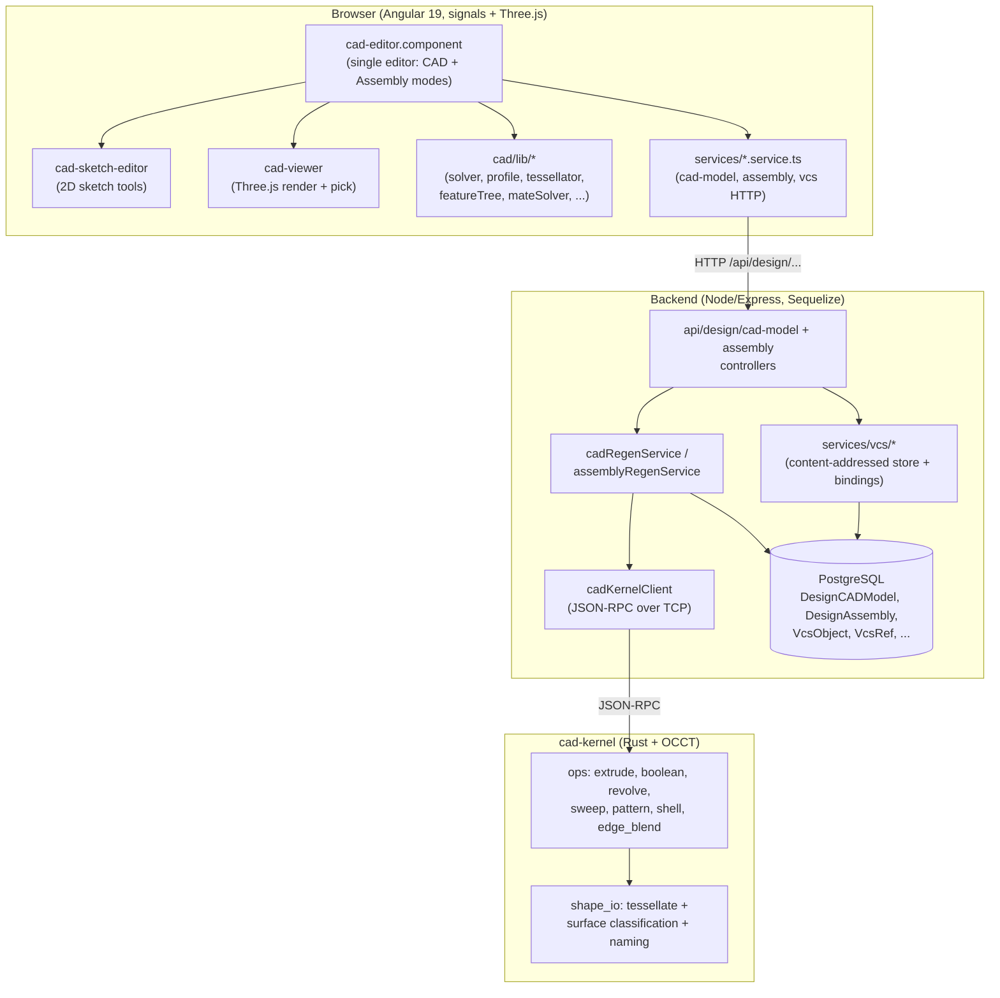

# CAD / Assembly / VCS — System Overview

> **System** ▸ Overview
> Master index: [README](./README.md) · Subsystems: [CAD Modeler](./10-cad-modeler.md) · [Kernel](./20-kernel.md) · [VCS](./30-vcs.md) · [Assembly](./40-assembly.md) · [Architecture](./50-architecture.md)

---

## Requirements

This page is the umbrella for the whole subsystem. The single requirement that frames everything below is the CAD root; each subsystem page carries its own bucket of the 258 requirements (REQ 512–769).

| REQ | Status | Summary |
|-----|--------|---------|
| 512 | unapproved | Parametric 3D CAD modeling capability attached to each Part record |
| 668 | unapproved | Content-addressed version control for each part's CAD model |
| 750 | unapproved | Assembly positioning multiple component instances together |
| 748 | unapproved | 3D assembly mate solver positioning rigid component instances |

### REQ 512 — CAD modeling capability (the root)

- **Description:** The system shall provide a parametric 3D CAD modeling capability attached to each Part record, allowing a user to define a model's geometry through an ordered history of features and 2D sketches, regenerate solid geometry from that history, and view and select the resulting geometry in 3D.
- **Rationale:** Part definitions need first-class 3D geometry that lives next to the inventory/manufacturing record, not in a disconnected external CAD file, so design intent, revisions, and manufacturing data stay in one system.
- **Verification:** Create a CAD model on a Part, add a sketch and an extrude, confirm the regenerated solid renders and its faces are selectable.
- **Validation:** A designer can model a real part end-to-end in the browser and a downstream consumer (manufacturing, BOM) sees the same revision-controlled geometry.

> Every other requirement in 512–769 is a child of this intent. The per-subsystem pages expand the requirements that *define* each feature.

---

## Succinct description

A browser-based parametric CAD system, attached to every Part, with four cooperating subsystems: a **CAD modeler** (sketches + feature history) driven by a **Rust/OCCT geometry kernel**, a git-like **content-addressed version-control system** (branch / review / release tied to Part revisions), and an **assembly module** that places multiple parts together and positions them with a real 3D mate solver. CAD parts and assemblies are the *same application* and share one version-control and measurement stack, written once.

---

## How it works — for everyone (non-technical)

Think of the system as four tools that share one workbench.

1. **The modeler** is where you draw. You sketch a 2D outline on a flat surface (like drawing on a piece of paper taped to a face), then give it depth — "push this circle 10 mm into a cylinder." You stack these steps like a recipe; change step 2 and the whole thing rebuilds. This recipe is the *feature history*.

2. **The kernel** is the engine room. It's a separate, fast program that does the heavy geometric math — turning your recipe into an actual solid shape, rounding edges, cutting holes, and figuring out which surfaces are flat or round. The modeler hands it instructions and gets back a 3D shape to display.

3. **Version control** is the time machine and the filing cabinet. Every time you "check in" your work it's saved as a permanent snapshot you can return to, compare against, or branch off from — exactly like the tools software engineers use, but for 3D parts. When a part is finished it's "released," which freezes its exact geometry and ties it to an official part revision number, so manufacturing always builds the right version.

4. **Assemblies** are where parts come together. You drop several finished parts into one scene and tell the system how they relate — "this bolt's shaft goes in that hole," "these two faces touch." A *mate solver* then figures out exactly where everything sits, the way SolidWorks or NX does. From an assembly you get a bill of materials, exploded views, interference checks, and a combined export.

The important design choice: parts and assemblies aren't two separate apps. They open in the same editor, save through the same version-control system, and measure with the same tools — so there's nothing to learn twice and no duplicated machinery to keep in sync.

---

## How it works — in detail (technical)

### Topology of the system

### The four subsystems and their boundaries

| Subsystem | Lives in | Owns | Page |
|-----------|----------|------|------|
| **CAD modeler** | `frontend/src/app/cad/lib/`, `frontend/src/app/components/cad/`, `backend/services/cadRegenService.js` & friends | Sketches, the 2D constraint solver, the feature tree, regen orchestration, the 3D viewer | [10-cad-modeler](./10-cad-modeler.md) |
| **Geometry kernel** | `cad-kernel/src/` (Rust) | Boundary-representation solids via OCCT; boolean/extrude/revolve/sweep/pattern/shell/fillet ops; tessellation; per-face surface classification; persistent naming | [20-kernel](./20-kernel.md) |
| **Version control** | `backend/services/vcs/`, `backend/models/vcs/` | Content-addressed blob/tree/commit store, branches, the review workflow, geometry freeze, release-to-revision, diff/compare, merge | [30-vcs](./30-vcs.md) |
| **Assembly** | `backend/services/assembly*`, `backend/api/design/assembly/`, `frontend/.../assembly-editor/`, `frontend/src/app/cad/lib/mateSolver.ts` | Component instances, the 3D mate solver, patterns/subassemblies, exploded/section/display states, interference + mass properties, BOM sync, export | [40-assembly](./40-assembly.md) |
| **Architecture** | the seams between the above | The "written once" VCS binding factories, the shared data model, the API/route surface | [50-architecture](./50-architecture.md) |

### The regeneration cycle (the heartbeat)

Everything visible is the output of *regeneration*: turning a stored document into displayable geometry.

- **CAD part:** `cadRegenService.regenerate` resolves equations, walks the ordered `featureTree`, extracts a profile from each sketch (`cadProfile`), checks a content-keyed cache (`DesignBRepCache`), and for cache misses calls the kernel (`cadKernelClient` → JSON-RPC → OCCT). Bodies accumulate through a cumulative-shape pipeline; the kernel returns tessellated `FaceMesh` arrays (positions/normals/indices + a stable `persistentName` per face + an optional `surface` classification) which the viewer renders.
- **Assembly:** `assemblyRegenService.regenerateAssembly` resolves each component instance to its source CAD geometry (reusing *frozen* geometry where the child is released — zero kernel calls), runs the **mate solver** to position floating instances, transforms the already-tessellated child meshes by each placement matrix, re-scopes face IDs to `instanceId::bodyId::faceId`, and composes one assembly geometry plus a per-instance roster.

### Versioning is the spine

A CAD model row (`DesignCADModel`) or assembly row (`DesignAssembly`) is only the *working copy*. The durable history is the content-addressed VCS keyed to the **part-revision lineage root**, so history is continuous as manufacturing cuts new Part rows. `main` is protected; work happens on draft branches; releasing a branch mints a numeric Part revision, freezes geometry onto the release commit, write-once-tags it, and archives the branch. A separate approval-gated production release mints the letter revision. CAD and assembly ride this *same* machinery — see [Architecture: unified VCS bindings](./architecture/unified-vcs-bindings.md).

### Why "same app, written once"

The unification is deliberate and load-bearing. The VCS exposes factory builders — `makeWorkingCopy(binding)`, `makeBranchOps(binding)`, `makeFreeze(binding)`, `makeRelease(binding)` — and CAD vs assembly are *thin bindings* that differ only in how a document is serialized, deserialized, regenerated, and frozen. Checkout/lock/branch/diff/release/workflow logic exists exactly once. The single `cad-editor.component` runs both a CAD mode and an assembly mode (`assemblyMode` route flag), sharing the viewer, the File ribbon tab, and the measurement tools.

---

## Document map

- **Tier 1 (this tier):** coarse, one doc per subsystem — you are here.
- **Tier 2:** [feature-group docs](./README.md#tier-2--feature-groups) — one per coherent feature (sketching, mates, branches, …).
- **Tier 3:** [per-module docs](./README.md#tier-3--per-module) — one per implementing source module.

## Key files

- `frontend/src/app/components/cad/cad-editor/cad-editor.component.ts` — the single editor host (CAD + assembly modes)
- `frontend/src/app/cad/lib/` — the modeling library (solver, profile, tessellator, featureTree, mateSolver, …)
- `cad-kernel/src/` — the Rust/OCCT geometry kernel
- `backend/services/cadRegenService.js`, `backend/services/assemblyRegenService.js` — regeneration
- `backend/services/vcs/` — the content-addressed VCS + binding factories
- `backend/api/design/cad-model/`, `backend/api/design/assembly/` — the HTTP surface
