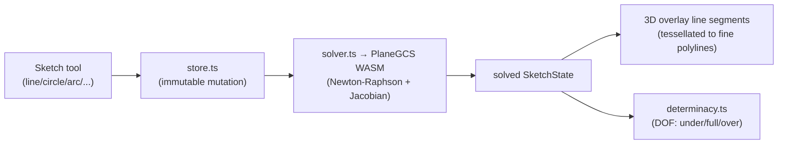

# CAD Modeler

> **System** ▸ [Overview](./00-overview.md) ▸ **CAD Modeler**
> Feature-group docs: [cad-modeler/](./cad-modeler/00-overview.md) · Related: [Kernel](./20-kernel.md) · [VCS](./30-vcs.md)

---

## Requirements

The CAD modeler spans REQ 512–667 (modeling) plus the rendering/measurement reqs. Defining requirements are expanded below; the rest are linked from their feature-group pages.

| REQ | Status | Summary |
|-----|--------|---------|
| 512 | unapproved | Parametric 3D CAD modeling attached to each Part (root) |
| 521 | unapproved | 2D sketching environment (primitives + constraints) |
| 524 | unapproved | Sketch constraint types (coincident, parallel, …) |
| 545 | unapproved | Ordered feature list producing the model's 3D geometry |
| 549 | unapproved | Extrude feature (sketch + distance → solid) |
| 558 | unapproved | Newton-Raphson 2D constraint solver (PlaneGCS) |
| 559 | unapproved | Tagged-union SketchEntity model (point/line/circle/arc/…) |
| 616 | unapproved | Tabbed ribbon toolbar (SolidWorks/OnShape style) |
| 620 | unapproved | Six 3D viewer display modes |
| 634 | unapproved | SolidWorks-style global equations |
| 657 | unapproved | Datum plane feature (8 construction methods) |
| 658 | unapproved | Linear/circular/mirror pattern features |
| 663 | unapproved | Hole Wizard (standardized holes) |

### REQ 545 — Feature history (the model recipe)

- **Description:** The CAD module shall maintain an ordered list of features that produces the model's 3D geometry; each feature consumes the geometry of the features before it and contributes to the running result.
- **Rationale:** Parametric modeling means geometry is *derived*, not stored — editing an early feature must ripple forward deterministically.
- **Verification:** Reorder/edit a feature and confirm downstream geometry regenerates from that point.
- **Validation:** A designer edits an early dimension and the whole part updates coherently.

### REQ 558 — 2D constraint solver

- **Description:** The CAD module shall solve sketch constraint systems using a Newton-Raphson 2D geometric constraint solver based on PlaneGCS (FreeCAD's solver).
- **Rationale:** Mixed constraint systems (tangency, perpendicularity, dimensions) need a convergent solver with analytical Jacobians; iterative ad-hoc solving does not generalize.
- **Verification:** Apply a mixed set of constraints (e.g. tangent + dimension) and confirm the sketch converges to a unique solution; conflicting constraints are rejected.
- **Validation:** A user fully constrains a rectangle and the solver reports it determinate.

---

## Succinct description

The CAD modeler is the part-design surface: a 2D sketcher backed by a PlaneGCS constraint solver, an ordered feature tree (extrude, revolve, sweep, fillet, chamfer, shell, pattern, hole, datum, …) that regenerates a solid through the kernel, and a Three.js viewer for visualizing and selecting the result — all inside a SolidWorks-style ribbon editor.

---

## How it works — for everyone (non-technical)

You design a part in two layers. First you **sketch**: pick a flat surface, draw lines, circles, and arcs, then pin them down with *constraints* ("this line is horizontal," "these two circles are equal," "this gap is exactly 5 mm"). The solver continuously snaps the drawing so every rule holds — a fully pinned sketch can't wiggle.

Then you turn sketches into **3D features**: extrude a profile into a block, revolve one around an axis, sweep it along a path, round edges with fillets, hollow it with a shell, drill standardized holes, or stamp a pattern of copies. Each feature is a step in an ordered list — the *feature tree* — and you can go back and edit any step; everything after it rebuilds automatically.

You can also write **equations** ("length = 2 × width") so dimensions stay related, and you **measure** distances and angles between anything you click. The whole thing is arranged like SolidWorks: a tabbed ribbon up top, a feature tree on the side, a 3D view in the middle.

---

## How it works — in detail (technical)

### Sketching and the 2D solver

A sketch is a tagged-union list of `SketchEntity` values (`point`, `line`, `circle`, `arc`, `ellipse`, `ellipticalArc`, `spline`, `conic`, `text`, `picture`, `equation`) plus a constraint list whose targets are `{ entityId, sub? }` references (REQ 559, 561). Every entity carries an optional `construction` flag that turns it into pinned reference geometry (REQ 560).

- `store.ts` performs pure, immutable mutations (add/move/delete entity, add constraint, merge points). `solver.ts` translates the entity+constraint set into PlaneGCS primitives (the vendored WASM under `frontend/src/app/cad/vendor/planegcs/`), solves, and reads coordinates back. `determinacy.ts` reports degrees of freedom so the UI can color under-constrained geometry (REQ 533).
- Curves are tessellated to fine polylines by `tessellator.ts` and drawn as Three.js line segments in the 3D overlay. Picking (`picking.ts`) is parametric and hit-tests the analytic definition independently — pick accuracy is unaffected by chord tolerance.

See [cad-modeler/sketching](./cad-modeler/sketching.md), [constraints](./cad-modeler/constraints.md).

### The feature tree and regeneration

`featureTree.ts` is an immutable, auto-named, sequenced list of features (`origin`, `extrude`, `cutExtrude`, `revolve`, `sweep`, `shell`, `pattern`, `chamfer`, `fillet`, `datumPlane/Axis/Point`, `hole`, `combine`, `mirrorBody`, `moveCopyBody`, …). On any change the backend `cadRegenService` re-runs from the affected feature forward:

1. Resolve equations (`cadEquations`) and overwrite numeric feature params (REQ 638).
2. For each feature, extract a profile from its sketch (`cadProfile` → typed `ProfileLoop` preserving curve identity, REQ 617) and build a content cache key.
3. On cache miss, call the kernel; accumulate bodies through a cumulative-shape pipeline.
4. Return `FaceMesh[]` + topology with body-scoped persistent face names.

See [cad-runtime/regen-pipeline](./cad-runtime/regen-pipeline.md), [feature-tree](./cad-modeler/feature-tree.md), [extrude-revolve-sweep](./cad-modeler/extrude-revolve-sweep.md), [fillet-chamfer-shell-pattern](./cad-modeler/fillet-chamfer-shell-pattern.md), [holes](./cad-modeler/holes.md), [datums-planes](./cad-modeler/datums-planes.md).

### Equations

`equations.ts` / `cadEquations.js` implement SolidWorks-style globals plus target-driven equations (`feature.distance`, `sketch.constraint`). Expressions are parsed/evaluated via `expr-eval`, a dependency graph is built from each expression's variables, topologically sorted, evaluated, and applied before feature dispatch (REQ 634–639). See [equations](./cad-modeler/equations.md).

### Measurement

`measure.ts` + the Measure sidebar compute distance/angle/circle-fit from picks of vertices, edges, and faces (REQ 652–656), including face-pair distance and circular-edge radius/diameter. Measurement is shared with the assembly editor (written once). See [measurement](./cad-modeler/measurement.md).

### Editor, viewer, UI

The editor (`cad-editor.component.ts`) presents a tabbed ribbon (File / Sketch / Features / Assembly, REQ 616) with `[hidden]`-based tab switching to preserve in-flight tool gestures. The viewer (`cad-viewer.component.ts`) renders `FaceMesh` via Three.js with six display modes (REQ 620), hidden-line removal, hover/select highlighting (REQ 518–520), datum-plane labels (REQ 729), a section/clipping plane, and parametric face/edge/datum picking with a face-prefers-datum precedence rule. See [cad-runtime/editor-ui](./cad-runtime/editor-ui.md), [viewer-rendering](./cad-runtime/viewer-rendering.md).

---

## Key files

- `frontend/src/app/cad/lib/` — solver, store, determinacy, profile, arrangement, tessellator, picking, inference, sketchEditOps, dimensions, equations, datum, plane, document, featureTree, preview, pattern, measure, holeSpecs, migration
- `frontend/src/app/components/cad/cad-editor/cad-editor.component.ts` — editor host + ribbon
- `frontend/src/app/components/cad/cad-sketch-editor/` — sketch tools
- `frontend/src/app/components/cad/cad-viewer/` — Three.js viewer
- `backend/services/cadRegenService.js`, `cadProfile.js`, `cadEquations.js`, `cadProjection.js` — backend regen
- `frontend/src/app/cad/vendor/planegcs/` — vendored PlaneGCS WASM solver
