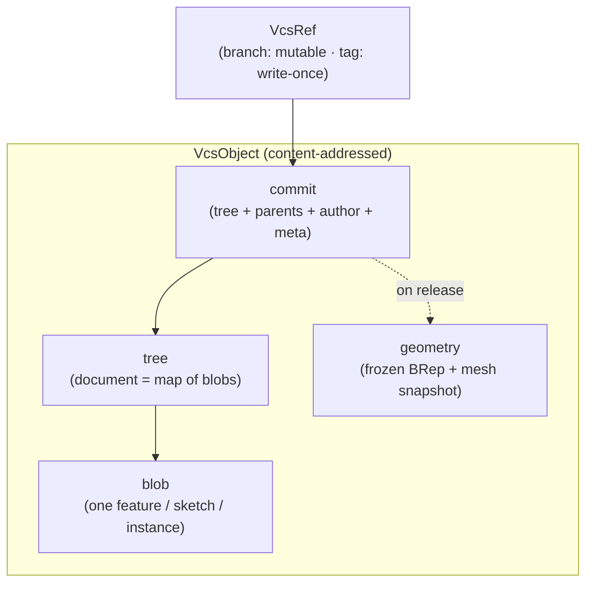
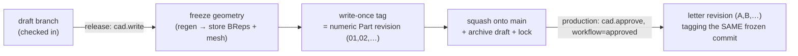

# Version Control (Content-Addressed VCS)

> **System** ▸ [Overview](./00-overview.md) ▸ **VCS**
> Feature-group docs: [vcs/](./vcs/00-overview.md) · Related: [Architecture: unified bindings](./architecture/unified-vcs-bindings.md)

---

## Requirements

The VCS spans REQ 668–747 (plus the release reqs shared with Part revisions). Defining requirements:

| REQ | Status | Summary |
|-----|--------|---------|
| 668 | unapproved | Content-addressed version history per part CAD model |
| 669 | unapproved | Objects identified by SHA-256 of canonical content |
| 671 | unapproved | Three core object kinds: blob, tree, commit |
| 677 | unapproved | Working copy bound to a checked-out branch |
| 678 | unapproved | Checkout acquires an exclusive per-branch lock |
| 680 | unapproved | Check-in commits the serialized working copy |
| 684 | unapproved | Release freezes regenerated geometry onto the commit |
| 686 | unapproved | Released commit corresponds to a Part revision (tag) |
| 692 | unapproved | Named variant branches |
| 699 | unapproved | Structural diff between two commits |
| 703 | unapproved | Generic declarative workflow engine |
| 734 | unapproved | Protected `main` branch |
| 741 | unapproved | Feature-level merge of main into a behind-main branch |

### REQ 669 — Content addressing

- **Description:** The version-control store shall identify every stored object by a SHA-256 hash of its canonical serialized content.
- **Rationale:** Content addressing gives automatic deduplication and integrity — identical content is stored once, and a hash both names and verifies an object.
- **Verification:** Store the same logical content twice; confirm one object and one hash.
- **Validation:** Re-checking-in an unchanged model creates no new blobs.

### REQ 734 — Protected main

- **Description:** The CAD module shall protect the main branch from direct editing: checkout, check-in, and updates on main shall be rejected; all editing happens on draft branches, and main advances only via release.
- **Rationale:** A trunk-based model keeps the released line clean and auditable; concurrent drafts never corrupt main.
- **Verification:** Attempt checkout on main → 423 Locked; release a draft → main advances.
- **Validation:** Two designers work concurrent drafts; releases serialize cleanly onto main.

---

## Succinct description

A git-like, content-addressed object store (SHA-256 blob/tree/commit objects, mutable branch refs, write-once tags) keyed to a part's revision lineage. It gives CAD models and assemblies branch / check-out-lock / check-in / diff / compare / merge, a declarative review workflow, geometry freeze on release, and release-to-Part-revision — all written once and shared by both document types.

---

## How it works — for everyone (non-technical)

This is version control for 3D parts, working just like the system software developers use for code — but you never see the plumbing.

Every time you finish a chunk of work you **check in**, which saves a permanent, named snapshot. You can always go back to an old snapshot, **compare** two of them to see exactly what changed, or start a **branch** to try an alternative without disturbing the main design. Because each snapshot is identified by a fingerprint of its contents, nothing is ever stored twice and nothing can be silently altered.

The "official" line of a part is called **main**, and it's protected — you can't scribble on it directly. You do your work on a draft branch, and when it's ready you **release** it. Releasing does three important things: it freezes the exact geometry so it can never drift, it stamps the part with its official revision number, and it locks the design as read-only. A second, approval-gated step promotes it to a lettered production revision. Throughout, a simple **review workflow** (draft → in review → approved) tracks where each design stands.

---

## How it works — in detail (technical)

### The object store

- `vcsService.js` is the kernel: store/read blob/tree/commit/geometry objects, each addressed by SHA-256 of its **canonical JSON** (`canonicalJson.js` — sorted keys, no whitespace, so equal content ⇒ equal hash, REQ 669–670). Branch refs are mutable; tags are write-once (REQ 673).
- A repo is keyed by `(repoType, repoId)` where `repoType ∈ {'cad','assembly'}` and `repoId` is the **part-revision lineage root** (walk `previousRevisionID` to the root), so history is continuous across manufacturing revisions (REQ 688, 724).

See [vcs/content-addressed-store](./vcs/content-addressed-store.md).

### Working copy: checkout / check-in / lock

The `DesignCADModel` / `DesignAssembly` row is the *working copy* (it gained `branchName`, `baseCommitHash`, `lockedByUserID`/`lockedAt`/`lockExpiresAt`, `dirty`, `releaseLocked`). Checkout acquires an exclusive per-branch lock (REQ 678–679); check-in requires the lock + a message, serializes the working copy into a tree, and creates a commit advancing the branch (REQ 680). Autosave persists edits without committing (REQ 681). See [vcs/working-copy-checkout-checkin](./vcs/working-copy-checkout-checkin.md).

### Branches, workflow, merge

- **Branches** (REQ 692–698): create/list/switch/archive; `main` is protected (REQ 734); creating a model seeds `main` + auto-creates `draft/01` (REQ 736). Workflow state is keyed **per branch** (`lineageRoot:branchName`, REQ 739) so multiple drafts review independently.
- **Workflow** (REQ 703–707): a declarative `draft → in_review → approved` engine, permission-guarded, best-effort notifications. `workflowEngine.js` is generic; `WORKFLOWS = { cad, assembly }` both use the same definition.
- **Diff / compare** (REQ 699–702, 713–714): structural tree diff (O(changed) via hash equality) reporting added/removed/modified features, sketches, equations — plus a body/face-level 3D diff colored by persistent-name.
- **Merge / reconcile** (REQ 741, 747): when main advanced past a branch (`behindMain`), a feature-level merge starts from main's current doc and splices in the selected branch features (3-way per-feature), committing with `parents=[mainHead]`.

See [vcs/branches](./vcs/branches.md), [workflow-review](./vcs/workflow-review.md), [diff-compare](./vcs/diff-compare.md), [merge-reconcile](./vcs/merge-reconcile.md), [history-graph](./vcs/history-graph.md).

### Freeze and release

- **Freeze** (REQ 684–685): on release, regenerate and store each body's BRep + a mesh snapshot as content-addressed objects on the commit. Checking out a released commit reconstructs geometry from those snapshots with **zero kernel calls**. `vcsFreeze.js` is the written-once factory; CAD/assembly bind `regen`/`snapshot`/`reconstruct`.
- **Release** (REQ 715–724, 737, 740): a draft release is self-service (`cad.write`) — mint the next numeric Part revision (`partRevisionService.createNewRevision`), freeze, write-once tag, squash onto main, lock, archive the draft. Production release is approval-gated (`cad.approve`, workflow `approved`) and mints the next letter revision tagging the *same* frozen commit (identical geometry guaranteed). STL/STEP downloads reproduce from frozen geometry (REQ 719, 723).

See [vcs/freeze-geometry](./vcs/freeze-geometry.md), [release-revisions](./vcs/release-revisions.md).

### Three distinct locks (don't confuse them)

| Lock | Meaning | Guard |
|------|---------|-------|
| `lockedByUserID` | transient edit/checkout (PDM checkout) | 423 |
| `DesignCADModel.releaseLocked` | CAD design read-only after release | 409/423 |
| `Parts.revisionLocked` | manufacturing-side revision immutability | 409 |

---

## Key files

- `backend/services/vcs/vcsService.js`, `canonicalJson.js` — content-addressed store
- `backend/services/vcs/vcsWorkingCopy.js`, `vcsBranchOps.js`, `vcsFreeze.js`, `vcsRelease.js` — written-once factories
- `backend/services/vcs/cadVcsService.js`, `assemblyVcsService.js`, `cadSerializer.js`, `assemblySerializer.js` — bindings
- `backend/services/vcs/cadBranchService.js`, `assemblyBranchService.js`, `cadDiffService.js`, `cadGraphService.js`, `workflowEngine.js`, `cadThumbnailSvg.js`
- `backend/models/vcs/` — `VcsObject`, `VcsRef`, `VcsChangeset`, `VcsWorkflowState`, `VcsUsage`
- `backend/services/partRevisionService.js` — numeric/letter Part revision minting
