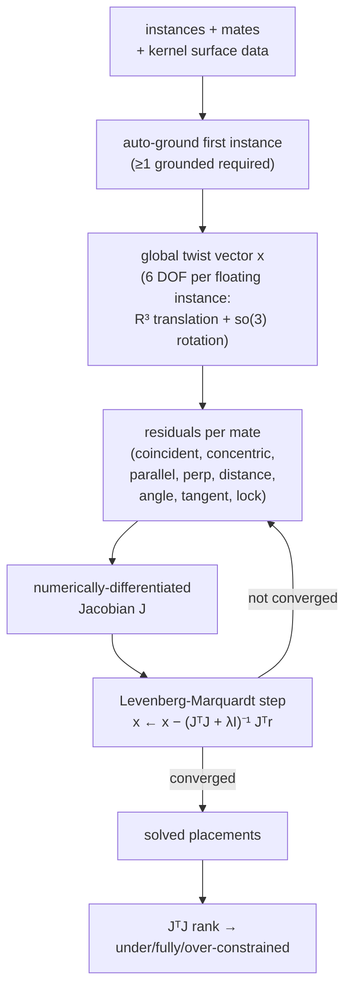

# Assembly

> **System** ▸ [Overview](./00-overview.md) ▸ **Assembly**
> Feature-group docs: [assembly/](./assembly/00-overview.md) · Related: [CAD Modeler](./10-cad-modeler.md) · [Kernel: surface classification](./kernel/surface-classification.md)

---

## Requirements

The assembly module spans REQ 748–769. Defining requirements:

| REQ | Status | Summary |
|-----|--------|---------|
| 748 | unapproved | 3D assembly mate solver |
| 750 | unapproved | Assembly positions multiple component instances |
| 751 | unapproved | Insert a component instance referencing a part with CAD |
| 752 | unapproved | Regenerate by resolving + transforming instances |
| 753 | unapproved | Bill of materials from instances |
| 754 | unapproved | Export whole assembly to STEP/STL |
| 755 | unapproved | Solve mate constraints during regeneration |
| 756 | unapproved | Mate types: coincident/concentric/parallel/perp/distance/angle/tangent/lock |
| 757 | unapproved | Report under/fully/over-constrained |
| 760 | unapproved | Linear component pattern |
| 761 | unapproved | Mirror a component instance |
| 763 | unapproved | Nested subassemblies |
| 764 | unapproved | Exploded view |
| 766 | unapproved | Section view |
| 767 | unapproved | Interference detection |
| 768 | unapproved | Mass properties |
| 769 | unapproved | Sync assembly BOM to inventory BOM records |

### REQ 748 — 3D mate solver

- **Description:** The CAD module shall provide a 3D assembly mate solver that positions rigid component instances by solving geometric constraints (mates) between faces.
- **Rationale:** Real assemblies are defined by relationships, not absolute coordinates; a constraint solver (as in SolidWorks/NX) lets parts move together correctly as the design changes.
- **Verification:** Two parts with a coincident + concentric mate solve to the expected relative pose; over-constraint is detected.
- **Validation:** A user mates a bolt into a hole and it snaps to the correct position.

### REQ 752 — Assembly regeneration

- **Description:** When regenerating an assembly, the CAD module shall resolve each non-suppressed component instance to its source geometry, apply its placement transform, and compose the combined assembly geometry.
- **Rationale:** An assembly is a composition of placed child parts; its geometry is derived, not stored.
- **Verification:** Compose two instances with namespaced IDs; confirm one combined geometry + per-instance roster.
- **Validation:** Moving a component re-composes the assembly view correctly.

---

## Succinct description

A multi-part design surface where component instances (each referencing a CAD part or nested assembly) are positioned by a real 3D rigid-body **mate solver** (Levenberg-Marquardt over R³ + so(3)). It composes combined geometry by transforming each child's frozen/regenerated mesh, supports patterns/mirror/subassemblies, exploded/section/display states, interference + mass-property analysis, BOM generation and inventory sync, and STEP/STL export — all inside the same CAD editor and the same VCS.

---

## How it works — for everyone (non-technical)

An assembly is a scene of finished parts arranged together. You **insert** parts as *instances* (the same bolt can appear twenty times), then tell the system how they relate using **mates**: "this face sits flat against that face," "this shaft is concentric with that hole," "keep these 5 mm apart." A **mate solver** — the same kind of engine SolidWorks uses — works out exactly where every part lands so all your rules hold at once, and it tells you whether you've pinned things down too little, just right, or contradicted yourself.

From there you get everything you'd expect of an assembly: a **bill of materials** counting every part, **patterns** that repeat a component in a row or circle, **mirroring** for left/right-hand pairs, and **subassemblies** (an assembly used as a part inside a bigger assembly). For documentation and checking you can **explode** the view to see how parts fit, slice it with a **section** plane, save **display states** (which parts are shown), run an **interference** check to catch parts that overlap, and compute **mass properties** like total volume and center of mass. The whole assembly versions, branches, and releases through the exact same system as a single part, and exports as one combined STEP or STL file.

---

## How it works — in detail (technical)

### The assembly document

The versioned content is `assemblyDoc` (JSONB): `{ nextInstanceSeq, nextMateSeq, nextPatternSeq, nextDisplayStateSeq, instances[], mates[], patterns[], explode{offsets,factor}, displayStates[] }`. Each instance is `{ instanceId, partID, ref:{kind,repoId}, placement:{translate, quaternion}, grounded, suppressed, visible }`; each mate is `{ mateId, type, a:{instanceId, faceId}, b:{...}, value?, flip? }` (the solver internally resolves `faceId` to an analytic surface). An assembly *is a Part* whose part category is named "Assembly" — eligibility (`createForPart`/`listEligibleParts`) resolves the category by **name**, not a hardcoded id (tests happen to use `partCategoryID: 4`). An assembly nests and appears in BOMs.

### The mate solver (the hard core)

The solver runs identically in the browser (`frontend/src/app/cad/lib/mateSolver.ts`, for interactive warm-started drag) and in Node (`backend/services/assemblyMateSolver.js`, authoritative on save/regen). It consumes the kernel's per-face **surface classification** (plane origin/normal, cylinder axis/radius — REQ 749), not BReps, so OCCT isn't needed at solve time. Mate types and constraint-state reporting: REQ 756–757. See [assembly/mates-solver](./assembly/mates-solver.md).

### Regeneration and composition

`assemblyRegenService.regenerateAssembly` (REQ 752):

1. Resolve each non-suppressed instance to its child geometry — live regen via `cadRegenService.regenerateModel` for CAD children, or recursive `regenerateAssembly` for sub-assembly children (reusing frozen geometry for released children is a planned optimization, not yet implemented).
2. Run the mate solver to position floating instances (grounded instances stay fixed).
3. Transform each child's already-tessellated mesh by its placement matrix (cheaper than re-running the kernel; the viewer needs it anyway).
4. Re-scope face IDs to `instanceId::bodyId::faceId`; compose one geometry + a per-instance roster.

Patterns (linear/circular/mirror, REQ 760–761) expand via a transform abstraction (`rigidTransform`/`mirrorTransform`); subassemblies recurse with cycle detection (an assembly can't transitively contain itself, REQ 763). Replace-component re-resolves mates by `geomRef` (REQ 762). See [assembly/instances-placement](./assembly/instances-placement.md), [patterns-mirror-subassemblies](./assembly/patterns-mirror-subassemblies.md).

### Visualization, analysis, BOM, export

- **Visualization** (REQ 764–766): exploded view (per-instance offsets × factor), named display states (saved show/hide sets), section view (renderer clipping plane) — all stored in `assemblyDoc`, mostly frontend group transforms. See [assembly/visualization](./assembly/visualization.md).
- **Analysis** (REQ 767–768): interference = AABB broad-phase (`aabbOverlap`) then boolean `common` on placed BReps; mass properties sum child volumes/centroids by placement. `assemblyAnalysisService.js`. See [assembly/analysis](./assembly/analysis.md).
- **BOM** (REQ 753, 769): aggregate instances into component lines; `syncBom` writes `BillOfMaterialItem` rows on the assembly Part. See [assembly/bom-sync](./assembly/bom-sync.md).
- **Export** (REQ 754): place each instance's BReps by its transform, write one STEP/STL. See [assembly/export](./assembly/export.md).

### Shared with CAD (written once)

Assemblies ride the *same* VCS — `assemblyVcsService.js` + `assemblySerializer.js` bind the written-once `makeWorkingCopy`/`makeRelease`/`makeFreeze` factories; branches use the generic `vcsBranchOps`; `workflowEngine` includes an `assembly` workflow; diff handles `instance:`/`mate:` entries. The assembly editor *is* `cad-editor.component` in `assemblyMode`, reusing the viewer, File ribbon tab, and measurement. See [Architecture: unified bindings](./architecture/unified-vcs-bindings.md).

---

## Key files

- `frontend/src/app/cad/lib/mateSolver.ts`, `assembly.types.ts` — solver + document types
- `frontend/src/app/components/cad/assembly-editor/assembly-edit.controller.ts` — assembly state/ops
- `frontend/src/app/components/cad/assembly-landing/` — landing + eligible-part picker
- `frontend/src/app/services/assembly.service.ts` — HTTP surface
- `backend/services/assemblyRegenService.js`, `assemblyMateSolver.js`, `assemblyAnalysisService.js`
- `backend/api/design/assembly/controller.js`, `routes.js`
- `backend/models/design/designAssembly.js`, `designAssemblyHistory.js`
- `backend/services/vcs/assemblyVcsService.js`, `assemblySerializer.js`, `assemblyBranchService.js`, `assemblyFreezeService.js`
