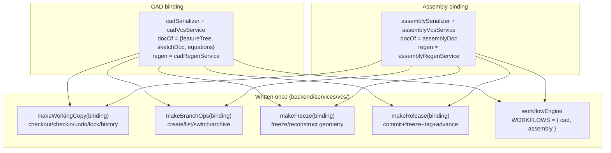
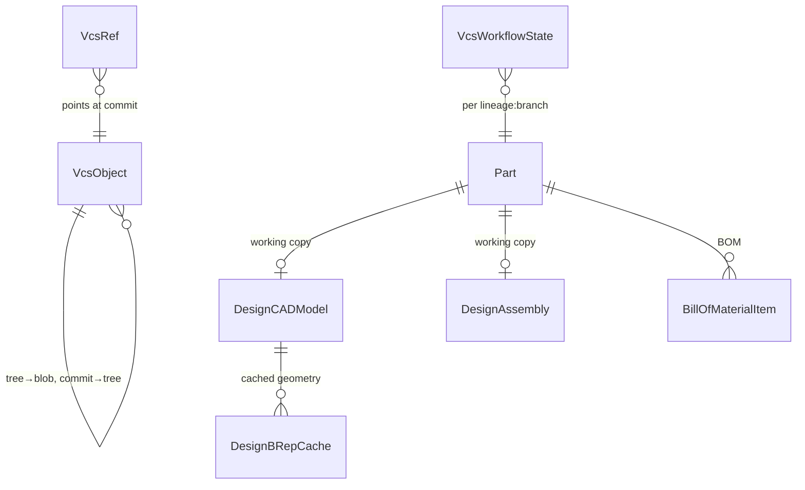

# Architecture

> **System** ▸ [Overview](./00-overview.md) ▸ **Architecture**
> Feature-group docs: [architecture/](./architecture/00-overview.md)

---

## Requirements

Architecture is cross-cutting; these requirements most directly drive the structural decisions:

| REQ | Status | Summary |
|-----|--------|---------|
| 556 | unapproved | `cad` permission resource gates all CAD operations |
| 673 | unapproved | Repository scoped by `(repoType, repoId)` |
| 688 | unapproved | One repository per part lineage, continuous history |
| 703 | unapproved | Generic declarative workflow engine (reused by CAD + assembly) |
| 750 | unapproved | Assembly is a Part (nests, appears in BOMs) |

### REQ 703 — Generic workflow engine

- **Description:** The system shall provide a generic, declarative workflow engine that drives permission-guarded state transitions, reusable across document types.
- **Rationale:** CAD and assembly share the same review lifecycle; encoding it once avoids divergence and duplicated bugs.
- **Verification:** The same engine drives both a CAD model and an assembly through draft → in_review → approved.
- **Validation:** A reviewer's approval action behaves identically for parts and assemblies.

---

## Succinct description

The defining architectural decision is **"written once":** CAD parts and assemblies are the same application sharing one content-addressed VCS, one editor, and one measurement stack. The VCS exposes factory builders parameterized by small per-document *bindings*; CAD and assembly supply bindings that differ only where they must (serialize / deserialize / regen / freeze), so all checkout/branch/diff/release/workflow logic lives exactly once.

---

## How it works — for everyone (non-technical)

When you build two similar things — here, single-part CAD and multi-part assemblies — the tempting mistake is to write two parallel systems that slowly drift apart and have to be fixed twice. This project avoids that. The version-control machinery, the 3D editor, and the measuring tools are each written a single time. CAD and assembly just plug into them by answering a few questions: "how do I save my document?", "how do I rebuild my geometry?". Everything else — locking, branching, comparing versions, releasing — is shared. The payoff: a feature added to version control instantly works for both, and there's half as much code to keep correct.

---

## How it works — in detail (technical)

### The binding/factory pattern

The VCS core is a set of factory functions, each taking a *binding* object and returning the operations for one document type:

A binding provides: `repoFor(model,db)`, `docOf(model)`, `serialize`/`deserialize`, `applyDoc(model,doc)`, `commitMeta`, and for freeze `regen`/`snapshot`/`reconstruct`. CAD's `docOf` returns `{featureTree, sketchDoc, equations}` and serializes as a tree of one blob per feature/sketch; assembly's returns the single `assemblyDoc` blob. Everything downstream — the lock protocol, branch protection, the commit graph (`cadGraphService.buildGraphForRepo`), structural diff (`cadDiffService`, which special-cases `instance:`/`mate:` entries), the workflow state machine — is document-agnostic.

See [architecture/unified-vcs-bindings](./architecture/unified-vcs-bindings.md).

### Shared editor and tools

The frontend has one editor component, `cad-editor.component.ts`, with an `assemblyMode` signal set from the route (`/parts/:id/assembly/editor` carries `data:{assemblyMode:true}`). In assembly mode it injects an `AssemblyEditController` and an `AssemblyService` and swaps the displayed geometry source and ribbon panes, but reuses the `cad-viewer`, the File ribbon tab (checkout/checkin/branches/workflow/release/compare/merge all branch to the assembly API), and the measurement tools. Nothing in the viewer, version UI, or measurement is duplicated.

### Data model

- `DesignCADModel` / `DesignAssembly` — working copies carrying the VCS columns (`branchName`, `baseCommitHash`, lock fields, `dirty`, `releaseLocked`) + history tables.
- `VcsObject` (blob/tree/commit/geometry, content + bytes), `VcsRef` (branches mutable, tags write-once), `VcsChangeset`, `VcsWorkflowState`, `VcsUsage`.
- `DesignBRepCache` — content-keyed kernel-output cache with `namingVersion` for invalidation.

See [architecture/data-model](./architecture/data-model.md).

### API and route surface

- Backend (auto-discovered via `backend/api/index.js`): `/api/design/cad-model/*` and `/api/design/assembly/*` — CRUD + instances/mates/patterns + regen + BOM + analysis + export + the full VCS surface (checkout/checkin/undo/branches/switch/archive/commits/graph/workflow/release/production-release/release-export/commit-diff/reconcile). All gated by the `cad` permission resource (REQ 556) — no separate `assembly` resource.
- Frontend routes: `/design/cad`, `/design/assemblies` (landings), `/parts/:id/cad/editor`, `/parts/:id/assembly/editor` (both load `cad-editor`).

See [architecture/api-and-routes](./architecture/api-and-routes.md).

### Test-harness gotchas (institutional knowledge)

- `tablesToClean` in `backend/tests/setup.js` must clean FK-RESTRICT design/VCS tables (incl. `DesignAssembly`, `DesignCADModelHistory`) **before** Part/User.
- Assembly test parts need a `partCategoryID` that matches the seeded "Assembly" `PartCategory` row (id 4 in the test fixture — but eligibility is resolved by **name** in production code, not by a hardcoded id).
- `Users.displayName` is UNIQUE — a second `authenticatedRequest()` in one test needs a distinct displayName.
- Reusing the `cad` permission resource (not a new one) means no permission-count test bump for assemblies.

---

## Key files

- `backend/services/vcs/vcsWorkingCopy.js`, `vcsBranchOps.js`, `vcsFreeze.js`, `vcsRelease.js` — the factories
- `backend/services/vcs/cadVcsService.js`, `assemblyVcsService.js`, `cadSerializer.js`, `assemblySerializer.js` — the bindings
- `backend/services/vcs/workflowEngine.js`, `cadGraphService.js`, `cadDiffService.js` — document-agnostic machinery
- `frontend/src/app/components/cad/cad-editor/cad-editor.component.ts` — the shared editor
- `frontend/src/app/app.routes.ts` — route wiring (`assemblyMode` flag)
- `backend/tests/setup.js` — `tablesToClean` ordering
