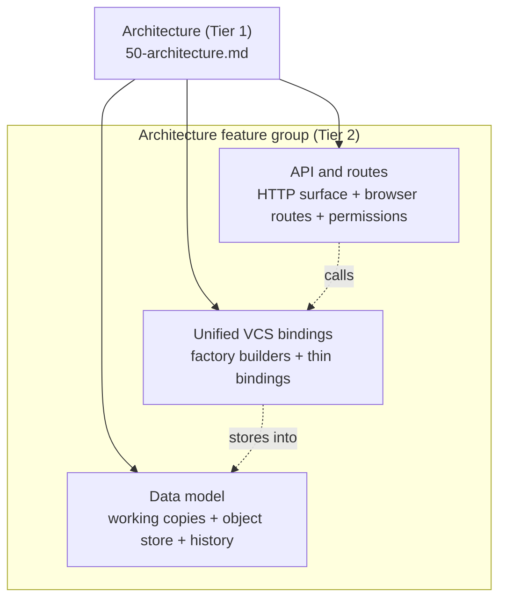

# Architecture — Feature Group Overview

> **System** ▸ [Overview](../00-overview.md) ▸ [Architecture](../50-architecture.md) ▸ **Architecture feature group**
> Related: [Unified VCS bindings](./unified-vcs-bindings.md) · [Data model](./data-model.md) · [API and routes](./api-and-routes.md) · [VCS subsystem](../30-vcs.md)

---

## Requirements

These are the cross-cutting requirements that shape the *structure* of the system rather than any single feature. Each is expanded on the page noted in the table.

| REQ | Status | Summary | Page |
|-----|--------|---------|------|
| 556 | unapproved | `cad` permission resource (read/write/delete/approve) gates all CAD + assembly operations | [API and routes](./api-and-routes.md) |
| 673 | unapproved | VCS refs scoped to a repository identified by `(repoType, repoId)`; branches mutable, tags write-once | [Data model](./data-model.md) |
| 688 | unapproved | One VCS repository per part lineage; history continuous across part revisions | [Data model](./data-model.md) · [Unified VCS bindings](./unified-vcs-bindings.md) |
| 703 | unapproved | Generic declarative workflow engine, reused by CAD and assembly | [Unified VCS bindings](./unified-vcs-bindings.md) |
| 750 | unapproved | An assembly is a Part (it nests and appears in BOMs) and rides the same VCS working-copy model | [Data model](./data-model.md) |

### REQ 703 — Generic workflow engine

- **Description:** The system shall provide a generic, declarative workflow engine that drives permission-guarded state transitions defined per repository type, with the current workflow state stored per repository.
- **Rationale:** A reusable declarative engine replaces ad-hoc per-entity state columns and can later govern parts/harness/requirements by adding a transition table — not just CAD.
- **Verification:** Unit test: declarative transition table drives state changes; state persists per repo, defaults to initial. `backend/tests/__tests__/vcs/cad-workflow.test.js`.
- **Validation:** Workflow behaviour is defined in one declarative place and reused across entities.

### REQ 688 — One repository per part lineage

- **Description:** Each part lineage shall have exactly one version-control repository whose commit history is continuous across the part's revisions, with a default branch representing the working line of development.
- **Rationale:** Revisions create new Part rows linked by `previousRevisionID`; keying the repository to the lineage keeps one continuous history rather than a fresh history per revision.
- **Verification:** Integration test: creating a new Part revision continues the same repository and history; the default branch exists and advances.
- **Validation:** A user sees one continuous history for a part across all of its revisions.

---

## Succinct description

This feature group documents the *seams* of the CAD/assembly/VCS system — the structural decisions that hold the four subsystems together. The thesis is **"written once":** version control, the editor, and the measurement stack each exist a single time, and CAD parts and assemblies plug into them through small per-document *bindings*.

---

## How it works — for everyone (non-technical)

Imagine you are building two products that are 90% the same — a single-part designer and a multi-part assembly designer. The lazy approach is to build them twice, which means every bug, every new feature, and every fix has to be done twice and the two copies slowly drift apart. This project takes the opposite approach: the shared machinery (saving versions, branching, comparing, releasing, the 3D editor, the rulers) is built exactly once. CAD and assembly each answer a handful of "how do I save myself?" and "how do I rebuild my shape?" questions, and inherit everything else for free.

This group of three documents explains how that single-copy design is wired:

- **Unified VCS bindings** — the central pattern that lets one version-control engine serve both document types.
- **Data model** — the database tables that store working copies, history, and the content-addressed object store.
- **API and routes** — the web addresses (HTTP endpoints and browser pages) the system exposes, and how access is controlled.

---

## How it works — in detail (technical)

### Subsystem map

### The three pages and what each owns

| Page | Owns | Key source |
|------|------|------------|
| [Unified VCS bindings](./unified-vcs-bindings.md) | The factory builders `makeWorkingCopy` / `makeBranchOps` / `makeFreeze` / `makeRelease`, the document-agnostic graph/diff/workflow code, and the thin CAD vs assembly bindings | `backend/services/vcs/*` |
| [Data model](./data-model.md) | The Sequelize tables: working copies (`DesignCADModel`, `DesignAssembly`), their history tables, the content-addressed store (`VcsObject`, `VcsRef`, …), and the BRep cache | `backend/models/design/*`, `backend/models/vcs/*` |
| [API and routes](./api-and-routes.md) | The `/api/design/cad-model/*` and `/api/design/assembly/*` endpoint tables, the Angular routes, and `cad`-resource permission gating | `backend/api/design/*/routes.js`, `frontend/src/app/app.routes.ts` |

### Why "written once" is the through-line

Each page restates the same thesis from its own angle:

- In **code** (bindings): `makeWorkingCopy(binding)`, `makeBranchOps(binding)`, `makeFreeze(binding)`, and `makeRelease(binding)` are each defined once in `backend/services/vcs/`; CAD and assembly supply bindings that differ only in `repoFor` / `docOf` / `serialize` / `deserialize` / `applyDoc` / `commitMeta` / `regen` / `snapshot` / `reconstruct`. Checkout, branching, diffing, freezing, and releasing therefore have exactly one implementation.
- In **data**: both working copies carry the *same* VCS columns (`branchName`, `baseCommitHash`, lock fields, `dirty`, `releaseLocked`) and write into the *same* content-addressed object store (`VcsObject`/`VcsRef`), keyed by `(repoType, repoId)` so each part lineage owns exactly one continuous repository (REQ 688).
- In **interface**: CAD and assembly do not get a separate permission resource — both are gated by the single `cad` resource (REQ 556) — and both editor surfaces load the same `cad-editor` Angular component, with an `assemblyMode` route flag the only switch.

---

## Key files

- `backend/services/vcs/vcsWorkingCopy.js`, `vcsBranchOps.js`, `vcsFreeze.js`, `vcsRelease.js` — the four factory builders
- `backend/services/vcs/cadVcsService.js`, `assemblyVcsService.js` — the two thin bindings
- `backend/services/vcs/workflowEngine.js`, `cadGraphService.js`, `cadDiffService.js` — document-agnostic machinery
- `backend/models/design/designCADModel.js`, `designAssembly.js`, `backend/models/vcs/*` — the data model
- `backend/api/design/cad-model/routes.js`, `backend/api/design/assembly/routes.js`, `frontend/src/app/app.routes.ts` — the API + route surface
