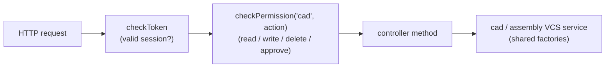

# API and Routes — HTTP Surface, Browser Routes, and Permission Gating

> **System** ▸ [Overview](../00-overview.md) ▸ [Architecture](../50-architecture.md) ▸ **API and routes**
> Related: [Architecture feature group](./00-overview.md) · [Unified VCS bindings](./unified-vcs-bindings.md) · [Data model](./data-model.md) · [VCS subsystem](../30-vcs.md)

---

## Requirements

| REQ | Status | Summary |
|-----|--------|---------|
| 556 | unapproved | A `cad` permission resource with actions `read`/`write`/`delete`/`approve` gates CAD (and assembly) data and operations; `approve` gates the release transition |

### REQ 556 — `cad` permission resource

- **Description:** The CAD module shall gate access to CAD model data and operations by a `cad` permission resource with actions `read`, `write`, `delete`, and `approve`; the `approve` action shall be required to invoke the release transition.
- **Rationale:** Access control over engineering artifacts is required by the QMS framework; separating read/write/delete/approve lets the user designate distinct reviewers and editors.
- **Verification:** `backend/tests/__tests__/design/cad-model-permissions.test.js` — per-action gating for `cad.read`/`write`/`delete` plus `cad.approve` specifically gating release.
- **Validation:** An administrator can grant a designer `cad.read` + `cad.write` while reserving `cad.approve` for engineering review.

---

## Succinct description

CAD and assembly each expose a REST surface — `/api/design/cad-model/*` and `/api/design/assembly/*` — auto-discovered by the API loader and gated entirely by the single `cad` permission resource. The frontend exposes four browser routes that load two landing components and the one shared `cad-editor`, with an `assemblyMode` flag the only switch between part and assembly editing.

---

## How it works — for everyone (non-technical)

The system talks over the web in two layers. The **backend** offers a set of web addresses (an "API") that the browser calls to do things: list a part's CAD models, check one out for editing, save a snapshot, compare two versions, release a finished design. There's one such address book for single-part CAD and a parallel one for assemblies.

Every one of those addresses is locked behind a single keyring called `cad`, with four keys: *read* (look), *write* (edit), *delete* (remove), and *approve* (sign off a release). An administrator hands out keys per person — a designer might get read and write but not approve, so a separate reviewer holds the approval key.

The **frontend** is the set of pages you actually click through: a list of all parts that have CAD, a list of all assemblies, and the editor itself. Notably, the part editor and the assembly editor are the *same page* — it just knows which mode it's in.

---

## How it works — in detail (technical)

### Mounting and auto-discovery

`backend/api/index.js` scans its subdirectories and mounts any folder containing a `routes.js`, including one level of nesting. The `design/cad-model` and `design/assembly` folders are therefore mounted at `/api/design/cad-model` and `/api/design/assembly` with no manual wiring.

Every route is composed of `checkToken` (authenticated session) followed by `checkPermission('cad', <action>)`. There is **no separate `assembly` resource** — assembly routes reuse `cad` (so no permission-count test bump was needed). The action chosen per route follows a consistent rule:

- `read` — every GET (listings, history, commits, diffs, geometry, exports, mass properties).
- `write` — create / update / checkout / check-in / branch / mate / pattern edits and **development release**.
- `delete` — soft-delete a model or assembly, remove an instance/mate/pattern.
- `approve` — `force-unlock` and **production release** (the approval-gated tier).

### `/api/design/cad-model/*`

From `backend/api/design/cad-model/routes.js` (paths relative to the mount):

| Method | Path | Permission | Controller |
|--------|------|-----------|-----------|
| GET | `/kernel/status` | read | `kernelStatus` |
| GET | `/parts-with-cad` | read | `listPartsWithCad` |
| GET | `/by-part/:partID` | read | `listByPart` |
| GET | `/by-part/:partID/active` | read | `getActiveByPart` |
| POST | `/by-part/:partID` | write | `createForPart` |
| GET | `/:id` | read | `getById` |
| PUT | `/:id` | write | `update` |
| DELETE | `/:id` | delete | `delete` |
| POST | `/:id/release` | write | `release` |
| POST | `/:id/dev-release` | write | `devRelease` |
| POST | `/:id/new-revision` | write | `newRevision` |
| POST | `/:id/production-release` | **approve** | `productionRelease` |
| GET | `/:id/release/step` | read | `exportReleaseStep` |
| GET | `/:id/release/stl` | read | `exportReleaseStl` |
| GET | `/:id/history` | read | `getHistory` |
| POST | `/:id/checkout` | write | `checkout` |
| POST | `/:id/checkin` | write | `checkin` |
| POST | `/:id/undo-checkout` | write | `undoCheckout` |
| POST | `/:id/force-unlock` | **approve** | `forceUnlock` |
| GET | `/:id/commits` | read | `getCommits` |
| GET | `/:id/working-diff` | read | `getWorkingDiff` |
| GET | `/:id/graph` | read | `getGraph` |
| GET | `/:id/branches` | read | `listBranches` |
| POST | `/:id/branches` | write | `createBranch` |
| POST | `/:id/switch-branch` | write | `switchBranch` |
| DELETE | `/:id/branches/:name` | write | `archiveBranch` |
| POST | `/:id/cherry-pick` | write | `cherryPick` |
| POST | `/:id/rebase` | write | `rebaseBranch` |
| POST | `/:id/reconcile` | write | `reconcileBranch` |
| POST | `/:id/reconcile/preview` | read | `reconcilePreview` |
| GET | `/:id/workflow` | read | `getWorkflow` |
| POST | `/:id/workflow` | read* | `transitionWorkflow` |
| GET | `/:id/commits/:a/diff/:b` | read | `getCommitDiff` |
| POST | `/:id/commits/:a/diff/:b/regen` | read | `getBodyDiff3D` |
| GET | `/:id/commits/:a/diff/:b/faces` | read | `getFaceDiff` |
| GET | `/:id/commits/:hash/geometry` | read | `getCommitGeometry` |
| GET | `/:id/commits/:hash/doc` | read | `getCommitDoc` |
| GET | `/:id/commits/:hash/thumbnail` | read | `getCommitThumbnail` |
| POST | `/:id/default-view` | write | `setDefaultView` |
| POST | `/:id/regenerate` | read | `regenerate` |
| GET | `/:id/export/step` | read | `exportStep` |

> *The `POST /:id/workflow` route is mounted with `checkPermission('cad', 'read')`; the *transition itself* is then permission-guarded inside `workflowEngine.transition` (e.g. `approve` requires `cad.approve`), which is where REQ 556's "approve gates release" is enforced for the workflow path.

### `/api/design/assembly/*`

From `backend/api/design/assembly/routes.js`:

| Method | Path | Permission | Controller |
|--------|------|-----------|-----------|
| GET | `/parts-with-assembly` | read | `listPartsWithAssembly` |
| GET | `/eligible-parts` | read | `listEligibleParts` |
| GET | `/by-part/:partID/active` | read | `getActiveByPart` |
| POST | `/by-part/:partID` | write | `createForPart` |
| GET | `/:id` | read | `getById` |
| PUT | `/:id` | write | `update` |
| DELETE | `/:id` | delete | `delete` |
| POST | `/:id/instances` | write | `insertInstance` |
| PUT | `/:id/instances/:instanceId` | write | `updateInstance` |
| DELETE | `/:id/instances/:instanceId` | write | `removeInstance` |
| PUT | `/:id/instances/:instanceId/replace` | write | `replaceInstance` |
| POST | `/:id/mates` | write | `addMate` |
| DELETE | `/:id/mates/:mateId` | write | `removeMate` |
| POST | `/:id/patterns` | write | `addPattern` |
| DELETE | `/:id/patterns/:patternId` | write | `removePattern` |
| POST | `/:id/explode/auto` | write | `autoExplode` |
| PUT | `/:id/explode` | write | `setExplode` |
| POST | `/:id/display-states` | write | `saveDisplayState` |
| POST | `/:id/display-states/:stateId/apply` | write | `applyDisplayState` |
| DELETE | `/:id/display-states/:stateId` | write | `deleteDisplayState` |
| POST | `/:id/regenerate` | read | `regenerate` |
| GET | `/:id/bom` | read | `getBom` |
| POST | `/:id/interference` | read | `interference` |
| GET | `/:id/mass-properties` | read | `massProperties` |
| POST | `/:id/bom/sync` | write | `syncBom` |
| GET | `/:id/export/step` | read | `exportStep` |
| GET | `/:id/export/stl` | read | `exportStl` |
| GET | `/:id/history` | read | `getHistory` |
| POST | `/:id/checkout` | write | `checkout` |
| POST | `/:id/checkin` | write | `checkin` |
| POST | `/:id/undo-checkout` | write | `undoCheckout` |
| POST | `/:id/force-unlock` | **approve** | `forceUnlock` |
| GET | `/:id/commits` | read | `getCommits` |
| GET | `/:id/graph` | read | `getGraph` |
| GET | `/:id/branches` | read | `listBranches` |
| POST | `/:id/branches` | write | `createBranch` |
| POST | `/:id/switch-branch` | write | `switchBranch` |
| DELETE | `/:id/branches/:name` | write | `archiveBranch` |
| GET | `/:id/workflow` | read | `getWorkflow` |
| POST | `/:id/workflow` | read | `transitionWorkflow` |
| POST | `/:id/release` | write | `release` |
| POST | `/:id/production-release` | **approve** | `productionRelease` |
| GET | `/:id/release/step` | read | `exportReleaseStep` |
| GET | `/:id/release/stl` | read | `exportReleaseStl` |
| GET | `/:id/commits/:a/diff/:b` | read | `getCommitDiff` |
| GET | `/:id/reconcile/preview` | read | `reconcilePreview` |
| POST | `/:id/reconcile` | write | `reconcile` |

The two surfaces are deliberately parallel: both expose the full VCS verb set (checkout / check-in / undo / force-unlock / commits / graph / branches / switch / workflow / release / production-release / diff / reconcile), because both ride the same factories described in [Unified VCS bindings](./unified-vcs-bindings.md). The assembly surface adds the multi-part-specific verbs (instances, mates, patterns, explode/display states, interference, mass properties, BOM sync); the CAD surface adds single-part verbs (cherry-pick, rebase, working-diff, default-view, regenerate-from-recipe).

### Frontend routes

From `frontend/src/app/app.routes.ts` (all guarded by `authGuard` + `permissionGuard`, `data.resource = 'cad'`):

| Path | Title | Component | Notes |
|------|-------|-----------|-------|
| `design/cad` | CAD Models | `CadLandingComponent` | Landing: parts that have CAD |
| `parts/:id/cad` | Part CAD | `CadRevisionListComponent` | A part's CAD revisions/history |
| `parts/:id/cad/editor` | CAD Editor | `CadEditorComponent` | The editor in CAD mode |
| `design/assemblies` | Assemblies | `AssemblyLandingComponent` | Landing: parts that have an assembly |
| `parts/:id/assembly/editor` | Assembly Editor | `CadEditorComponent` | Same editor, `data.assemblyMode: true` |

The crucial line is the last one: `parts/:id/assembly/editor` loads the **same `CadEditorComponent`** as the CAD editor, distinguished only by `data: { resource: 'cad', assemblyMode: true }`. The editor reads that flag to swap its geometry source and ribbon panes while reusing the viewer, the version-control File tab, and the measurement tools — the "written once" UI counterpart to the written-once backend factories.

### Permission gating end to end

`checkPermission(resource, action)` is the same RBAC middleware used across the app. CAD and assembly both pass `'cad'` as the resource, so granting `cad.read` + `cad.write` enables full design work while `cad.approve` remains a reservable reviewer key — the access-control split REQ 556 calls for, and the gate that makes production release approval-only.

---

## Key files

- `backend/api/design/cad-model/routes.js` — CAD HTTP surface
- `backend/api/design/assembly/routes.js` — assembly HTTP surface (reuses the `cad` resource)
- `backend/api/index.js` — directory-scan route auto-discovery (mounts `design/cad-model`, `design/assembly`)
- `backend/middleware/checkPermission.js` — `checkPermission('cad', action)` RBAC gate
- `frontend/src/app/app.routes.ts` — CAD + assembly browser routes (`assemblyMode` flag on the shared editor)
