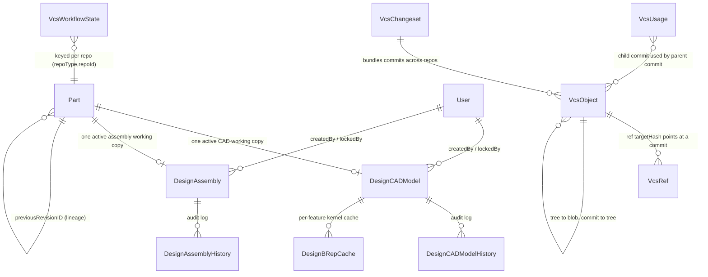

# Data Model — Working Copies, History, and the Object Store

> **System** ▸ [Overview](../00-overview.md) ▸ [Architecture](../50-architecture.md) ▸ **Data model**
> Related: [Architecture feature group](./00-overview.md) · [Unified VCS bindings](./unified-vcs-bindings.md) · [VCS subsystem](../30-vcs.md) · [Assembly subsystem](../40-assembly.md)

---

## Requirements

| REQ | Status | Summary |
|-----|--------|---------|
| 552 | unapproved | Each CAD model is associated with exactly one Part; creation against a missing part is rejected |
| 635 | unapproved | `DesignCADModel` persists an `equations` JSONB doc of shape `{ entries: Record<key, {expression, lastValue?, error?}> }` |
| 673 | unapproved | VCS refs scoped to a repository `(repoType, repoId)`: branches mutable, tags write-once |
| 688 | unapproved | One repository per part lineage; commit history continuous across part revisions |

### REQ 552 — CAD model ↔ Part linkage

- **Description:** Each CAD model shall be associated with exactly one Part record by a part identifier, and the system shall reject any attempt to create a CAD model against a part identifier that does not exist.
- **Rationale:** CAD models describe the geometry of a Part; orphaning them from the part record would lose the parametric link to the inventory item the geometry describes.
- **Verification:** `backend/tests/__tests__/design/cad-model-crud.test.js` asserts `partID` linkage, 404 on missing part, and 409 on a duplicate active revision; the `by-part` listing is scoped.
- **Validation:** A user opening a Part's CAD tab sees only CAD models that belong to that Part.

### REQ 635 — Equations document column

- **Description:** Each `DesignCADModel` shall persist an equations document as a JSONB column whose shape is `{ entries: Record<key, { expression, lastValue?, error? }> }` where keys are either bare global names (e.g. `"length"`) or target-path strings identifying a feature parameter (`feature.<id>.distance`, `feature.<id>.angle`, `feature.<id>.direction2.distance`, `feature.<id>.startCondition.distance`) or a sketch constraint (`sketch.<id>.constraint.<id>`).
- **Rationale:** Storing equations as a separate map keyed by target keeps existing feature/sketch types unchanged and avoids touching every consumer of those fields. Mirrors how SolidWorks separates equations from feature data.
- **Verification:** Backend test inserts a model with equations, reads it back, asserts shape preservation; migration test confirms the column exists and defaults to empty.
- **Validation:** Inspecting a saved model in the DB shows the equations column carrying user-entered expressions; opening the model restores them.

### REQ 673 — Repository-scoped refs

- **Description:** The version-control store shall provide named references scoped to a repository identified by `(repoType, repoId)`: branches, which are mutable pointers to a commit, and tags, which are write-once pointers to a commit.
- **Rationale:** Branches enable variant lines of development; write-once tags provide immutable release markers; per-repository scoping isolates each part's history.
- **Verification:** Unit test (`backend/tests/__tests__/vcs/vcs-service.test.js`): a branch advances, a tag is write-once, refs are isolated per repo.
- **Validation:** A user can create a variant branch and a permanent release tag on a model independently of other models.

---

## Succinct description

Two working-copy tables (`DesignCADModel`, `DesignAssembly`) hold the live, editable document and the same set of VCS columns; their durable history lives in a content-addressed object store (`VcsObject` + `VcsRef`), keyed by `(repoType, repoId)` so each part lineage owns exactly one continuous repository. Audit history, per-repo workflow state, a cross-repo changeset/usage seam, and a per-feature kernel cache round out the schema.

---

## How it works — for everyone (non-technical)

The database splits cleanly into three jobs.

1. **The desk** — two tables hold the *thing you're currently working on*: one for a single part's CAD model, one for an assembly. Each is a single editable copy, like the document open on your desk. It remembers which version line it's on, whether it has unsaved edits, and whether someone has it checked out.

2. **The filing cabinet** — when you "check in," your work becomes a permanent, never-changing snapshot stored by a fingerprint of its exact contents. Two identical snapshots share one slot (no waste). "Branches" are sticky notes you can move to point at any snapshot; "tags" are permanent labels (like a release number) that can never be re-stuck somewhere else.

3. **The logbook and caches** — separate tables record who changed what and when (the history log), what review stage each item is in (the workflow log), and a scratchpad of pre-computed 3D shapes so the system doesn't have to recompute geometry it already worked out.

The key idea: every revision of a part shares the *same* filing cabinet, so a part's whole story stays in one continuous place even as it gets renumbered over the years.

---

## How it works — in detail (technical)

### Entity relationships

### Working-copy tables

Both working copies carry an identical block of VCS columns — the structural payoff of the "written once" design.

**`DesignCADModel`** (`backend/models/design/designCADModel.js`, table `DesignCADModels`):

| Column | Type | Role |
|--------|------|------|
| `partID` | INTEGER, not null | FK to the Part this geometry describes (REQ 552) |
| `featureTree` | JSONB, not null | Ordered feature history |
| `sketchDoc` | JSONB, not null | All sketches |
| `equations` | JSONB, default `{ entries: {} }` | SolidWorks-style equations (REQ 635) |
| `branchName` | STRING, default `'main'` | Which version line the working copy is on |
| `baseCommitHash` | STRING(64), nullable | The commit the copy was checked out from |
| `dirty` | BOOLEAN, default false | Has uncommitted edits |
| `lockedByUserID` / `lockedAt` / `lockExpiresAt` | — | PDM-style exclusive checkout lock |
| `defaultView` | JSONB, nullable | Saved camera orientation (a view pref, not versioned content) |
| `releaseLocked` | BOOLEAN, default false | Read-only after a development release (distinct from the checkout lock and from `Parts.revisionLocked`) |
| `activeFlag` | BOOLEAN, default true | Soft delete |

A partial unique index `design_cad_models_part_unique_active` enforces **one active working copy per part** (`WHERE activeFlag = true`) — revisions are VCS tags, not extra rows.

**`DesignAssembly`** (`designAssembly.js`, table `DesignAssemblies`) mirrors this exactly, swapping the three CAD document columns for a single `assemblyDoc` JSONB (`{ nextInstanceSeq, nextMateSeq, nextPatternSeq?, nextDisplayStateSeq?, instances, mates, patterns?, explode?, displayStates? }`) and carrying the same `branchName` / `baseCommitHash` / `dirty` / lock / `defaultView` / `releaseLocked` / `activeFlag` block and the same partial unique index (`design_assemblies_part_unique_active`). Because an assembly is associated with a Part, it can itself nest and appear in BOMs (REQ 750).

### History tables

`DesignCADModelHistory` and `DesignAssemblyHistory` are append-only audit logs (`timestamps: false`, explicit `createdAt`). Each row records `changeType` (STRING(30)), `changedByUserID`, and `previousState` / `newState` JSONB snapshots, linked to its parent by `cadModelID` / `assemblyID`. These are the human-facing audit trail; the VCS object store is the geometry/document history.

> **Test-harness note:** any model with a Part/User FK using `onDelete: RESTRICT` must appear in `tablesToClean` (`backend/tests/setup.js`) *before* Part/User — `DesignCADModelHistory`, `DesignAssembly`, and friends sit at the top of that list.

### The content-addressed object store

`VcsObject` (`backend/models/vcs/vcsObject.js`, table `VcsObjects`) is the heart of the VCS. Its primary key is the triple **`(repoType, repoId, hash)`** — the same content stored twice occupies one row, and objects are immutable (`updatedAt: false`). `kind` is one of `blob` / `tree` / `commit` / `geometry` / `component` / `thumbnail`; JSON kinds use the `content` column, binary kinds (geometry, thumbnails) use `bytes`. The three core kinds (REQ 671) compose into a git-like graph: a commit references a tree, a tree references blobs.

`VcsRef` (`vcsRef.js`, table `VcsRefs`) holds the named pointers (REQ 673): `kind` is `branch` (mutable) or `tag` (write-once), scoped to `(repoType, repoId, name)` by a unique index. A branch's `targetHash` advances on check-in/release; a tag is created once and never moved.

Because `repoFor` resolves `repoId` to the **lineage-root part id** (walking `Part.previousRevisionID`), all of a part's revisions share one `(repoType, repoId)` repository — a single continuous history across renumbering (REQ 688). CAD and assembly use distinct `repoType` values (`'cad'` vs `'assembly'`) so they never collide on the same part.

### Per-repo and cross-repo support tables

- **`VcsWorkflowState`** (`vcsWorkflowState.js`) — generic review state for the declarative workflow engine (REQ 703), keyed per `(repoType, repoId)` where `repoId` is composed as `<lineageRootPartId>:<branchName>` (per-branch keying — each branch has its own state row); a missing row means the workflow's initial state. Any entity adopts a workflow without its own state column.
- **`VcsChangeset`** (`vcsChangeset.js`) — a reserved seam: groups commits made across multiple repos into one logical atomic check-in (e.g. a part edit plus the assembly that uses it). `commits` is a JSONB array of `{ repoType, repoId, commitHash }`.
- **`VcsUsage`** (`vcsUsage.js`) — a where-used reverse index: when an assembly commit references a child part's commit via a `component` object, a row records the edge so "revise this child → which assemblies use it?" is a single indexed lookup. Indexed on child and on parent.

### Geometry cache (CAD only)

`DesignBRepCache` (`designBrepCache.js`, table `DesignBRepCache`) is a per-feature BRep + tessellated-mesh cache keyed by the unique tuple `(cadModelID, featureID, paramHash, upstreamHash)`. It stores `brepBytes` (long BLOB) and `tessellatedFaces` (JSONB) plus a `namingVersion` for invalidation and a `lastAccessedAt` for eviction. This is a *performance* cache (regen reuses unchanged features without a kernel call); the durable geometry history lives as `geometry`-kind `VcsObject` rows frozen onto release commits.

---

## Key files

- `backend/models/design/designCADModel.js` — CAD working copy (`partID`, document JSONBs, VCS columns, active-unique index) → [module doc](./modules/designCADModel.md)
- `backend/models/design/designCADModelHistory.js` — CAD audit log → [module doc](./modules/designCADModelHistory.md)
- `backend/models/design/designAssembly.js` — assembly working copy (mirrors the CAD VCS columns) → [module doc](./modules/designAssembly.md)
- `backend/models/design/designAssemblyHistory.js` — assembly audit log → [module doc](./modules/designAssemblyHistory.md)
- `backend/models/design/designBrepCache.js` — per-feature kernel cache → [module doc](./modules/designBrepCache.md)
- `backend/models/vcs/vcsObject.js` — content-addressed object store (`(repoType, repoId, hash)` PK) → [module doc](./modules/vcsObject.md)
- `backend/models/vcs/vcsRef.js` — branches (mutable) + tags (write-once) → [module doc](./modules/vcsRef.md)
- `backend/models/vcs/vcsWorkflowState.js` — per-repo workflow state → [module doc](./modules/vcsWorkflowState.md)
- `backend/models/vcs/vcsChangeset.js` — cross-repo atomic-changeset seam → [module doc](./modules/vcsChangeset.md)
- `backend/models/vcs/vcsUsage.js` — where-used reverse index → [module doc](./modules/vcsUsage.md)
