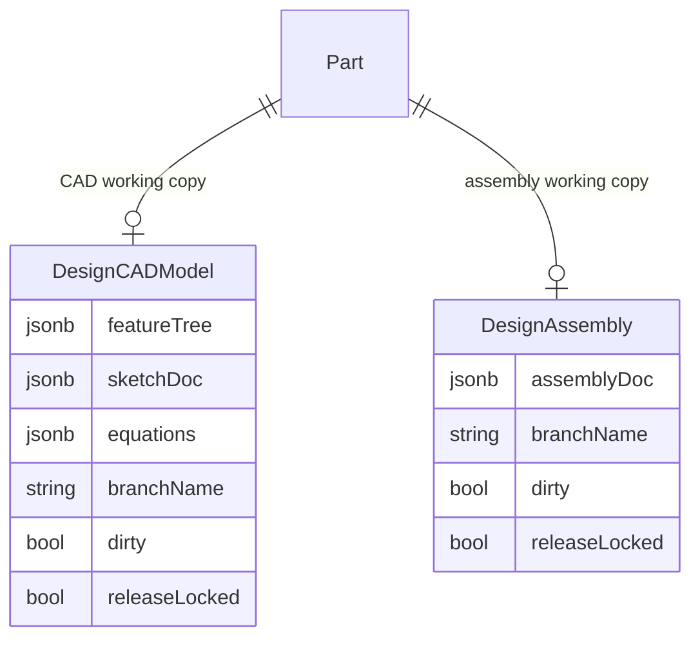

# DesignAssembly

> **System** ▸ [Overview](../../00-overview.md) ▸ [Architecture](../../50-architecture.md) ▸ [Data Model](../data-model.md) ▸ **DesignAssembly**
> Related: [designCADModel](./designCADModel.md) · [designAssemblyHistory](./designAssemblyHistory.md) · [vcsObject](./vcsObject.md) · [vcsRef](./vcsRef.md)

---

## Requirements

| REQ | Status | Summary |
|-----|--------|---------|
| 750 | unapproved | An assembly is associated with a Part so it can be nested and appear in BOMs |
| 751 | unapproved | A component instance references an existing part that has a CAD model or assembly |
| 677 | unapproved | Working copy binds to a branch, recording base commit hash and dirty flag |

### REQ 750 — Assembly as a Part

- **Description:** The CAD module shall provide an Assembly that positions multiple component instances together. An assembly shall be associated with a Part (so it can itself be nested and appear in bills of materials) and carry the full VCS working-copy state.
- **Rationale:** Assemblies are the container for multi-part design. Modeling an assembly as its own Part-associated entity means it can be nested inside another assembly and referenced by BOM items exactly like any other part.
- **Verification:** `backend/tests/__tests__/design/assembly-crud.test.js` covers create/read/update/soft-delete and history records.
- **Validation:** A user can create an assembly for a part and reopen it with its component instances intact.

---

## Succinct description

`DesignAssembly` is the editable working copy of an assembly document — the multi-part counterpart to `DesignCADModel`. It carries one `assemblyDoc` JSONB column instead of the three CAD document columns, but is otherwise structurally identical, including the full VCS lock/branch/dirty state block.

---

## How it works — for everyone (non-technical)

An assembly is a document that says "this product is made of these parts, positioned like this." This row is the live, editable version of that document — who's editing it right now, what branch it's on, and whether there are uncommitted changes. Because an assembly is also tied to a Part record, it can be placed inside another assembly (nesting), exactly like a sub-assembly in a real manufacturing context.

---

## How it works — in detail (technical)

**Source:** `backend/models/design/designAssembly.js`, table `DesignAssemblies`.

`DesignAssembly` mirrors `DesignCADModel` column-for-column on all VCS fields. The sole document-content difference is that the three CAD columns (`featureTree`, `sketchDoc`, `equations`) are replaced by a single `assemblyDoc` JSONB.

### Columns

| Column | Type | Constraints | Notes |
|--------|------|-------------|-------|
| `id` | INTEGER | PK, autoIncrement | |
| `name` | STRING(255) | nullable | Optional human label |
| `partID` | INTEGER | not null | FK → `Parts.id` |
| `assemblyDoc` | JSONB | not null | `{ nextInstanceSeq, nextMateSeq, instances: [...], mates: [...] }` |
| `branchName` | STRING(255) | not null, default `'main'` | Active branch name |
| `baseCommitHash` | STRING(64) | nullable | SHA-256 of the checked-out commit |
| `dirty` | BOOLEAN | not null, default false | Uncommitted edits present |
| `lockedByUserID` | INTEGER | nullable | FK → `Users.id` |
| `lockedAt` | DATE | nullable | |
| `lockExpiresAt` | DATE | nullable | |
| `defaultView` | JSONB | nullable | Saved camera orientation |
| `releaseLocked` | BOOLEAN | not null, default false | Read-only after a release |
| `createdByUserID` | INTEGER | not null | FK → `Users.id` |
| `activeFlag` | BOOLEAN | not null, default true | Soft delete |
| `createdAt` | DATE | not null | |
| `updatedAt` | DATE | not null | |

### `assemblyDoc` shape

```
{
  nextInstanceSeq: number,
  nextMateSeq: number,
  nextPatternSeq?: number,
  nextDisplayStateSeq?: number,
  instances: [
    {
      instanceId: string,
      partID: number,
      ref?: { kind: "cad" | "assembly" },
      pinnedCommitHash?: string | null,
      grounded?: boolean,
      placement: { translate: [x,y,z], quaternion: [x,y,z,w] },
      suppressed?: boolean,
      visible?: boolean
    }
  ],
  mates: Mate[],
  patterns?: AssemblyPattern[],
  explode?: { offsets: Record<instanceId, [x,y,z]>, factor: number },
  displayStates?: [{ id, name, hidden: instanceId[] }]
}
```

### Key index

| Name | Fields | Condition | Effect |
|------|--------|-----------|--------|
| `design_assemblies_part_unique_active` | `partID` | `WHERE activeFlag = true` | One active working copy per part |

### Associations

| Relation | Target | FK | Alias |
|----------|--------|----|-------|
| belongsTo | `Part` | `partID` | `part` |
| belongsTo | `User` | `createdByUserID` | `createdBy` |
| belongsTo | `User` | `lockedByUserID` | `lockedBy` |
| hasMany | `DesignAssemblyHistory` | `assemblyID` | `history` |

### Structural parity with DesignCADModel



The VCS binding (`assemblyVcsService.js`) supplies `repoType = 'assembly'` and `docOf(model) = model.assemblyDoc`; all checkout/checkin/branch/release logic is shared with the CAD path via the same factory functions.

---

## Key files

- `backend/models/design/designAssembly.js` — model definition
- `backend/api/design/assembly/controller.js` — CRUD + VCS operations
- `backend/services/vcs/assemblyVcsService.js` — VCS binding
- `backend/services/vcs/assemblySerializer.js` — serialize/deserialize assemblyDoc
- `backend/tests/__tests__/design/assembly-crud.test.js` — integration tests
