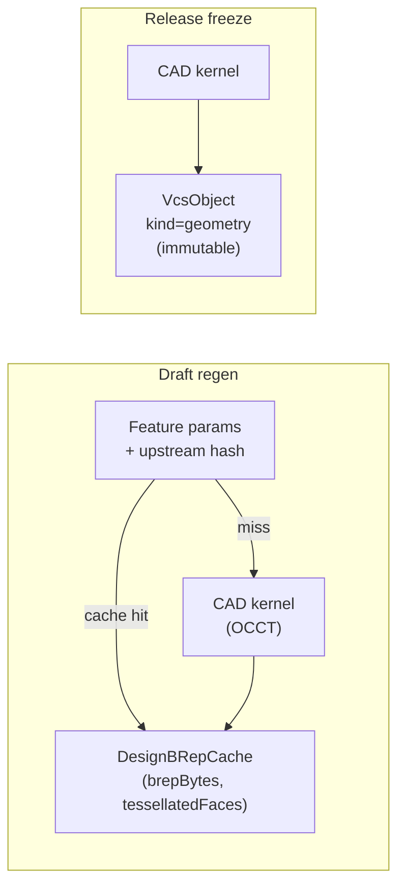

# DesignBRepCache

> **System** ▸ [Overview](../../00-overview.md) ▸ [Architecture](../../50-architecture.md) ▸ [Data Model](../data-model.md) ▸ **DesignBRepCache**
> Related: [designCADModel](./designCADModel.md) · [vcsObject](./vcsObject.md)

---

## Requirements

| REQ | Status | Summary |
|-----|--------|---------|
| 684 | unapproved | On release, regenerate and store each body's BRep + mesh as immutable content-addressed objects |
| 685 | unapproved | Checking out a released commit loads frozen geometry without a kernel call |

This cache serves REQ 685's performance goal during draft regeneration. Released geometry uses `VcsObject` rows (kind `geometry`) rather than this cache. The broader regen pipeline is governed by [VCS subsystem](../../30-vcs.md).

---

## Succinct description

`DesignBRepCache` is a mutable, evictable per-feature kernel-output cache: given a feature and its upstream context, it stores the BRep bytes and tessellated face mesh so the regenerator can skip unchanged features on the next regen pass.

---

## How it works — for everyone (non-technical)

Computing a 3D solid from a feature recipe takes real time. If you change one feature near the top of a 20-feature model, the system only has to recompute the features that depend on the changed one — it can reuse the cached results for everything else. This table is that reuse cache: keyed by what the feature looks like and what came before it, it stores the already-computed 3D output so the same result can be loaded instantly instead of recomputed.

---

## How it works — in detail (technical)

**Source:** `backend/models/design/designBrepCache.js`, table `DesignBRepCache`.

`timestamps: false` — `createdAt` and `lastAccessedAt` are managed explicitly by the application.

### Cache key

The unique constraint on `(cadModelID, featureID, paramHash, upstreamHash)` defines the four-part cache key:

| Key part | Meaning |
|----------|---------|
| `cadModelID` | The working copy owning this cache entry |
| `featureID` | The feature being cached (string id, e.g. `extrude-abc123`) |
| `paramHash` | SHA-256 of the feature's own parameters |
| `upstreamHash` | SHA-256 of the cumulative body state from all preceding features |

A cache hit requires all four to match. Changing any upstream feature changes `upstreamHash` and invalidates all downstream entries, exactly like a dependency graph.

### Columns

| Column | Type | Constraints | Notes |
|--------|------|-------------|-------|
| `id` | INTEGER | PK, autoIncrement | |
| `cadModelID` | INTEGER | not null | FK → `DesignCADModels.id` |
| `featureID` | STRING(64) | not null | Feature id within the document |
| `paramHash` | STRING(64) | not null | Hash of feature parameters |
| `upstreamHash` | STRING(64) | not null, default `''` | Hash of upstream body state |
| `brepBytes` | BLOB (long) | not null | Binary BRep from the kernel |
| `tessellatedFaces` | JSONB | not null | Mesh: `[{ vertices, indices, normals, persistentName }]` |
| `namingVersion` | INTEGER | not null, default 1 | Incremented when the face-naming scheme changes; mismatched rows are ignored |
| `createdAt` | DATE | not null | First population timestamp |
| `lastAccessedAt` | DATE | not null | Updated on every cache hit (for eviction) |

### Indexes

| Name | Fields | Unique | Notes |
|------|--------|--------|-------|
| `design_brep_cache_key_unique` | `(cadModelID, featureID, paramHash, upstreamHash)` | yes | Cache key lookup + dedup guard |
| *(unnamed)* | `lastAccessedAt` | no | LRU eviction scan |

### Associations

| Relation | Target | FK | Alias |
|----------|--------|----|-------|
| belongsTo | `DesignCADModel` | `cadModelID` | `cadModel` |

### Relationship to frozen geometry

This cache is a **performance optimisation for draft regeneration** only. Released-revision geometry is stored permanently as `VcsObject` rows (kind `geometry`) on the release commit; those objects are immutable and content-addressed. `DesignBRepCache` rows can be safely deleted at any time (next regen will rebuild them) — they are not part of the durable record.

---

## Key files

- `backend/models/design/designBrepCache.js` — model definition
- `backend/migrations/20260515000000-create-design-brep-cache.js` — migration with full design notes
- `backend/services/cadRegenService.js` — cache lookup and population during regen
- `backend/services/vcs/cadFreezeService.js` — release freeze (writes to `VcsObject`, not this table)
