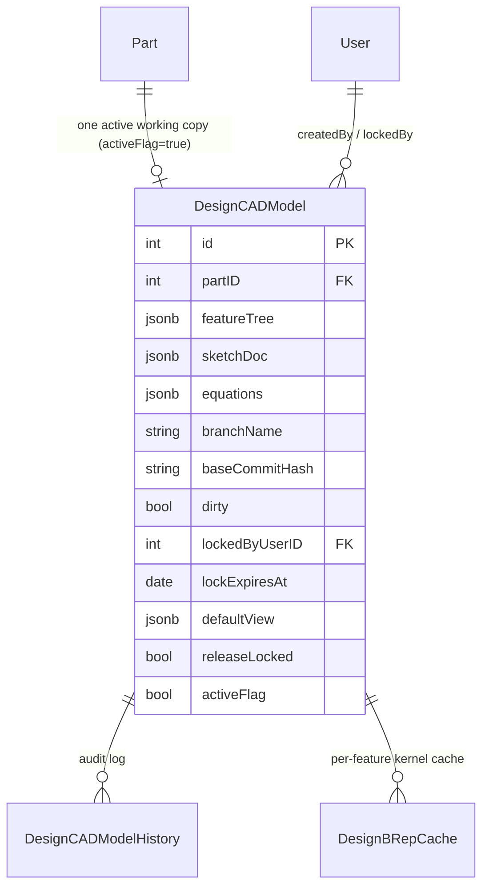

# DesignCADModel

> **System** ▸ [Overview](../../00-overview.md) ▸ [Architecture](../../50-architecture.md) ▸ [Data Model](../data-model.md) ▸ **DesignCADModel**
> Related: [designCADModelHistory](./designCADModelHistory.md) · [designBrepCache](./designBrepCache.md) · [vcsObject](./vcsObject.md) · [vcsRef](./vcsRef.md)

---

## Requirements

| REQ | Status | Summary |
|-----|--------|---------|
| 552 | unapproved | Each CAD model is associated with exactly one Part; creation against a missing part is rejected |
| 635 | unapproved | `DesignCADModel` persists an `equations` JSONB doc keyed by global names or target paths |
| 677 | unapproved | Working copy binds to a branch, recording base commit hash and dirty flag |
| 678 | unapproved | Checkout acquires an exclusive lock; concurrent checkouts are rejected with HTTP 423 |
| 715 | unapproved | Release requires dirty=false and a base commit |
| 718 | unapproved | Development release sets the design and Part revision read-only |

### REQ 552 — CAD model ↔ Part linkage

- **Description:** Each CAD model shall be associated with exactly one Part record by a part identifier, and the system shall reject any attempt to create a CAD model against a part identifier that does not exist.
- **Rationale:** CAD models describe the geometry of a Part; orphaning them from the part record would lose the parametric link to the inventory item the geometry describes.
- **Verification:** `backend/tests/__tests__/design/cad-model-crud.test.js` asserts `partID` linkage, 404 on missing part, and 409 on a duplicate active revision.
- **Validation:** A user opening a Part's CAD tab sees only CAD models that belong to that Part.

### REQ 635 — Equations document column

- **Description:** Each `DesignCADModel` shall persist an equations document as a JSONB column whose shape is `{ entries: Record<key, { expression, lastValue?, error? }> }` where keys are either bare global names or target-path strings (`feature.<id>.distance`, `sketch.<id>.constraint.<id>`, etc.).
- **Rationale:** Storing equations as a separate map keyed by target keeps existing feature/sketch types unchanged and avoids touching every consumer of those fields. Mirrors how SolidWorks separates equations from feature data.
- **Verification:** Backend test inserts a model with equations, reads it back, asserts shape preservation.
- **Validation:** Inspecting a saved model in the DB shows the equations column carrying user-entered expressions; opening the model in the editor restores them.

---

## Succinct description

`DesignCADModel` is the editable working copy of one part's CAD geometry — the "open document" row. It carries the parametric design (feature tree, sketches, equations) plus a block of VCS columns that record which branch the copy is on, its last committed state, the current edit lock, and its release-lock status.

---

## How it works — for everyone (non-technical)

Think of this row as the document sitting on your desk right now. It knows what the part looks like (the feature tree and sketches), whether you've made changes since your last save (the dirty flag), and whether someone else has the file checked out so you can't edit it (the lock fields). When you release a version, the row gets a "read-only" mark so nobody accidentally edits the released design; to make changes you open a new revision — which creates a fresh row.

---

## How it works — in detail (technical)

**Source:** `backend/models/design/designCADModel.js`, table `DesignCADModels`.

### Columns

| Column | Type | Constraints | Notes |
|--------|------|-------------|-------|
| `id` | INTEGER | PK, autoIncrement | |
| `name` | STRING(255) | nullable | Optional human label |
| `partID` | INTEGER | not null | FK → `Parts.id` (REQ 552) |
| `featureTree` | JSONB | not null | Ordered list of features (Origin, Extrude, Fillet, …) |
| `sketchDoc` | JSONB | not null | All sketches keyed by id |
| `equations` | JSONB | not null, default `{ entries: {} }` | SolidWorks-style equations (REQ 635) |
| `branchName` | STRING(255) | not null, default `'main'` | Active branch name |
| `baseCommitHash` | STRING(64) | nullable | SHA-256 of the commit checked out from |
| `dirty` | BOOLEAN | not null, default false | True when working copy differs from `baseCommitHash` |
| `lockedByUserID` | INTEGER | nullable | FK → `Users.id` — current lock holder |
| `lockedAt` | DATE | nullable | When the lock was acquired |
| `lockExpiresAt` | DATE | nullable | Absolute expiry; sweeper clears stale locks |
| `defaultView` | JSONB | nullable | Saved camera state `{ theta, phi, distance, target:[x,y,z] }` — not versioned |
| `releaseLocked` | BOOLEAN | not null, default false | True after a dev release; edits require a new revision (REQ 718) |
| `createdByUserID` | INTEGER | not null | FK → `Users.id` |
| `activeFlag` | BOOLEAN | not null, default true | Soft delete |
| `createdAt` | DATE | not null | |
| `updatedAt` | DATE | not null | |

### Key index

| Name | Fields | Condition | Effect |
|------|--------|-----------|--------|
| `design_cad_models_part_unique_active` | `partID` | `WHERE activeFlag = true` | One active working copy per part; revisions are VCS tags, not extra rows |

### Associations

| Relation | Target | FK | Alias |
|----------|--------|----|-------|
| belongsTo | `Part` | `partID` | `part` |
| belongsTo | `User` | `createdByUserID` | `createdBy` |
| belongsTo | `User` | `lockedByUserID` | `lockedBy` |
| hasMany | `DesignCADModelHistory` | `cadModelID` | `history` |

### Data shape diagram

### Lock lifecycle

Three lock-related columns operate together: `lockedByUserID` / `lockedAt` / `lockExpiresAt`. Checkout sets all three; check-in or an explicit undo-checkout clears them. A background sweeper (`sweepExpiredLocks`) nulls the columns when `lockExpiresAt` is in the past. An admin force-release can clear them at any time (REQ 679). While locked, update/checkin calls from any other user receive HTTP 423. `releaseLocked` is a separate, permanent flag set by `dev-release` and only cleared when a new revision row is created.

---

## Key files

- `backend/models/design/designCADModel.js` — the model definition
- `backend/api/design/cad-model/controller.js` — CRUD + checkout/checkin/lock/release handlers
- `backend/services/vcs/cadVcsService.js` — VCS binding (docOf, serialize, repoFor)
- `backend/tests/__tests__/design/cad-model-crud.test.js` — integration tests
