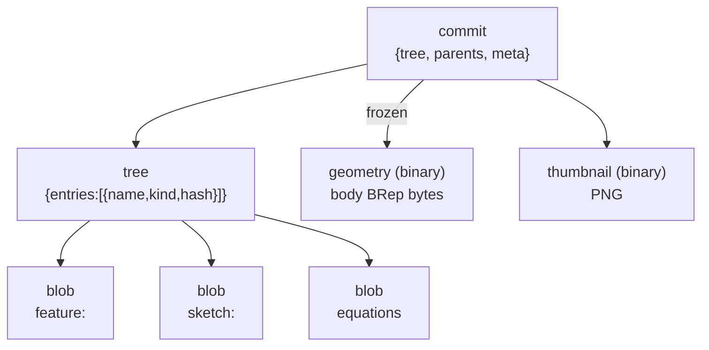

# VcsObject

> **System** ▸ [Overview](../../00-overview.md) ▸ [Architecture](../../50-architecture.md) ▸ [Data Model](../data-model.md) ▸ **VcsObject**
> Related: [vcsRef](./vcsRef.md) · [vcsUsage](./vcsUsage.md) · [vcsChangeset](./vcsChangeset.md) · [VCS subsystem](../../30-vcs.md)

---

## Requirements

| REQ | Status | Summary |
|-----|--------|---------|
| 668 | unapproved | Version history in a content-addressed store with commits, branches, tags, and immutable snapshots |
| 669 | unapproved | Every object identified by SHA-256 of its canonical content; identical content stored once |
| 671 | unapproved | Three core object kinds: blob, tree, commit; compose into a git-like graph |
| 675 | unapproved | Binary objects (frozen geometry) addressed by hash of byte content, deduplicated identically |
| 676 | unapproved | Component object kind references another repository's commit for assembly composition |

### REQ 669 — Content addressing

- **Description:** The version-control store shall identify every stored object by a SHA-256 hash of its canonical serialized content, and shall store at most one copy of any object whose content hash already exists (deduplication by content).
- **Rationale:** Content addressing gives immutable, tamper-evident identity and O(changes) storage via structural sharing of unchanged content.
- **Verification:** Unit test: identical content stores one row + same hash regardless of key order; different content yields distinct hashes.
- **Validation:** Editing one feature and re-committing a model does not duplicate the unchanged features in storage.

### REQ 671 — Core object kinds

- **Description:** The version-control store shall represent model state using three core object kinds: blob (a leaf content unit), tree (an ordered set of named references to child objects), and commit (a snapshot of a tree with parents, author, message, timestamp, and version metadata).
- **Rationale:** Mirrors git's proven object model; per-unit blobs plus trees enable fine-grained diff and structural sharing.
- **Verification:** Unit test: write/read round-trip for blob, tree, and commit preserves content and entry order.
- **Validation:** The history of a model can be reconstructed from its stored blob/tree/commit objects.

---

## Succinct description

`VcsObject` is the content-addressed, immutable object store at the heart of the VCS — every feature blob, tree snapshot, commit, geometry binary, component reference, and thumbnail is a row here, identified by SHA-256 of its content.

---

## How it works — for everyone (non-technical)

Every time you save a version of a CAD model or assembly, the system breaks the document into small pieces and gives each piece a fingerprint (a hash of its content). Two identical pieces — say, two features with the same geometry — share one storage slot. Pieces are never changed once written; a "new version" adds new pieces that reference old unchanged ones. This means the complete history of a model is stored efficiently, with no wasted space for parts that didn't change.

---

## How it works — in detail (technical)

**Source:** `backend/models/vcs/vcsObject.js`, table `VcsObjects`.

`updatedAt: false` — objects are immutable once written. Only `createdAt` is recorded.

### Primary key

The PK is the composite triple **`(repoType, repoId, hash)`**:

- `repoType` — string namespace (`'cad'` or `'assembly'`); CAD and assembly for the same part never share object rows.
- `repoId` — the lineage-root part id (as a string); all revisions of one part share one repository.
- `hash` — SHA-256 hex of `kind + canonical-json(content)` for JSON kinds, or SHA-256 of raw bytes for binary kinds.

A write is idempotent: `findOrCreate` on the PK — if the hash already exists for this repo the row is returned without error.

### Columns

| Column | Type | Constraints | Notes |
|--------|------|-------------|-------|
| `repoType` | STRING(32) | PK, not null | `'cad'` or `'assembly'` |
| `repoId` | STRING(64) | PK, not null | Lineage-root part id |
| `hash` | STRING(64) | PK, not null | SHA-256 hex |
| `kind` | STRING(16) | not null | One of `blob`, `tree`, `commit`, `geometry`, `component`, `thumbnail` |
| `content` | JSONB | nullable | Set for JSON kinds (blob/tree/commit/component) |
| `bytes` | BLOB | nullable | Set for binary kinds (geometry/thumbnail) |
| `size` | INTEGER | not null, default 0 | Byte length of content/bytes for storage accounting |
| `createdAt` | DATE | not null | |

Exactly one of `content` or `bytes` is non-null per row.

### Object kinds and their content shapes

| Kind | Storage | Content shape |
|------|---------|---------------|
| `blob` | JSON | arbitrary leaf content — one feature or sketch document |
| `tree` | JSON | `{ entries: [{ name, kind, hash }] }` — ordered named children |
| `commit` | JSON | `{ tree, parents: [], author, message, timestamp, meta: { kernelVersion, namingVersion } }` |
| `geometry` | binary | BRep bytes from the kernel (one body per object) |
| `component` | JSON | `{ repoType, repoId, commitHash | revisionRule }` — assembly child reference (REQ 676) |
| `thumbnail` | binary | Low-res PNG raster captured on check-in (REQ 710) |

### Canonical JSON

The hash depends on `canonicalJson(content)` — keys sorted recursively, numbers normalised. Implemented in `backend/services/vcs/canonicalJson.js`. Non-canonical serialization would break deduplication and diff (REQ 670).

### Object graph

### Repository scoping

`repoFor(model, db)` in `cadVcsService.js` / `assemblyVcsService.js` walks `Part.previousRevisionID` to the lineage root. All revisions of one part thus share `repoId`, giving a single continuous history (REQ 688). The `repoType` discriminator prevents CAD and assembly objects from colliding on the same part.

---

## Key files

- `backend/models/vcs/vcsObject.js` — model definition
- `backend/services/vcs/vcsService.js` — `writeObject`, `readObject`, `writeTree`, `readCommit`
- `backend/services/vcs/canonicalJson.js` — deterministic JSON serialisation (REQ 670)
- `backend/tests/__tests__/vcs/vcs-service.test.js` — unit tests for object store
- `backend/tests/__tests__/vcs/canonical-json.test.js` — canonical serialisation tests
