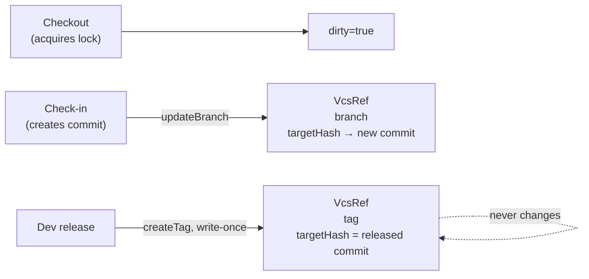

# VcsRef

> **System** ▸ [Overview](../../00-overview.md) ▸ [Architecture](../../50-architecture.md) ▸ [Data Model](../data-model.md) ▸ **VcsRef**
> Related: [vcsObject](./vcsObject.md) · [vcsWorkflowState](./vcsWorkflowState.md) · [VCS subsystem](../../30-vcs.md)

---

## Requirements

| REQ | Status | Summary |
|-----|--------|---------|
| 673 | unapproved | Named references scoped to `(repoType, repoId)`: branches mutable, tags write-once |
| 686 | unapproved | Releasing tags the commit with the Part's revision identifier (write-once tag) |
| 692 | unapproved | Create a named variant branch pointing at a chosen commit |
| 695 | unapproved | Archive (remove) a branch reference; main and current branch are protected |

### REQ 673 — Repository-scoped refs

- **Description:** The version-control store shall provide named references scoped to a repository identified by `(repoType, repoId)`: branches, which are mutable pointers to a commit, and tags, which are write-once pointers to a commit.
- **Rationale:** Branches enable variant lines of development; write-once tags provide immutable release markers; per-repository scoping isolates each part's history.
- **Verification:** Unit test (`backend/tests/__tests__/vcs/vcs-service.test.js`): branch advances, tag is write-once, refs isolated per repo.
- **Validation:** A user can create a variant branch and a permanent release tag on a model independently of other models.

---

## Succinct description

`VcsRef` holds the named pointers into the commit graph — branches (which advance as work is committed or released) and tags (which are set once at release time and never moved).

---

## How it works — for everyone (non-technical)

A commit is like a photograph in an archive — immutable and identified by its serial number. A "ref" is a sticky label you put on a photograph: "this is the current draft" or "this is revision 01." Branch labels move as new work is committed; release labels are permanent. This table stores all those labels, one row each.

---

## How it works — in detail (technical)

**Source:** `backend/models/vcs/vcsRef.js`, table `VcsRefs`.

### Columns

| Column | Type | Constraints | Notes |
|--------|------|-------------|-------|
| `id` | INTEGER | PK, autoIncrement | |
| `repoType` | STRING(32) | not null | `'cad'` or `'assembly'` |
| `repoId` | STRING(64) | not null | Lineage-root part id |
| `name` | STRING(255) | not null | Ref name: `'main'`, `'draft/01'`, `'release 01'`, `'A'`, etc. |
| `kind` | STRING(8) | not null | `'branch'` or `'tag'` |
| `targetHash` | STRING(64) | not null | SHA-256 of the commit this ref points at |
| `updatedByUserID` | INTEGER | nullable | FK → `Users.id` — last updater |
| `createdAt` | DATE | not null | |
| `updatedAt` | DATE | not null | |

### Key index

| Name | Fields | Unique | Effect |
|------|--------|--------|--------|
| `vcs_refs_repo_name_unique` | `(repoType, repoId, name)` | yes | One ref per name per repo; prevents name collisions |

### Branch vs tag enforcement

The application layer enforces write-once on tags: `vcsService.updateRef` checks the existing row's `kind` and rejects an update if `kind === 'tag'`. No DB-level constraint enforces this — the service layer is the gate.

### Naming conventions in use

| Pattern | Kind | Set when |
|---------|------|----------|
| `main` | branch | Always present (seeded on model creation) |
| `draft/NN` | branch | Auto-created on model creation; also user-created via branch API |
| `release NN` | tag | Dev release (numeric, e.g. `release 01`) |
| `A`, `B`, … | tag | Production release (letter rev) |

### Main-branch protection

The service layer (`vcsBranchOps.js`) rejects archive/delete of `main` and of the working copy's current branch. The `DesignCADModel.branchName` column records the current branch so the guard can check it.

---

## Key files

- `backend/models/vcs/vcsRef.js` — model definition
- `backend/services/vcs/vcsService.js` — `updateRef`, `createTag`, `getRef`, `listRefs`
- `backend/services/vcs/vcsBranchOps.js` — branch create/switch/archive with protection guards
- `backend/tests/__tests__/vcs/vcs-service.test.js` — ref unit tests
