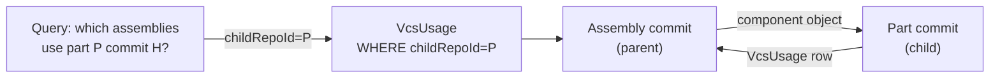

# VcsUsage

> **System** ▸ [Overview](../../00-overview.md) ▸ [Architecture](../../50-architecture.md) ▸ [Data Model](../data-model.md) ▸ **VcsUsage**
> Related: [vcsObject](./vcsObject.md) · [vcsChangeset](./vcsChangeset.md) · [designAssembly](./designAssembly.md) · [VCS subsystem](../../30-vcs.md)

---

## Requirements

| REQ | Status | Summary |
|-----|--------|---------|
| 676 | unapproved | Component object kind references another repository's commit; where-used tracking supported |

### REQ 676 — Component references and where-used index

- **Description:** The version-control store shall support a component object kind whose content references another repository's commit — either a pinned commit hash or a symbolic revision rule — so that an assembly model can record exactly which version of each child part it was composed from, and so that the store can answer "which assemblies use this part commit?" via a reverse index.
- **Rationale:** Assemblies compose versioned child parts; modeling the component reference now (the storage seam) avoids an object-model migration when the assembly editor lands.
- **Verification:** Unit test: a tree containing a component entry round-trips and records the child repo + pinned/symbolic ref; a `VcsUsage` row records the reverse edge.
- **Validation:** An assembly snapshot records exactly which version of each child part it was composed from.

---

## Succinct description

`VcsUsage` is a where-used reverse-edge index: when an assembly commit includes a child part's commit, a row here records the `(childRepo → parentCommit)` link so impact analysis ("which assemblies use this part?") is a single indexed lookup rather than a full object-store scan.

---

## How it works — for everyone (non-technical)

When you build an assembly, you pick specific versions of each part to include. The normal VCS objects record that forward direction: "assembly commit X uses part commit Y." This table records the reverse: "part commit Y is used by assembly commit X." Without this reverse index, asking "if I change this part, which assemblies reference it?" would require reading every assembly commit ever stored. With the index, it is a single database query.

---

## How it works — in detail (technical)

**Source:** `backend/models/vcs/vcsUsage.js`, table `VcsUsages`.

`updatedAt: false` — rows are written once when the assembly commit is created and never updated.

### Columns

| Column | Type | Constraints | Notes |
|--------|------|-------------|-------|
| `id` | INTEGER | PK, autoIncrement | |
| `childRepoType` | STRING(32) | not null | `repoType` of the referenced (child) repository |
| `childRepoId` | STRING(64) | not null | `repoId` of the child repository |
| `parentRepoType` | STRING(32) | not null | `repoType` of the referencing (parent) assembly |
| `parentRepoId` | STRING(64) | not null | `repoId` of the parent assembly |
| `parentCommitHash` | STRING(64) | not null | The assembly commit that contains the reference |
| `instanceId` | STRING(128) | nullable | The `instanceId` within the assembly doc, for tracing back to the specific instance |
| `createdAt` | DATE | not null | |

### Indexes

| Name | Fields | Purpose |
|------|--------|---------|
| `vcs_usages_child_idx` | `(childRepoType, childRepoId)` | Forward impact lookup: "all assemblies that reference this child part" |
| `vcs_usages_parent_idx` | `(parentRepoType, parentRepoId, parentCommitHash)` | Reverse lookup: "all children used by this specific assembly commit" |

### Write pattern

When `assemblySerializer.js` writes an assembly commit containing `component` objects, it also writes one `VcsUsage` row per child component:

```
for each instance in assemblyDoc.instances:
  VcsUsage.create({
    childRepoType: instance.ref.repoType,
    childRepoId:   instance.ref.repoId,
    parentRepoType: 'assembly',
    parentRepoId:   parentRepoId,
    parentCommitHash: newCommitHash,
    instanceId: instance.instanceId,
  })
```

Old rows for prior commits are not removed — the index accumulates the full history of where-used relationships.

### Current status

The table is created and the model is loaded. `VcsUsage` rows are written when assembly commits contain `component` objects. Impact-analysis queries (e.g. "show me all assemblies affected if I release a new version of this part") can use `childRepoType + childRepoId` as the lookup key.



---

## Key files

- `backend/models/vcs/vcsUsage.js` — model definition
- `backend/services/vcs/assemblySerializer.js` — writes `VcsUsage` rows on assembly commit
- `backend/services/vcs/vcsService.js` — `writeObject` for `component` kind objects
