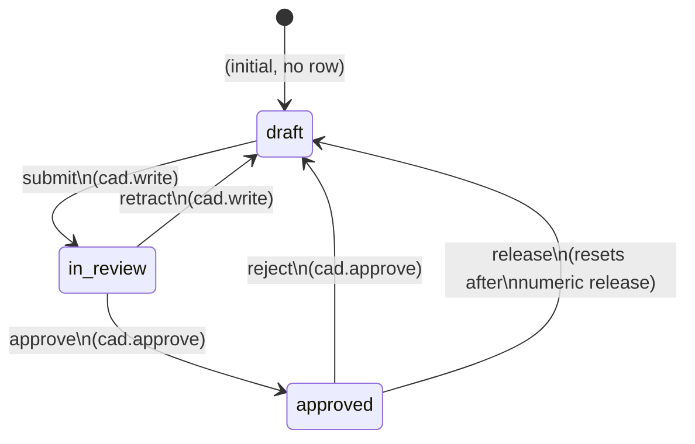

# VcsWorkflowState

> **System** ▸ [Overview](../../00-overview.md) ▸ [Architecture](../../50-architecture.md) ▸ [Data Model](../data-model.md) ▸ **VcsWorkflowState**
> Related: [vcsRef](./vcsRef.md) · [vcsObject](./vcsObject.md) · [VCS subsystem](../../30-vcs.md)

---

## Requirements

| REQ | Status | Summary |
|-----|--------|---------|
| 703 | unapproved | Generic, declarative workflow engine; current state stored per repository |
| 704 | unapproved | CAD model follows draft → in_review → approved workflow |
| 739 | unapproved | Workflow state tracked per branch (lineage root + branch name) |

### REQ 703 — Generic per-repo workflow state

- **Description:** The system shall provide a generic, declarative workflow engine that drives permission-guarded state transitions defined per repository type, with the current workflow state stored per repository.
- **Rationale:** A reusable declarative engine replaces ad-hoc per-entity state columns and can later govern parts/harness/requirements by adding a transition table — without touching entity models.
- **Verification:** Unit test: declarative transition table drives state changes; state persists per repo, defaults to initial. `backend/tests/__tests__/vcs/cad-workflow.test.js`.
- **Validation:** Workflow behaviour is defined in one declarative place and reused across entities.

### REQ 739 — Per-branch workflow state

- **Description:** CAD review workflow state shall be tracked per branch (keyed by lineage root and branch name) so multiple draft branches may be in review concurrently and main keeps its own production-approval cycle.
- **Rationale:** Per-branch state lets several drafts progress independently and separates branch review from the main production gate.
- **Verification:** `backend/tests/__tests__/vcs/cad-workflow-routes.test.js` and `cad-release-workflow.test.js`.
- **Validation:** Two draft branches can each be in review at the same time without interfering.

---

## Succinct description

`VcsWorkflowState` stores one row per `(repoType, repoId)` recording the current review-lifecycle state for that repository; a missing row means the workflow is in its initial state. The `workflowEngine` service uses this table to drive declarative, permission-guarded state transitions without adding a state column to every entity model.

---

## How it works — for everyone (non-technical)

A design goes through a review process before it can be released: it starts as a draft, gets submitted for review, then gets approved. Instead of adding a "review state" column to every type of document in the system, the system stores the state here in one generic table, keyed by the document's repository identity. Any type of document can have a review lifecycle just by registering a transition table — no schema change needed.

---

## How it works — in detail (technical)

**Source:** `backend/models/vcs/vcsWorkflowState.js`, table `VcsWorkflowStates`.

`createdAt: false` — only `updatedAt` is recorded (the time the state was last changed).

### Columns

| Column | Type | Constraints | Notes |
|--------|------|-------------|-------|
| `repoType` | STRING(32) | PK, not null | `'cad'` or `'assembly'` |
| `repoId` | STRING(64) | PK, not null | Repository key — see below |
| `state` | STRING(32) | not null | Current workflow state string |
| `updatedByUserID` | INTEGER | nullable | FK → `Users.id` — who last transitioned |
| `updatedAt` | DATE | not null | Timestamp of last transition |

### Primary key and per-branch keying

The PK `(repoType, repoId)` is **free-form** — the application composes `repoId` as `"<lineageRootPartId>:<branchName>"` for CAD models (REQ 739). Examples:

| Document | repoType | repoId |
|----------|----------|--------|
| Part 42, branch `main` | `cad` | `42:main` |
| Part 42, branch `draft/01` | `cad` | `42:draft/01` |
| Assembly for Part 99 | `assembly` | `99:main` |

This means each branch has its own state row. Multiple draft branches can be independently `in_review` at the same time. The `main` branch tracks the production-approval state separately.

**Footgun:** any code calling `workflowEngine.getState/setState/transition` with the bare lineage-root `repoId` (without `:branchName`) would operate on a stale or wrong row. `workflowRepo(model)` in the controller composes the correct key.

### Absence-means-initial semantics

If no row exists for a `(repoType, repoId)`, `workflowEngine.getState()` returns the initial state (`'draft'`). This means newly created models start in `draft` with zero DB writes.

### Workflow transition diagram (CAD)

---

## Key files

- `backend/models/vcs/vcsWorkflowState.js` — model definition
- `backend/services/vcs/workflowEngine.js` — declarative transition engine; `WORKFLOWS` registry
- `backend/api/design/cad-model/controller.js` — `workflowRepo(model)` key composer
- `backend/tests/__tests__/vcs/cad-workflow.test.js` — workflow unit tests
- `backend/tests/__tests__/vcs/cad-workflow-routes.test.js` — per-branch workflow integration tests
