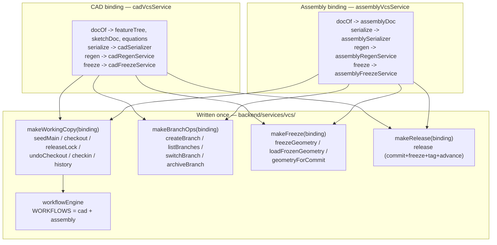
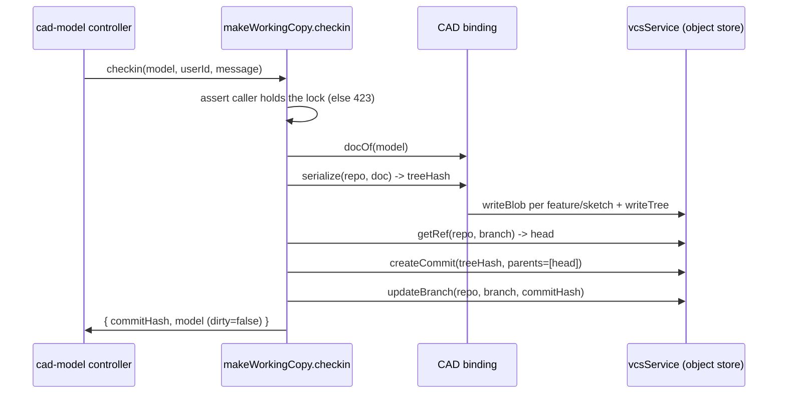

# Unified VCS Bindings — Written Once for CAD and Assembly

> **System** ▸ [Overview](../00-overview.md) ▸ [Architecture](../50-architecture.md) ▸ **Unified VCS bindings**
> Related: [Architecture feature group](./00-overview.md) · [Data model](./data-model.md) · [VCS subsystem](../30-vcs.md) · [Assembly subsystem](../40-assembly.md)

---

## Requirements

| REQ | Status | Summary |
|-----|--------|---------|
| 703 | unapproved | Generic declarative workflow engine driving permission-guarded transitions per repo type, state stored per repo |

(Many other VCS requirements — checkout/check-in 677–681, branches 692–695, freeze 684–685, release 715–722, diff 699–701 — are *implemented through* the factories described here. The defining requirement for the binding/factory pattern as a structural choice is REQ 703, which the unified workflow engine satisfies.)

### REQ 703 — Generic workflow engine

- **Description:** The system shall provide a generic, declarative workflow engine that drives permission-guarded state transitions defined per repository type, with the current workflow state stored per repository.
- **Rationale:** A reusable declarative engine replaces ad-hoc per-entity state columns and can later govern parts/harness/requirements by adding a transition table — not just CAD.
- **Verification:** Unit test: declarative transition table drives state changes; state persists per repo, defaults to initial. `backend/tests/__tests__/vcs/cad-workflow.test.js`.
- **Validation:** Workflow behaviour is defined in one declarative place and reused across entities.

---

## Succinct description

The version-control engine is a set of factory functions — `makeWorkingCopy`, `makeBranchOps`, `makeFreeze`, `makeRelease` — each taking a small *binding* object and returning the operations for one document type. CAD and assembly supply bindings that differ only in how a document is serialized, deserialized, applied back, regenerated, and frozen; checkout, branching, diff, release, and workflow therefore exist exactly once.

---

## How it works — for everyone (non-technical)

Think of a coffee machine that can make either espresso or tea. The machine itself — the heating element, the pump, the buttons, the timer — is one device. To switch drinks you swap in a small *pod*: the pod says "this is how much water, this is the grind, this is the temperature." The machine doesn't change; only the pod does.

Here the "machine" is version control: it knows how to lock a document for editing, save a snapshot, make a branch, compare two snapshots, and freeze a finished design. The "pods" are tiny descriptions called *bindings*. The CAD pod says "my document is a feature tree plus sketches plus equations, and here's how I turn it into 3D." The assembly pod says "my document is a list of components and mates, and here's how I turn it into 3D." Everything else — the locking, branching, comparing, freezing, releasing, and the review process — is the same machine, written and tested one time. Add a feature to the machine and both drinks get it instantly.

---

## How it works — in detail (technical)

### The binding contract

A *binding* is a plain object of functions that answer the document-specific questions the generic code can't. The factories consume only what they need:

| Binding field | Purpose | Used by |
|---------------|---------|---------|
| `noun` | Error-message wording (`'model'` / `'assembly'`) | working copy |
| `repoFor(model, db)` | Resolve the repo key `{ repoType, repoId }` | working copy, branch ops, release |
| `docOf(model)` | Extract the serializable document from the row | working copy, release |
| `serialize(repo, doc, db)` | Write the doc into the object store → tree hash | working copy, release |
| `deserialize(repo, hash, db)` | Read a tree hash back into a document | working copy, branch ops |
| `applyDoc(model, doc)` | Produce the `model.update()` patch that restores a doc | working copy, branch ops |
| `commitMeta()` | Optional per-commit metadata (e.g. naming version) | working copy, release |
| `regen(model, { kernelClient, db })` | Regenerate geometry `{ bodies, ... }` | freeze |
| `snapshot(geometry)` | A mesh snapshot with no BReps (content-addressable) | freeze |
| `reconstruct(snapshot, brepByBody)` | Rebuild renderable geometry from frozen objects | freeze |

### The four factories (each written once)

- **`makeWorkingCopy(binding)`** (`backend/services/vcs/vcsWorkingCopy.js`) returns `seedMain`, `checkout`, `releaseLock`, `undoCheckout`, `checkin`, and `history`. The PDM-style exclusive-lock protocol (`lockHeldByOther`, `lockExpiresAt`, the 423 "checked out by …" error), the "commit chains the parent, advance the branch, clear `dirty`" check-in flow, and the "roll back to the base commit, drop the lock" undo flow are all here and document-agnostic. The binding only supplies `docOf` / `serialize` / `deserialize` / `applyDoc`.
- **`makeBranchOps(binding)`** (`vcsBranchOps.js`) returns `createBranch`, `listBranches`, `switchBranch`, `archiveBranch`. `switchBranch` deserializes the branch head, calls `applyDoc` to restore it, and sets `releaseLocked = (name === 'main')` — main is the protected/released line. Content-specific reconciliation (cherry-pick / reconcile / rebase) deliberately stays in the per-document service, not in this factory.
- **`makeFreeze(binding)`** (`vcsFreeze.js`) returns `freezeGeometry`, `loadFrozenGeometry`, `geometryForCommit`. On release it regenerates once, stores a `snapshot()` mesh blob plus one binary BRep object per body, and records `{ meshHash, bodies }`. `geometryForCommit` short-circuits to `loadFrozenGeometry` whenever `commit.meta.frozen` exists — a released commit reconstructs with **zero kernel calls** via the binding's `reconstruct()`.
- **`makeRelease(binding)`** (`vcsRelease.js`) returns `release`: it refuses a duplicate tag *before* mutating anything (write-once tags are race-safe), serializes the doc, freezes geometry into the new commit's `meta.frozen`, claims the write-once tag *before* advancing the branch, then points the branch at the new commit. A `parents` override lets a branch→main release chain off the branch head so the branch's commits become ancestors of main.

### The two bindings

**CAD** (`backend/services/vcs/cadVcsService.js`): `docOf` returns `{ featureTree, sketchDoc, equations }`; `serialize`/`deserialize` are `cadSerialize`/`cadDeserialize` from `cadSerializer.js`, which write **one blob per feature, one blob per sketch, one equations blob, and a meta blob** carrying feature order. `commitMeta` stamps `{ kernelVersion, namingVersion }` into every commit. `repoForModel` walks `Part.previousRevisionID` to the lineage-root part id and returns `{ repoType: 'cad', repoId: <rootPartId> }`.

**Assembly** (`backend/services/vcs/assemblyVcsService.js`): `docOf` returns the single `assemblyDoc` (`{ nextInstanceSeq, nextMateSeq, instances, mates }`); `serialize`/`deserialize` are `assemblySerialize`/`assemblyDeserialize` from `assemblySerializer.js`, which write **one blob per component instance, one blob per mate, and a meta blob**. `repoForAssembly` walks the same lineage but returns `{ repoType: 'assembly', repoId: <rootPartId> }` — a distinct `repoType` so assembly repos never collide with CAD repos on the same part.

The two serializers are deliberately parallel: per-feature / per-instance blob granularity is what gives structural sharing (editing one feature re-hashes only that blob plus the tree) and clean feature-level diff and cherry-pick.

### The document-agnostic machinery downstream

Three more services operate on the object store directly and are written once for any repo:

- **`workflowEngine.js`** — the generic declarative engine (REQ 703). `WORKFLOWS = { cad: CAD_WORKFLOW, assembly: CAD_WORKFLOW }` maps a `repoType` to a transition table (`draft → in_review → approved`, with `submit`/`approve`/`reject`/`reopen`, each guarded by a permission like `cad.write` or `cad.approve`). `getState`/`setState` persist to `VcsWorkflowState` keyed per repo (absence of a row = the initial state); `transition` validates the move, checks the actor's effective permissions, advances the state, and fires a best-effort notification hook (a hook failure never fails the transition). Assemblies adopt a workflow by sharing the CAD table entry — no new code.
- **`cadGraphService.js`** — `buildGraphForRepo(repo, headHash, db)` walks every branch ref, collects all reachable commits, assigns lanes (main vs experiment), attaches release tags and author initials, and is **repo-keyed**, so it builds the version-history graph for either CAD or assembly repos.
- **`cadDiffService.js`** — `treeDiff` compares two trees by entry hash in O(changes) (identical subtrees compare equal by hash); `attachEntryDetail` already special-cases assembly entry names (`instance:` → "Component …", `mate:` → "… mate") alongside CAD's `feature:`/`sketch:`/`equations`, so the same structural-diff path serves both document types.

### A check-in, end to end

The identical sequence runs for an assembly check-in — only the binding (`docOf`/`serialize`) differs.

---

## Key files

- `backend/services/vcs/vcsWorkingCopy.js` — `makeWorkingCopy`: seed/checkout/check-in/undo/lock/history
- `backend/services/vcs/vcsBranchOps.js` — `makeBranchOps`: create/list/switch/archive
- `backend/services/vcs/vcsFreeze.js` — `makeFreeze`: freeze/load/geometry-for-commit
- `backend/services/vcs/vcsRelease.js` — `makeRelease`: commit + freeze + write-once tag + advance
- `backend/services/vcs/cadVcsService.js` — CAD binding (`repoForModel`, `docOf`, dev/prod release helpers)
- `backend/services/vcs/assemblyVcsService.js` — assembly binding (`repoForAssembly`, `docOf`)
- `backend/services/vcs/cadSerializer.js`, `assemblySerializer.js` — per-blob serialize/deserialize
- `backend/services/vcs/workflowEngine.js` — generic declarative workflow engine (REQ 703)
- `backend/services/vcs/cadGraphService.js` — repo-keyed version-graph builder
- `backend/services/vcs/cadDiffService.js` — structural + 3D diff (handles CAD and assembly entry names)
