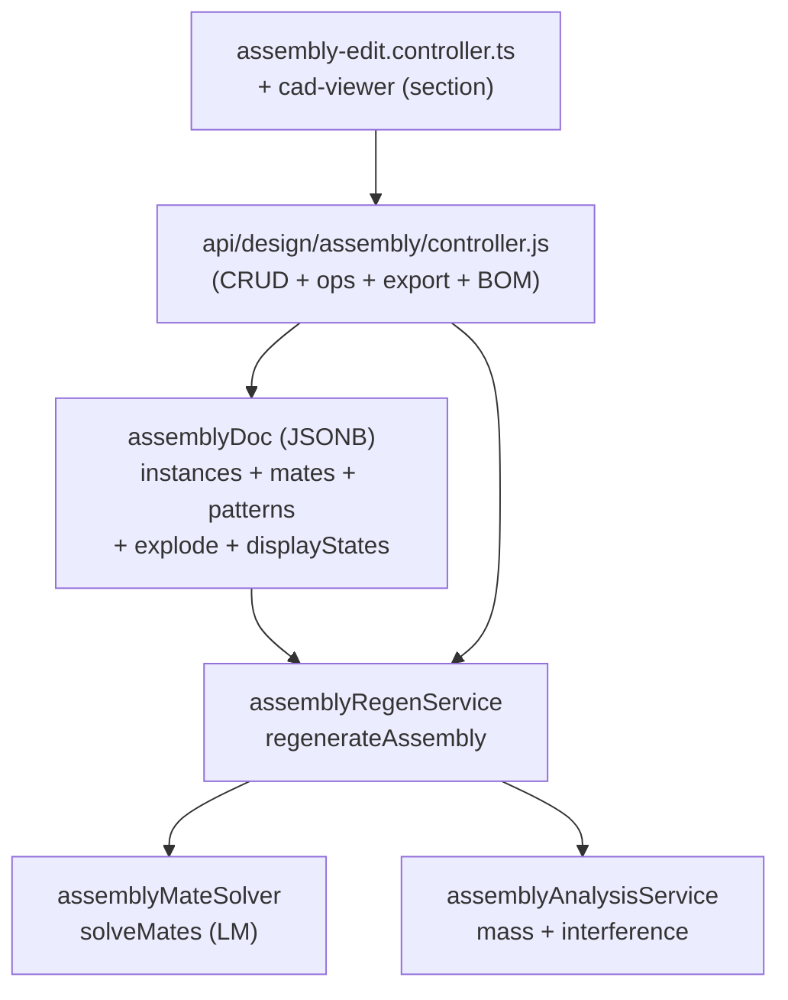

# Assembly Subsystem — Map

> **System** ▸ [Overview](../00-overview.md) ▸ [Assembly](../40-assembly.md) ▸ **Subsystem map**
> Related: [Instances & placement](./instances-placement.md) · [Mates & solver](./mates-solver.md) · [Patterns / mirror / subassemblies](./patterns-mirror-subassemblies.md) · [Kernel: surface classification](../kernel/surface-classification.md)

---

## Requirements

This page is the index for the assembly feature-group docs. The four requirements that frame the whole subsystem:

| REQ | Status | Summary |
|-----|--------|---------|
| 748 | unapproved | 3D assembly mate solver positions rigid component instances |
| 750 | unapproved | An Assembly positions multiple component instances, associated with a Part |
| 752 | unapproved | Regenerate by resolving + transforming + scoping instances into one geometry |
| 755 | unapproved | Solve mate constraints during regeneration to position floating instances |

### REQ 750 — The Assembly entity

- **Description:** The CAD module shall provide an Assembly that positions multiple component instances together. An assembly shall be associated with a Part (so it can itself be nested and appear in bills of materials) and shall persist its content as an assembly document containing component instances and (in later phases) mates. The assembly shall use the same content-addressed version-control working-copy model as single-part CAD models (branch, base commit, checkout lock, release lock).
- **Rationale:** Assemblies are the container for multi-part design. Modeling an assembly as its own Part-associated entity (rather than a feature inside a single-part tree) keeps the single-part regeneration pipeline unpolluted and lets assemblies nest and participate in BOMs. Reusing the existing VCS working-copy model gives branching/locking/release for free.
- **Verification:** Backend `assembly-crud.test.js` covers create/read/update/soft-delete of an assembly and its history records.
- **Validation:** A user can create an assembly for a part and reopen it with its component instances intact.

### REQ 748 — The mate solver

- **Description:** The CAD module shall provide a 3D assembly mate solver that positions rigid component instances by solving geometric mate constraints. Each non-grounded component instance shall have six degrees of freedom. The solver shall support coincident, concentric, parallel, perpendicular, distance, angle, tangent, and lock; shall require at least one grounded instance; and shall report whether the assembly is under-, fully-, or over-constrained.
- **Rationale:** Mate-based positioning (the SolidWorks/NX paradigm) is the chosen assembly positioning model. A dedicated 3D rigid-body constraint solver is required because the 2D PlaneGCS sketch solver cannot solve component placement.
- **Verification:** `frontend/src/app/cad/lib/mateSolver.spec.ts` validates coincident/concentric mates, grounded handling, and under/over/fully classification.
- **Validation:** A user mates two components (a coincident face mate + a concentric hole mate) and the editor reports the remaining degrees of freedom.

---

## Succinct description

The assembly subsystem turns finished CAD parts into multi-part designs. It holds component *instances* (each referencing a part's CAD model or a nested assembly), positions them with a real 3D rigid-body **mate solver**, composes one combined geometry, and provides patterns, mirror, subassemblies, exploded/section/display visualization, interference + mass-property analysis, BOM aggregation/sync, and STEP/STL export — all inside the same CAD editor and the same version-control machinery as single parts.

---

## How it works — for everyone (non-technical)

An assembly is a scene where finished parts are arranged together. You drop in parts as *instances* (the same bolt can appear many times), tell the system how they relate with **mates** ("this face sits flat on that one", "this shaft runs down that hole"), and a solver figures out exactly where each part lands. From there you get the documentation outputs an engineer expects: a parts list (bill of materials), repeated copies in rows or circles (patterns), left/right-hand pairs (mirror), assemblies nested inside bigger assemblies, an exploded view, a cut-away section, saved show/hide configurations, overlap (interference) checks, and weight/balance figures (mass properties). The whole assembly versions and releases through the same time-machine the single parts use, and exports as one combined file.

This page is a directory. Each linked sub-page below covers one slice of that picture in depth.

---

## How it works — in detail (technical)

The subsystem is split into eight feature-group docs. Each maps to concrete source and a bucket of requirements.

| Doc | Covers | REQs | Primary source |
|-----|--------|------|----------------|
| [instances-placement](./instances-placement.md) | assemblyDoc shape, instance insert/update/remove/replace, eligibility, regen resolve+transform+scope | 750, 751, 752, 758, 762 | `assembly.types.ts`, `assemblyRegenService.js`, `assembly/controller.js`, `designAssembly.js` |
| [mates-solver](./mates-solver.md) | the 3D Levenberg-Marquardt mate solver, residuals, DOF/rank, mate authoring | 748, 755, 756, 757, 758, 759 | `mateSolver.ts`, `mateSolver.spec.ts`, `assemblyMateSolver.js` |
| [patterns-mirror-subassemblies](./patterns-mirror-subassemblies.md) | linear/circular pattern, mirror, subassembly nesting + cycle detection | 760, 761, 763 | `assemblyRegenService.js` |
| [visualization](./visualization.md) | exploded view, display states, section view | 764, 765, 766 | `assembly-edit.controller.ts`, `cad-viewer.component.ts`, `assembly/controller.js` |
| [analysis](./analysis.md) | interference (AABB → boolean), mass properties | 767, 768 | `assemblyAnalysisService.js` |
| [bom-sync](./bom-sync.md) | BOM aggregation + sync to inventory BillOfMaterialItem | 753, 769 | `assembly/controller.js`, `assemblyRegenService.js` |
| [export](./export.md) | whole-assembly STEP/STL export with placement | 754 | `assembly/controller.js`, `assembly.service.ts` |

### The spine: one versioned document, derived everything else

`DesignAssembly.assemblyDoc` (JSONB) is the single source of truth. Every render, analysis, BOM, and export is *derived* from it by `assemblyRegenService.regenerateAssembly`. Nothing geometric is stored on the assembly row beyond the document and VCS working-copy fields (`branchName`, `baseCommitHash`, `dirty`, lock fields, `releaseLocked`) — identical to `DesignCADModel`.

---

## Key files

- `frontend/src/app/cad/lib/assembly.types.ts` — document + composed-geometry types, `validMateTypes`, euler↔quat helpers
- `backend/services/assemblyRegenService.js` — resolve + transform + scope + compose; pattern/mirror/cycle; BOM aggregation
- `backend/services/assemblyMateSolver.js` / `frontend/src/app/cad/lib/mateSolver.ts` — the dual-runtime mate solver
- `backend/services/assemblyAnalysisService.js` — mass properties + interference
- `backend/api/design/assembly/controller.js` — the HTTP surface (CRUD, ops, analysis, BOM, export, VCS)
- `backend/models/design/designAssembly.js` — the working-copy row
- `frontend/src/app/components/cad/assembly-editor/assembly-edit.controller.ts` — editor state + operations
