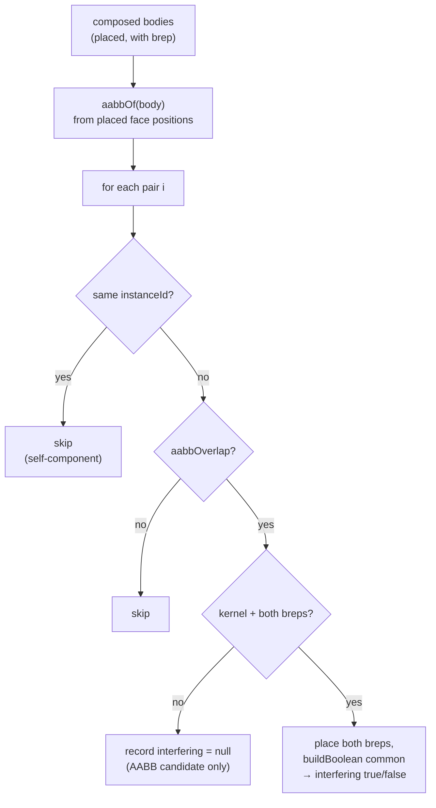

# Assembly Analysis — Interference & Mass Properties

> **System** ▸ [Overview](../00-overview.md) ▸ [Assembly](../40-assembly.md) ▸ **Analysis**
> Related: [Assembly map](./00-overview.md) · [Instances & placement](./instances-placement.md) · [Visualization](./visualization.md)

---

## Requirements

| REQ | Status | Summary |
|-----|--------|---------|
| 767 | unapproved | Interference detection: AABB broad phase, then boolean intersection on placed solids |
| 768 | unapproved | Mass properties: total volume + volume-weighted center of mass |

### REQ 767 — Interference detection

- **Description:** The CAD module shall detect interference between component instances in an assembly. It shall first find candidate pairs whose axis-aligned bounding boxes overlap, then confirm true interference by computing the boolean intersection of the placed component solids; when the CAD kernel is unavailable it shall report the bounding-box candidates as potential interferences.
- **Rationale:** Interference detection catches parts that occupy the same space before manufacture. A bounding-box broad phase keeps the expensive boolean checks to plausibly-overlapping pairs.
- **Verification:** Backend `assembly-analysis.test.js` asserts overlapping components are flagged as candidates and non-overlapping are not, and that a stubbed kernel intersection confirms interference.
- **Validation:** A user runs interference detection and sees which components overlap.

### REQ 768 — Mass properties

- **Description:** The CAD module shall compute assembly mass properties: the total volume as the sum of the component solid volumes and the assembly center of mass as the volume-weighted average of the component centroids in their placed positions.
- **Rationale:** Mass properties (volume, center of mass) are needed for weight estimates and balance checks. Summing component solids with their placement transforms gives the assembly-level values without a separate kernel computation.
- **Verification:** Backend `assembly-analysis.test.js` asserts the assembly volume sums component volumes and the center of mass is the volume-weighted centroid.
- **Validation:** A user views the total volume and center of mass of an assembly.

---

## Succinct description

Two analyses over the composed assembly geometry. **Mass properties** is pure JS: sum each placed body's volume and take the volume-weighted average of its centroids. **Interference** is two-phase: a pure-JS axis-aligned bounding-box broad phase finds candidate body pairs from different instances, then a kernel boolean `common` on the placed BReps confirms (or refutes) true overlap — degrading to "AABB candidate only" when the kernel is unavailable.

---

## How it works — for everyone (non-technical)

Two checks engineers run on an assembly.

- **Mass properties** answers "how big and where's the balance point?" The system adds up the volume of every part and works out the overall center of mass (the balance point), weighting each part by how much material it has. Useful for weight estimates and checking the design won't be lopsided.
- **Interference detection** answers "do any parts crash into each other?" Two parts that overlap in space would be impossible to actually build. Checking every pair precisely would be slow, so the system does a quick rough pass first — comparing each part's bounding box (the smallest box that contains it) — and only runs the exact, expensive overlap test on pairs whose boxes touch. If the geometry engine is offline, it still reports the rough candidates as "might overlap".

---

## How it works — in detail (technical)

Both functions live in `backend/services/assemblyAnalysisService.js` and take the **composed** geometry produced by `assemblyRegenService.regenerateAssembly` (so bodies are already placed, scoped, and carry per-body `volume` / `centroid` / `brep`).

### Mass properties (REQ 768)

`massProperties(composed)`:

```
volume = Σ body.volume          (over bodies with a numeric volume + array centroid)
acc    = Σ body.centroid · body.volume
centerOfMass = volume > 0 ? acc / volume : null
```

Bodies without reported volume/centroid are skipped and counted, so the result reports `{ volume, centerOfMass, bodyCount, bodiesWithMass }` — the caller can tell when the result is partial (e.g. a child whose kernel didn't return mass data). Per-body `volume` is invariant under rigid/mirror transforms; `centroid` is moved by the placement transform in Phase C of regeneration, so the centroids summed here are already in world space.

### Interference detection (REQ 767)



- **Broad phase.** `aabbOf(body)` computes the min/max box from the body's already-placed face positions; `aabbOverlap(a, b, tol)` is a standard 3-axis interval overlap with a 1e-6 tolerance. Pairs of bodies on the **same** instance are skipped (a component never interferes with itself).
- **Narrow phase.** For an AABB-overlapping pair, if a `kernelClient` and both BReps are present, `placeBrep` bakes each instance placement into its BRep (rotate-about-origin via `buildPattern` `rotate`, then `translate`), and `buildBoolean { op: 'common' }` computes the intersection — `interfering` is true when the result has any solids or faces. A kernel error leaves `interfering = null` (still an AABB candidate).
- **Degraded mode.** With no kernel, every record carries `interfering: null` — the AABB candidates stand in as potential interferences (REQ 767).

Each record is `{ a, b, aabbOverlap: true, interfering: true | false | null }`, where `a`/`b` are the two `instanceId`s.

### Endpoints + UI

- `GET /:id/mass-properties` (`massProperties` controller) and `POST /:id/interference` (`interference` controller) both regenerate first, then run the analysis; both 503 when the kernel is disconnected.
- The editor (`assembly-edit.controller.ts`) drives them via `computeMass()` and `checkInterference()`; `interferenceCount()` counts pairs where `interfering !== false` (so AABB-only candidates count until disproven).

---

## Key files

- `backend/services/assemblyAnalysisService.js` — `massProperties`, `interference`, `aabbOf`, `aabbOverlap`, `placeBrep`
- `backend/api/design/assembly/controller.js` — `massProperties`, `interference` endpoints
- `backend/services/assemblyRegenService.js` — supplies per-body `volume` / `centroid` / `brep` (via `flattenChildGeometry` + Phase C transform)
- `frontend/src/app/components/cad/assembly-editor/assembly-edit.controller.ts` — `computeMass`, `checkInterference`, `interferenceCount`
- `frontend/src/app/cad/lib/assembly.types.ts` — `MassProperties`, `InterferencePair`
