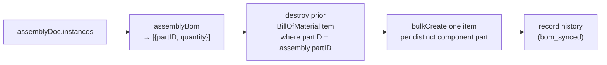

# Assembly BOM — Aggregation & Inventory Sync

> **System** ▸ [Overview](../00-overview.md) ▸ [Assembly](../40-assembly.md) ▸ **BOM & sync**
> Related: [Assembly map](./00-overview.md) · [Instances & placement](./instances-placement.md) · [Export](./export.md)

---

## Requirements

| REQ | Status | Summary |
|-----|--------|---------|
| 753 | unapproved | Produce a BOM by aggregating instances into one line per distinct part |
| 769 | unapproved | Sync the assembly BOM into inventory BillOfMaterialItem records |

### REQ 753 — Bill of materials

- **Description:** The CAD module shall produce a bill of materials for an assembly by aggregating its component instances into one line per distinct referenced part with the instance count as the quantity.
- **Rationale:** A BOM is the primary documentation output of an assembly and the bridge to the inventory/manufacturing domain. Deriving it from the instance list keeps the assembly document the single source of truth.
- **Verification:** Backend `assembly-regen.test.js` (`assemblyBom` suite) asserts three instances of two distinct parts aggregate to two BOM lines with correct quantities, and that suppressed instances are excluded.
- **Validation:** A user can view an assembly bill of materials listing each distinct part and how many are used.

### REQ 769 — Inventory BOM sync

- **Description:** The CAD module shall synchronize an assembly bill of materials to the inventory bill-of-materials records, writing one bill-of-material item per distinct component part (with the instance count as quantity) under the assembly part, replacing any prior items for that assembly part.
- **Rationale:** Pushing the assembly structure into the inventory BOM keeps the existing planning, kitting, and ordering tooling working from the CAD-defined assembly structure.
- **Verification:** Backend `assembly-analysis.test.js` asserts syncing creates one `BillOfMaterialItem` per distinct component part with correct quantities and replaces prior items.
- **Validation:** A user syncs an assembly BOM and the parts appear as components of the assembly part in inventory.

---

## Succinct description

The assembly BOM is derived directly from the instance list: one line per distinct referenced part, quantity = number of (non-suppressed) instances of it. The aggregation (`assemblyBom`) is pure and stored nowhere. Sync (`POST /:id/bom/sync`) pushes that aggregation into the inventory `BillOfMaterialItem` table under the assembly's own Part, replacing any prior items — bridging the CAD assembly structure into planning/kitting/ordering.

---

## How it works — for everyone (non-technical)

A bill of materials is the "parts list" for an assembly: which parts, and how many of each. The system builds it automatically by counting the components you've placed — if the assembly has three of part A and one of part B, the list shows "A ×3, B ×1". Nothing is typed by hand, and the list always matches what's actually in the assembly.

Because the rest of the system (ordering, kitting, planning) already understands inventory parts lists, there's a "sync" button that copies this CAD-derived list into the inventory records attached to the assembly's part. After syncing, anyone looking at the assembly part in inventory sees its components — and the ordering and kitting tools can work from it. Syncing replaces the previous list, so it always reflects the current assembly.

---

## How it works — in detail (technical)

### Aggregation (REQ 753)

`assemblyBom(assembly)` in `backend/services/assemblyRegenService.js` walks `assemblyDoc.instances`, skipping suppressed ones, and counts per `partID` while preserving first-appearance order:

```
for inst in doc.instances:
  if inst.suppressed: continue
  byPart[inst.partID] += 1            (order tracked on first sight)
return order.map(partID => ({ partID, quantity: byPart[partID] }))
```

Output is `[{ partID, quantity }]`. It is **derived, stored nowhere** — the instance list is the single source of truth. Pattern/mirror-expanded copies are *not* counted here (the BOM is over the document's `instances`, before render-unit expansion); the quantity reflects authored instances.

Two read paths use it:

- `GET /:id/bom` (`getBom`) enriches each line with `{ item, partID, quantity, part }` by loading the referenced `Part` rows (name/sku/revision) for display.
- The frontend `loadBom()` (`assembly-edit.controller.ts`) renders that enriched list.

### Inventory sync (REQ 769)



`syncBom` (`POST /:id/bom/sync`):

1. `lines = assemblyRegenService.assemblyBom(assembly)`.
2. **Replace** prior items: `db.BillOfMaterialItem.destroy({ where: { partID: assembly.partID }, force: true })`. The assembly's own Part is the BOM parent (`partID`); each component is `componentPartID`.
3. `bulkCreate` one `BillOfMaterialItem` per line: `{ partID: assembly.partID, componentPartID: line.partID, quantity: line.quantity, activeFlag: true }`.
4. Record a `bom_synced` history entry; return the count + items.

This reuses the existing inventory `BillOfMaterialItem` schema (the same table BOMs use elsewhere in the system), so downstream planning/kitting/ordering work unchanged from the CAD-defined structure. Because an assembly **is a Part** (REQ 750), the assembly part can itself appear as a component in a larger assembly's BOM — the structure nests.

---

## Key files

- `backend/services/assemblyRegenService.js` — `assemblyBom` aggregation
- `backend/api/design/assembly/controller.js` — `getBom` (enriched read) + `syncBom` (inventory write)
- `frontend/src/app/components/cad/assembly-editor/assembly-edit.controller.ts` — `loadBom`, `syncBom`
- `frontend/src/app/services/assembly.service.ts` — `bom`, `syncBom` HTTP methods
- `frontend/src/app/cad/lib/assembly.types.ts` — `BomLine`
