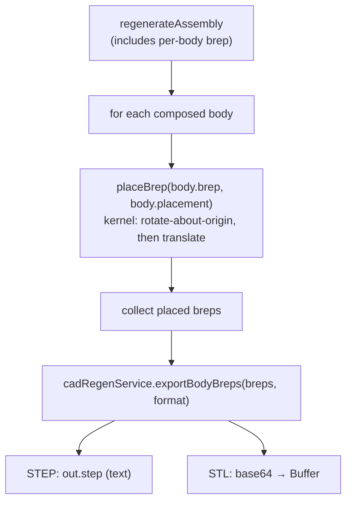

# Whole-Assembly Export (STEP / STL)

> **System** ▸ [Overview](../00-overview.md) ▸ [Assembly](../40-assembly.md) ▸ **Export**
> Related: [Assembly map](./00-overview.md) · [Instances & placement](./instances-placement.md) · [BOM & sync](./bom-sync.md)

---

## Requirements

| REQ | Status | Summary |
|-----|--------|---------|
| 754 | unapproved | Export the whole assembly to STEP or STL by placing each instance's BReps |

### REQ 754 — Whole-assembly export

- **Description:** The CAD module shall export the whole assembly as a STEP or STL file by applying each component instance placement transform to that component boundary representation and composing the placed solids into a single exported model.
- **Rationale:** Whole-assembly export is required to hand off the design to downstream CAM/inspection and to external collaborators. Reusing the existing per-body BRep export with the placement transform avoids new kernel export machinery.
- **Verification:** Backend `assembly-export.test.js` asserts a two-instance assembly export composes both placed solids (kernel-dependent; degrades to a clear error when the kernel is unavailable).
- **Validation:** A user can download a STEP file of an assembly containing all components in their assembled positions.

---

## Succinct description

Export regenerates the assembly, takes each composed body's untransformed BRep, bakes its placement transform into it kernel-side (rotate-about-origin then translate, via the kernel `buildPattern` op), and hands the placed BRep set to the shared `cadRegenService.exportBodyBreps` to serialize one STEP or STL file. Released assemblies have a separate frozen-geometry export path that skips regeneration entirely.

---

## How it works — for everyone (non-technical)

Export bundles the entire assembly into a single 3D file (STEP for CAD interchange, STL for meshes/3D printing) that you can hand to a machine shop, an inspector, or a collaborator. Crucially, every part is exported *where it sits in the assembly* — the file is the assembled product, not a pile of loose parts at the origin. The system takes each part's exact shape, moves and rotates it into its assembled position, and writes them all out together.

If the part has already been released (frozen as an official revision), export skips re-computing the geometry and reads the stored frozen shapes directly — guaranteeing the exported file matches exactly what was approved.

---

## How it works — in detail (technical)

### Live export (working copy)

`exportAssembly(req, res, format)` (`backend/api/design/assembly/controller.js`, reached via `GET /:id/export/step` and `/:id/export/stl`):

1. Regenerate the assembly (the composed bodies each carry an **untransformed** seed `brep` plus their `placement` — placement is applied at export, not during compose).
2. For each body, `placeBrep(brep, placement, client)` bakes the placement into the BRep using the kernel `buildPattern` op: if the quaternion encodes a rotation, a `rotate` transform about the origin with the extracted axis/angle; if there's a translation, a `translate` transform. (This is the same placement-baking used by the interference narrow phase and mirrors the MoveCopyBody dispatch.)
3. `cadRegenService.exportBodyBreps(placedBreps, format, { kernelClient })` serializes the placed BRep set into one STEP (`out.step`) or STL (`out.stlBase64`, decoded to a `Buffer`). Filenames derive from the part sku/name, sanitized.
4. With no body geometry the endpoint 422s; a kernel disconnect/RPC error 503s.

### Released export (frozen geometry)

`exportFrozen(req, res, format)` (`GET /:id/release/step`, `/:id/release/stl`) serves a **released** assembly without regenerating: it resolves the Part revision → its release tag → the frozen commit, loads per-body BReps via `assemblyFreezeService.geometryForCommit`, and serializes those. This guarantees the exported file is byte-identical to the approved revision (no kernel re-run, no drift). 409 if the revision isn't released yet or carries no body geometry.

### Frontend

`assembly.service.ts` exposes `exportStep(id)` / `exportStl(id)` (working copy) and `releaseStep(id)` / `releaseStl(id)` (frozen). The editor controller's `exportStep()` / `exportStl()` (`assembly-edit.controller.ts`) fetch the payload and trigger a browser download, surfacing a kernel-offline (503) message when the kernel is down.

---

## Key files

- `backend/api/design/assembly/controller.js` — `exportAssembly` (`exportStep`/`exportStl`), `placeBrep`, `exportFrozen` (`exportReleaseStep`/`exportReleaseStl`)
- `backend/services/cadRegenService.js` — `exportBodyBreps` (shared STEP/STL serialization)
- `backend/services/assemblyRegenService.js` — supplies the per-body `brep` + `placement` consumed by export
- `frontend/src/app/services/assembly.service.ts` — `exportStep`, `exportStl`, `releaseStep`, `releaseStl`
- `frontend/src/app/components/cad/assembly-editor/assembly-edit.controller.ts` — `exportStep`, `exportStl` (download triggers)
