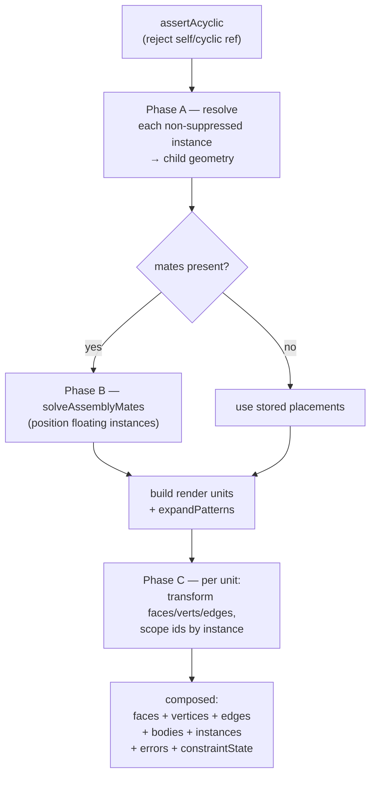

# Component Instances & Placement

> **System** ▸ [Overview](../00-overview.md) ▸ [Assembly](../40-assembly.md) ▸ **Instances & placement**
> Related: [Assembly map](./00-overview.md) · [Mates & solver](./mates-solver.md) · [Patterns / mirror / subassemblies](./patterns-mirror-subassemblies.md)

---

## Requirements

| REQ | Status | Summary |
|-----|--------|---------|
| 750 | unapproved | An Assembly positions multiple instances, associated with a Part, persisted as an assembly document |
| 751 | unapproved | Insert a component instance referencing a part that has a CAD model or assembly |
| 752 | unapproved | Regenerate by resolving + transforming + scoping each instance into one geometry |
| 758 | unapproved | Add/remove a mate referencing a face on each of two distinct instances |
| 762 | unapproved | Replace the part referenced by an instance, preserving placement + compatible mates |

### REQ 751 — Insert a component instance

- **Description:** The CAD module shall allow inserting a component instance into an assembly by referencing an existing part that has a CAD model or assembly. Each instance shall record the referenced part, the resolved source commit (pinned version), a stable instance identifier, a grounded flag, and a placement consisting of a translation and an orientation. The same part may be inserted multiple times as distinct instances.
- **Rationale:** Component insertion with per-instance placement and version pinning is the foundation of assemblies. Pinning the source commit makes an assembly a reproducible snapshot (git-submodule style); multiple instances of one part is a basic reuse requirement.
- **Verification:** Backend `assembly-instances.test.js` covers inserting one and multiple instances, removing an instance, and rejecting a non-existent part.
- **Validation:** A user can insert a part twice and position each instance independently.

### REQ 752 — Composite regeneration

- **Description:** When regenerating an assembly, the CAD module shall resolve each non-suppressed component instance to its source geometry (reusing frozen released geometry without a kernel call when the instance is pinned to a released commit, otherwise regenerating), apply the instance placement transform, scope every body/face/topology identifier by the instance identifier so identifiers are unique across components, and compose a single assembly geometry with a per-instance roster. The module shall detect and reject a circular assembly reference.
- **Rationale:** Composite regeneration is how an assembly becomes renderable. Reusing frozen geometry avoids redundant kernel work; instance-scoped identifiers prevent collisions; cycle detection prevents infinite recursion through nested assemblies.
- **Verification:** Backend `assembly-regen.test.js` asserts two instances compose with instance-scoped ids, placement applied, and a circular reference throws a named error.
- **Validation:** A user sees both inserted components in their placed positions and is prevented from inserting an assembly into itself.

### REQ 762 — Replace component

- **Description:** The CAD module shall allow replacing the part referenced by a component instance with another part that has a CAD model or assembly, preserving the instance placement and any mates that reference still-existing faces; mates whose referenced face no longer exists shall be surfaced as errors rather than silently dropped.
- **Rationale:** Replace-component lets a user swap a placeholder or revised part without rebuilding the assembly. Preserving mates by face reference avoids re-authoring constraints when the geometry is compatible.
- **Verification:** Backend `assembly-replace.test.js` covers replacing an instance part and rejecting a part with no geometry.
- **Validation:** A user replaces a component with a newer part revision and the assembly keeps its position and compatible mates.

---

## Succinct description

An assembly's content is a single JSONB document (`assemblyDoc`) holding a list of component *instances*. Each instance references a part by id and carries a placement (translation + quaternion) plus `grounded` / `suppressed` / `visible` flags. The controller inserts, updates, removes, and replaces instances on the document; regeneration resolves each instance to its child geometry, transforms it by its placement, and namespaces every id by the instance.

---

## How it works — for everyone (non-technical)

Picture a checklist. Each line is "one copy of part X, sitting here, turned this way." Adding a part to the assembly adds a line. Moving the part edits the line's position numbers; hiding it flips a "show" switch; "grounding" it tacks it down so the solver treats it as fixed. The same part can appear on many lines — twenty bolts are twenty lines pointing at one bolt part. When the system draws the assembly, it reads each line, fetches that part's shape, moves it to the line's position, and stamps every surface with the line's name so two copies of the same bolt never get confused. Replacing a part just rewrites which part a line points at, while keeping its position.

---

## How it works — in detail (technical)

### The assembly document

`assemblyDoc` (JSONB on `DesignAssembly`, `backend/models/design/designAssembly.js`) is shaped (TypeScript mirror in `frontend/src/app/cad/lib/assembly.types.ts`):

```
AssemblyDoc {
  nextInstanceSeq, nextMateSeq, nextPatternSeq?, nextDisplayStateSeq?,
  instances: AssemblyInstance[],
  mates: Mate[],
  patterns?, explode?, displayStates?
}

AssemblyInstance {
  instanceId: string,        // "i1", "i2", … minted from nextInstanceSeq
  partID: number,
  ref?: { kind: 'cad' | 'assembly' },
  pinnedCommitHash?: string | null,
  grounded?: boolean,
  placement: { translate: [x,y,z], quaternion: [x,y,z,w] },
  suppressed?: boolean,
  visible?: boolean
}
```

`INITIAL_ASSEMBLY_DOC` (controller) seeds the empty document with all four sequence counters and empty arrays plus `explode: { offsets:{}, factor:1 }`.

### Instance lifecycle (the controller)

All instance operations live in `backend/api/design/assembly/controller.js` and follow the same pattern: deep-clone `assemblyDoc`, mutate, `assertAcyclic`, persist with `dirty: true`, record history.

| Operation | Route | Notes |
|-----------|-------|-------|
| Insert | `POST /:id/instances` (`insertInstance`) | Requires the referenced part to have a CAD model **or** an assembly (else 422). `ref.kind` is `'assembly'` if the part has an active `DesignAssembly`, else `'cad'`. The **first** instance is auto-grounded (`doc.instances.length === 0`) — SolidWorks "fix first part". |
| Update | `PATCH /:id/instances/:instanceId` (`updateInstance`) | Sets placement / grounded / suppressed / visible. Placement is normalized by `sanitizePlacement` to `{translate:[3], quaternion:[4]}`. |
| Remove | `DELETE /:id/instances/:instanceId` (`removeInstance`) | Filters the instance out; 404 if no count change. |
| Replace | `PUT /:id/instances/:instanceId/replace` (`replaceInstance`) | Rewrites `partID` + `ref.kind`, keeps the placement. Mates keep their face refs; incompatible faces surface later as regen errors (REQ 762). |

`instanceId` is minted as `` `i${doc.nextInstanceSeq}` `` and the counter is bumped. The placement editor in the frontend (`assembly-edit.controller.ts`) edits translation directly and orientation via Euler degrees, converting with `eulerToQuat` / `quatToEuler` from `assembly.types.ts`.

### Eligibility

An assembly may only be created for a part in the **Assembly** part category. `createForPart` fetches the part's category by PK and checks `category.name === 'Assembly'`, 422ing if not. `listEligibleParts` (`GET /eligible-parts`) finds the "Assembly" category by name and lists every active part in it, flagged with `hasAssembly`. In both paths the category is resolved by **name**, not a hardcoded id. A part may carry at most one active assembly (a partial unique index `design_assemblies_part_unique_active` on `partID WHERE activeFlag = true`).

### Regeneration: resolve → solve → transform → scope → compose

`backend/services/assemblyRegenService.js` `regenerateAssembly(assembly, { db, resolveChild, kernelClient })` runs in phases:



- **Resolve (Phase A).** `defaultResolveChild` picks the source: `ref.kind === 'assembly'` (or a part that has an assembly but no CAD model) recurses through `regenerateAssembly` and is returned as one rigid child (REQ 763); otherwise the part's active `DesignCADModel` is regenerated via `cadRegenService.regenerateModel(..., { includeBodyBreps: true })` and flattened by `flattenChildGeometry` (last-write-wins per body, collecting faces/vertices/edges/breps + per-body `volume`/`centroid` for mass properties). A missing CAD model / assembly throws a 422; the error is captured per-instance into `composed.errors` so the rest still composes. The resolver is **injectable** so the compose/scope/cycle logic is unit-testable without a kernel.
- **Transform (Phase C).** Each render unit carries a transform abstraction (`rigidTransform(q, t)` exposes `point()` / `dir()` and a `flip` flag). `transformFace` applies `point` to positions and `dir` to normals (reversing triangle winding when `flip` is set — mirror copies); `transformEdge` maps the polyline; `transformSurface` carries the analytic surface classification (origin/normal/axis) into world space so mates and `isFlat` shading still work after placement.
- **Scope.** `scopeId(instanceId, id) = `${instanceId}::${id}`` namespaces every body id, and `scopeFace` rewrites both `persistentName` and `faceId` to the scoped form. This extends the kernel's existing per-body face scoping to a per-instance layer, so `i1::body0::f2` is unambiguous across components.
- **Compose.** The result is `{ faces, vertices, edges, bodies, instances, errors, constraintState }`. Each `bodies[]` entry also carries `brep` (untransformed seed BRep — placement applied kernel-side at export/interference), `placement`, `volume`, and transformed `centroid`. The `regenerate` controller endpoint strips `brep` from the wire payload (the viewer only needs meshes) and, when the requester holds the edit lock, persists solved placements back into the doc.

### Cycle detection

`assertAcyclic(assembly, db, visited)` rejects an assembly that transitively contains itself (409). It catches the direct case (inserting the assembly's own `partID`) without a DB, and walks referenced parts that are themselves assemblies via `db.DesignAssembly`. It runs before every mutating persist (insert, replace, raw `update`) so a cycle can never be stored.

---

## Key files

- `frontend/src/app/cad/lib/assembly.types.ts` — `AssemblyDoc` / `AssemblyInstance` / `Placement` types + euler↔quat
- `backend/models/design/designAssembly.js` — the working-copy row + `assemblyDoc` JSONB + partial unique index
- `backend/api/design/assembly/controller.js` — `createForPart`, `insertInstance`, `updateInstance`, `removeInstance`, `replaceInstance`, `listEligibleParts`, `regenerate`
- `backend/services/assemblyRegenService.js` — `regenerateAssembly`, `defaultResolveChild`, `flattenChildGeometry`, `scopeId` / `scopeFace`, `assertAcyclic`
- `frontend/src/app/components/cad/assembly-editor/assembly-edit.controller.ts` — instance insert/remove/replace/select/placement state
