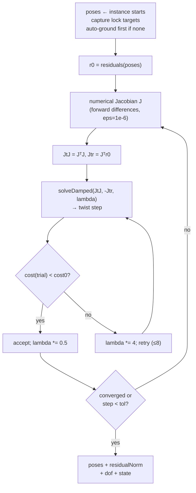

# Mates & the 3D Mate Solver

> **System** ▸ [Overview](../00-overview.md) ▸ [Assembly](../40-assembly.md) ▸ **Mates & solver**
> Related: [Assembly map](./00-overview.md) · [Instances & placement](./instances-placement.md) · [Kernel: surface classification](../kernel/surface-classification.md)

---

## Requirements

| REQ | Status | Summary |
|-----|--------|---------|
| 748 | unapproved | 3D assembly mate solver positions rigid instances; 6 DOF each; reports constraint state |
| 755 | unapproved | Solve mate constraints during regeneration; hold grounded fixed; require ≥1 grounded |
| 756 | unapproved | Mate types coincident/concentric/parallel/perpendicular/distance/angle/tangent/lock |
| 757 | unapproved | Report under-/fully-/over-constrained with remaining DOF count |
| 758 | unapproved | Add/remove a mate referencing a face on each of two distinct instances |
| 759 | unapproved | Editor mate-creation flow: pick face A, pick face B, choose valid type |

### REQ 748 — The mate solver

- **Description:** The CAD module shall provide a 3D assembly mate solver that positions rigid component instances by solving geometric mate constraints. Each non-grounded component instance shall have six degrees of freedom (three translational, three rotational). The solver shall support coincident (two planar faces, anti-parallel normals and zero separation), concentric (two cylindrical/axis features, coincident axes), parallel, perpendicular, distance (parameterized offset between two planar faces), angle (parameterized angle between two faces), tangent (a cylindrical face tangent to a planar face), and lock (two instances rigidly fixed relative to one another). The solver shall require at least one grounded instance and shall report whether the assembly is under-, fully-, or over-constrained.
- **Rationale:** Mate-based positioning (SolidWorks/NX) is the chosen model. A dedicated 3D rigid-body constraint solver is required because the PlaneGCS solver operates only on 2D sketch geometry. Isolating and proving the solver first de-risks the entire assembly feature.
- **Verification:** `frontend/src/app/cad/lib/mateSolver.spec.ts` validates coincident and concentric mates on hand-placed primitives, grounded-instance handling, and under/over/fully-constrained classification.
- **Validation:** A user mates two components (e.g. a coincident face mate and a concentric hole mate); the components move into position and the editor reports remaining DOF.

### REQ 755 — Solve during regeneration

- **Description:** When regenerating an assembly, the CAD module shall solve the geometric mate constraints to position the non-grounded instances, holding grounded instances fixed, and shall return (and persist) the solved placement of each instance. The solver shall require at least one grounded instance.
- **Rationale:** Mates are only useful if they actually move components. Solving server-side keeps the stored placement authoritative and reproducible so export and rendering agree.
- **Verification:** Backend `assembly-mate-solve.test.js` asserts a coincident mate moves a floating component onto a grounded face and a concentric mate aligns two axes (via a stub child-geometry resolver).
- **Validation:** A user adds a mate between two components and they move into the mated position.

### REQ 757 — Constraint-state reporting

- **Description:** The CAD module shall report whether an assembly is under-, fully-, or over-constrained by its mates, including the number of remaining free degrees of freedom, and shall surface a conflicting (over-constrained) mate set rather than silently ignoring it.
- **Rationale:** Constraint-state feedback is essential SolidWorks-style UX: users need to know when a component is still free, fully located, or when mates conflict.
- **Verification:** Backend `assembly-mate-solver-core.test.js` asserts fully (DOF 0), under (DOF > 0), and over (non-convergent) detection.
- **Validation:** A user sees whether a component is under-, fully-, or over-constrained after applying mates.

---

## Succinct description

The mate solver is the hard core of the assembly subsystem: a Levenberg-Marquardt least-squares solver over a global twist vector (R³ translation + so(3) rotation, 6 DOF per non-grounded instance), with a numerically-differentiated Jacobian and one residual block per mate. It auto-grounds the first instance if none is grounded, classifies the assembly as under/fully/over-constrained from the rank of JᵀJ, and runs identically in the browser (interactive) and in Node (authoritative on regen).

---

## How it works — for everyone (non-technical)

A mate is a rule about how two parts relate — "these two faces touch", "this shaft lines up with that hole", "keep these 12 mm apart". With several such rules, there's usually exactly one arrangement that satisfies all of them, but finding it by hand is fiddly. The solver does it automatically: it starts from where the parts currently sit, measures how badly each rule is broken, nudges the free parts a little to reduce the total error, and repeats until everything snaps into place. One part has to be pinned ("grounded") so the rest have something to move relative to — if you don't pin one, the solver pins the first part for you.

When it's done, it reports one of three verdicts: **under-constrained** (parts still free to slide or spin — you can add more mates), **fully constrained** (everything is locked in place), or **over-constrained** (your rules contradict each other and can't all be satisfied). That last verdict is shown rather than hidden, so you know to remove a conflicting mate.

---

## How it works — in detail (technical)

The same algorithm exists twice, byte-for-byte equivalent in math: `frontend/src/app/cad/lib/mateSolver.ts` (browser, interactive warm-started drag) and `backend/services/assemblyMateSolver.js` (Node, authoritative on save/regen). Both export `solveMates(instances, mates, opts?)`.

### Parameterization

Each free instance carries a pose `{ quaternion q, translate t }`. The world point of a local point `p` is `x = rotate(q, p) + t`. The optimization variables are per-instance local twists `δ = (δω, δt) ∈ R⁶`, applied as:

- `q ← q ⊗ quatFromRotVec(δω)` — body-frame rotation (well-conditioned away from the singularity)
- `t ← t + δt` — world-frame translation

Free instances are indexed into a global DOF vector of length `6 × (#non-grounded)`; grounded instances contribute no columns and never move.

### Residuals per mate type

`mateResiduals(mate, poseA, poseB)` returns a residual vector that is zero when the mate is satisfied. Mate geometry is supplied in each instance's **local** frame as `{ kind:'plane', origin, normal }` or `{ kind:'axis', origin, direction, radius? }`; `worldPlane` / `worldAxis` transform it by the current pose.

| Mate | Residual | Length |
|------|----------|--------|
| `coincident` | `normalA ± normalB` (anti-parallel, or parallel if `flip`) **and** plane separation `nA·(oB − oA)` | 4 |
| `distance` | same orientation block + `(separation − value)` | 4 |
| `parallel` | `cross(nA, nB)` | 3 |
| `perpendicular` | `dot(nA, nB)` | 1 |
| `angle` | `dot(nA, nB) − cos(value)` | 1 |
| `concentric` | `cross(axisA, axisB)` (parallel) + perpendicular component of origin delta (coincident lines) | 6 |
| `tangent` | `dot(axisA, planeN)` (axis parallel to plane) + `(signedDist ∓ radius)` | 2 |
| `lock` | rotation error (3) + translation error (3) of B in A's frame vs. the relative pose captured at solve start | 6 |

`lock` is special: at the start of each `solveMates` call, `lockTargets` captures the initial relative pose `relQ`/`relT` of B w.r.t. A, and the residual drives the current relative pose back to that target — making the two instances a rigid group. The map is cleared at the end of each solve.

### The Levenberg-Marquardt loop

- The Jacobian `J` (m × nDof) is built by **forward differences**: perturb each twist column by `eps = 1e-6`, re-evaluate residuals, divide. Analytic Jacobians are an explicit perf follow-up; numeric is robust and simple for assembly sizes here.
- `solveDamped(A, b, lambda)` solves `(JᵀJ + λI)x = b` with Gaussian elimination + partial pivoting, tolerant of singular columns (leaves those DOF unchanged).
- Damping adapts: on an accepted step `λ ← max(λ·0.5, 1e-12)`; on rejection `λ ← λ·4` (up to 8 inner tries). Defaults: `maxIterations = 80`, `tolerance = 1e-7`.

### Constraint-state classification (REQ 757)

After the loop:

- `converged = residualNorm < max(tolerance·10, 1e-5)`.
- `rank = symmetricRank(JtJ, 1e-6)` — Gaussian-elimination pivot count of JᵀJ = number of constrained DOF.
- `dof = max(0, nDof − rank)`.
- `state`: `!converged → 'over'`; else `dof > 0 → 'under'`; else `'fully'`.

The spec tests (`mateSolver.spec.ts`) pin the semantics exactly: a single coincident mate on a free part leaves `dof = 3` (`under`); concentric leaves `dof = 2`; three orthogonal coincident mates give `dof = 0` (`fully`); two conflicting distance mates (z=10 and z=20 on the same faces) fail to converge → `over`; a lock mate gives `dof = 0`.

### Wiring into regeneration (the server side)

`assemblyRegenService.solveAssemblyMates(instances, mates, childGeoById, errors)`:

1. Builds a `faceId → analytic surface` map per instance from the resolved child geometry (`faceSurfaceMap`), keyed by the **unscoped** local face id.
2. Auto-grounds the first instance if none is grounded (`solverInstances[0].grounded = true`).
3. Resolves each mate's `a`/`b` face references to solver geometry via `surfaceToGeom` (plane → `{kind:'plane'}`, cylinder → `{kind:'axis', radius}`); a mate with a missing instance/face/non-mateable surface is **skipped with an error** so the rest of the assembly still solves.
4. Calls `mateSolver.solveMates(...)` and returns `{ poses, state, dof, converged, residualNorm }`, which `regenerateAssembly` records as `composed.constraintState`.

The `regenerate` controller endpoint persists the solved placements back into `assemblyDoc` **only when the requester holds the edit lock** (`assembly.lockedByUserID === req.user.id`) — keeping the stored doc truthful and warm-starting the next solve; read-only viewers just get the result.

### Mate authoring (REQ 758, 759)

- **Backend** (`addMate` / `removeMate` in `assembly/controller.js`): a mate is `{ mateId, id, type, a:{instanceId, faceId}, b:{instanceId, faceId}, value?, flip?, suppressed }`. `addMate` validates the type is one of the eight, that both refs carry `instanceId` + `faceId`, that the two instances are **distinct**, and that both instances exist (404 otherwise). The solver keys mates by `id`, so the controller writes `mate.id = mateId` alongside `mateId`.
- **Frontend flow** (`assembly-edit.controller.ts`): `startMate()` enters a two-stage face pick (`matePickStage` `'a' → 'b'`). `onFacePicked` records the scoped face id for A, then requires B to be on a **different** instance (compared via `splitScoped`), then opens the mate-type chooser. `chooserTypes` computes the **valid** types for the two picked face kinds via `validMateTypes(kindA, kindB)` (from `assembly.types.ts`): two planes → coincident/parallel/perpendicular/distance/angle; two cylinders → concentric; plane+cylinder → tangent; `lock` always available. `createMate(type)` splits the scoped ids back into `{instanceId, faceId}` refs, converts an angle value to radians, posts, and regenerates.

---

## Key files

- `frontend/src/app/cad/lib/mateSolver.ts` — the browser solver (`solveMates`, residuals, LM loop, rank)
- `frontend/src/app/cad/lib/mateSolver.spec.ts` — the de-risk spec (coincident/concentric/distance/fully/over/lock)
- `backend/services/assemblyMateSolver.js` — the Node port (authoritative on regen)
- `backend/services/assemblyRegenService.js` — `solveAssemblyMates`, `faceSurfaceMap`, `surfaceToGeom`
- `backend/api/design/assembly/controller.js` — `addMate`, `removeMate`, and solved-placement persistence in `regenerate`
- `frontend/src/app/components/cad/assembly-editor/assembly-edit.controller.ts` — the face-pick → type-chooser mate flow
- `frontend/src/app/cad/lib/assembly.types.ts` — `MateType`, `Mate`, `ConstraintState`, `validMateTypes`
