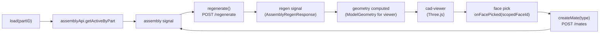

# assembly-edit.controller

> **System** ▸ [Overview](../../00-overview.md) ▸ [Assembly](../../40-assembly.md) ▸ [Subsystem map](../00-overview.md) ▸ **assembly-edit.controller**
> Related: [assembly.service](./assembly.service.md) · [assembly.types](./assembly.types.md) · [Visualization](../visualization.md) · [Mates & solver](../mates-solver.md)

---

## Requirements

| REQ | Status | Summary |
|-----|--------|---------|
| 759 | unapproved | Mate-creation flow: pick face A, pick face B, choose type |
| 764 | unapproved | Exploded view |
| 765 | unapproved | Named display states |
| 766 | unapproved | Section view |
| 767 | unapproved | Interference detection |
| 768 | unapproved | Mass properties |

For the full set governing all assembly editor operations, see [40-assembly.md](../../40-assembly.md).

---

## Succinct description

Angular `@Injectable` service (provided per-editor, not root) that holds all assembly editing state as Angular signals and exposes methods bound to the editor template. It is the single source of truth for the assembly editor's current state.

## How it works — for everyone (non-technical)

This is the brain of the assembly editor. It keeps track of what is selected, what the assembly document says, what geometry has been regenerated, and what the user is currently doing (picking faces for a mate, editing a placement, running an analysis). Every button in the editor calls a method here.

## How it works — in detail (technical)

`frontend/src/app/components/cad/assembly-editor/assembly-edit.controller.ts` is provided at the component level (not `providedIn: 'root'`) so each editor instance gets its own isolated state.

### Signals (state)

| Signal | Type | Purpose |
|--------|------|---------|
| `partID` | `number` | The Part this assembly belongs to |
| `loading` | `boolean` | Initial load spinner |
| `assembly` | `Assembly \| null` | Current assembly row (from API) |
| `regen` | `AssemblyRegenResponse \| null` | Latest regenerate result |
| `regenError` | `string \| null` | Error text if regen failed |
| `selectedId` | `string \| null` | Selected instance ID |
| `bom` | `BomLine[]` | Loaded BOM lines |
| `massProps` | `MassProperties \| null` | Latest mass-property result |
| `interferencePairs` | `InterferencePair[] \| null` | Latest interference result |
| `analysisBusy` | `boolean` | Spinner for slow analysis ops |
| `showPicker` | `boolean` | Part-picker panel open |
| `partsWithCad` | `PartWithCadSummary[]` | All parts with CAD, for the picker |
| `tx/ty/tz/rx/ry/rz` | `number` | Placement inspector (translate + ZYX Euler degrees) |
| `matePickStage` | `null \| 'a' \| 'b'` | Current step in the mate-creation flow |
| `faceA/faceB` | `string \| null` | Scoped face IDs for the two mate picks |
| `showMateChooser` | `boolean` | Mate-type chooser panel open |
| `mateValue` | `number` | Distance/angle for parameterized mates |
| `explodeFactor` | `number` | 0–1 factor applied to explode offsets |
| `sectionEnabled` | `boolean` | Section-view clipping active |
| `sectionAxis` | `'X'\|'Y'\|'Z'` | Section plane normal axis |
| `sectionPos` | `number` | Section plane position along the axis |
| `patternSeedId` | `string \| null` | Seed instance for the pattern form |
| `replaceTargetId` | `string \| null` | Instance being replaced (re-uses the picker) |

### Computed signals

| Computed | Derives from |
|----------|-------------|
| `instances` | `assembly().assemblyDoc.instances` |
| `selectedInstance` | `instances()` filtered by `selectedId()` |
| `mates` | `assembly().assemblyDoc.mates` |
| `patterns` | `assembly().assemblyDoc.patterns` |
| `constraintState` | `regen().constraintState` |
| `displayStates` | `assembly().assemblyDoc.displayStates` |
| `sectionPlane` | `sectionEnabled`, `sectionAxis`, `sectionPos` → `{ normal, point }` |
| `isLockedByMe` | `assembly().lockedByUserID === currentUser.id` |
| `facePickActive` | `matePickStage() !== null` |
| `pickedFaceIds` | `Set([faceA(), faceB()])` — used to highlight picked faces |
| `chooserTypes` | `validMateTypes(surfaceKindOf(faceA()), surfaceKindOf(faceB()))` — filters mate menu |
| `filteredParts` | `partsWithCad()` filtered by `partSearch()` |
| `geometry` | **Main viewer input**: maps `regen().bodies` → `ModelGeometry`, skipping hidden instances, applying explode offsets × factor |

### Key methods by area

**Load + regen**
- `load(partID)`: fetches `getActiveByPart`, then calls `regenerate()`.
- `regenerate()`: calls `assemblyApi.regenerate(id)`, stores result in `regen`; propagates errors to `regenError`.

**Instance management**
- `insert(partID)`: either inserts a new instance or calls `replaceInstance` if `replaceTargetId` is set.
- `remove(inst)`: removes, clears `selectedId` if it matches, re-regenerates.
- `toggleVisible(inst)`, `toggleGrounded(inst)`: single-field PATCH.
- `select(inst)`: populates the placement inspector (`tx/ty/tz/rx/ry/rz`) using `quatToEuler`.
- `applyPlacement()`: reads inspector fields, calls `eulerToQuat`, PATCHes placement, re-regenerates.

**Mate flow** (REQ 759)
- `startMate()` → sets `matePickStage('a')`.
- `onFacePicked(scopedFaceId)`: stage `'a'` stores `faceA`, advances to `'b'`; stage `'b'` validates the two faces belong to different instances, stores `faceB`, opens the type chooser.
- `createMate(type)`: calls `splitScoped` to decompose the scoped face IDs into `{ instanceId, faceId }`, converts angle values to radians, calls `assemblyApi.addMate`.

**Pattern management**
- `openPatternForm(inst)` / `cancelPattern()` / `createPattern()`: builds the pattern body from the form signals, dispatches to `assemblyApi.addPattern`.

**Visualization** (REQ 764–766)
- `autoExplode()`: triggers server-side offset computation; sets `explodeFactor(1)`.
- `onExplodeChange(v)`: updates local `explodeFactor` and persists via `setExplode` (fire-and-forget).
- `saveDisplayState()`, `applyDisplayState(s)`, `deleteDisplayState(s)`: delegate to `assemblyApi`.
- Section view is pure client-side: `sectionEnabled`, `sectionAxis`, `sectionPos` signals feed the `sectionPlane` computed signal, which the viewer component reads directly.

**Analysis** (REQ 767–768)
- `computeMass()`, `checkInterference()`: set `analysisBusy` around async calls.
- `interferenceCount()`: filters `interferencePairs()` for entries where `interfering !== false`.

**VCS**
- `checkout()`, `checkin()` (prompts for message), `undoCheckout()` (confirm dialog): thin wrappers over `assemblyApi`.

**Export**
- `exportStep()` / `exportStl()`: download via `URL.createObjectURL` using a `download()` helper.

### The `geometry` computed signal in detail

This is what the Three.js viewer receives. For each body in `regen().bodies`:
1. Skip if `instance.visible === false`.
2. Compute `off = explode.offsets[instanceId] × explodeFactor` (zero if no offset or factor is 0).
3. For faces: build `FaceMesh` with shifted `Float32Array` positions (or the raw buffer if not exploding), normals, indices, and `featureId = instanceId` (so the viewer colors/selects by component).
4. For vertices/edges: shift positions by offset.

## Key files

- `frontend/src/app/components/cad/assembly-editor/assembly-edit.controller.ts` — this module
- `frontend/src/app/services/assembly.service.ts` — all API calls dispatched here
- `frontend/src/app/cad/lib/assembly.types.ts` — `eulerToQuat`, `quatToEuler`, `validMateTypes`, `IDENTITY_PLACEMENT`
