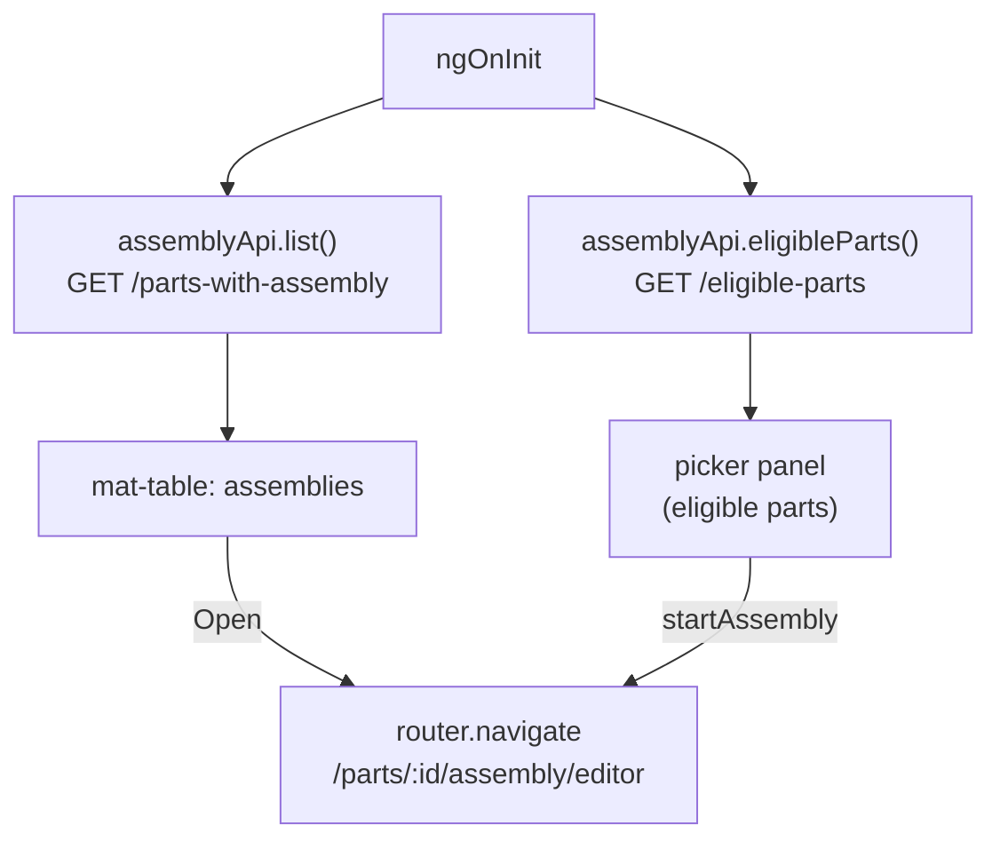

# assembly-landing

> **System** ▸ [Overview](../../00-overview.md) ▸ [Assembly](../../40-assembly.md) ▸ [Subsystem map](../00-overview.md) ▸ **assembly-landing**
> Related: [assembly.service](./assembly.service.md) · [assembly.types](./assembly.types.md)

---

## Requirements

| REQ | Status | Summary |
|-----|--------|---------|
| 750 | unapproved | An Assembly positions multiple component instances, associated with a Part |
| 751 | unapproved | Insert a component instance referencing a part with CAD |

### REQ 750 — The Assembly entity

- **Description:** The CAD module shall provide an Assembly that positions multiple component instances together. An assembly shall be associated with a Part (so it can itself be nested and appear in bills of materials) and shall persist its content as an assembly document containing component instances and mates.
- **Rationale:** Modeling an assembly as its own Part-associated entity lets assemblies nest and participate in BOMs; reusing the VCS working-copy model gives branching/locking/release for free.
- **Verification:** Backend `assembly-crud.test.js` covers create/read/update/soft-delete.
- **Validation:** A user can create an assembly for a part and reopen it with its component instances intact.

---

## Succinct description

Angular standalone component that serves as the entry screen for the assembly module: lists existing assemblies in a table and provides a part-picker panel for creating new ones.

## How it works — for everyone (non-technical)

When you navigate to the assemblies section, this screen shows you a table of every assembly that exists. If you want to start a new one, you click "New assembly" and pick from the list of parts that are eligible (those in the "Assembly" category). Clicking "Open" on any row takes you into the full assembly editor.

## How it works — in detail (technical)

`frontend/src/app/components/cad/assembly-landing/assembly-landing.component.ts` is an Angular 19 standalone component.

### Signals

| Signal | Type | Purpose |
|--------|------|---------|
| `loading` | `boolean` | Spinner while `list()` is in flight |
| `assemblies` | `AssemblyListItem[]` | All active assemblies |
| `showPicker` | `boolean` | Toggle the eligible-part picker panel |
| `eligibleParts` | `EligiblePart[]` | Parts in the "Assembly" category |
| `partSearch` | `string` | Filter text for the picker |

### Computed

`filteredParts` filters `eligibleParts()` by case-insensitive match against `part.name` + `part.revision`.

### Lifecycle

`ngOnInit` fires two parallel calls:
1. `assemblyApi.list()` → populates `assemblies` + clears `loading`.
2. `assemblyApi.eligibleParts()` → populates `eligibleParts` (failure is silently swallowed — the picker just shows empty).

### Template

The component's template is inline. Three sections:
1. **Header** with the "New assembly" toggle button.
2. **Picker panel** (hidden by default): a text search field + scrollable list of eligible parts as `mat-button` rows. Each row shows the part name, revision, and a "has assembly" badge if one already exists. Clicking a row calls `startAssembly(partID)`.
3. **Table or empty state**: a `mat-table` with columns `name`, `part`, `count` (instance count), and `actions`. The "Open" button calls `open(a)`.

### Navigation

- `open(a: AssemblyListItem)` → `router.navigate(['/parts', a.partID, 'assembly', 'editor'])`.
- `startAssembly(partID)` → same route. The editor handles the case where no assembly exists yet (calls `createForPart`).

## Key files

- `frontend/src/app/components/cad/assembly-landing/assembly-landing.component.ts` — this module (single file, template + styles inline)
- `frontend/src/app/services/assembly.service.ts` — `list()` and `eligibleParts()` used here
