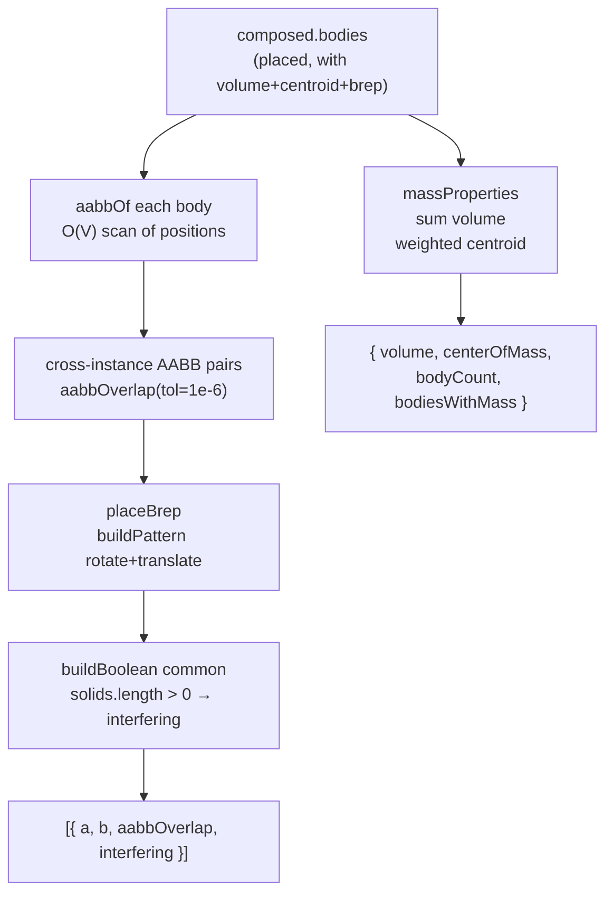

# assemblyAnalysisService

> **System** ▸ [Overview](../../00-overview.md) ▸ [Assembly](../../40-assembly.md) ▸ [Subsystem map](../00-overview.md) ▸ **assemblyAnalysisService**
> Related: [Analysis](../analysis.md) · [assemblyRegenService](./assemblyRegenService.md) · [controller](./controller.md)

---

## Requirements

| REQ | Status | Summary |
|-----|--------|---------|
| 767 | unapproved | Interference detection between component instances |
| 768 | unapproved | Mass properties: total volume and center of mass |

### REQ 767 — Interference detection

- **Description:** The CAD module shall detect interference between component instances in an assembly. It shall first find candidate pairs whose axis-aligned bounding boxes overlap, then confirm each candidate with a kernel boolean intersection.
- **Rationale:** AABB filtering keeps the kernel call count low; the boolean `common` call on BRep pairs gives exact results for confirmed pairs.
- **Verification:** Unit test: two overlapping AABB bodies with BReps confirm `interfering: true`; non-overlapping bodies return no candidates.
- **Validation:** A user runs interference check and sees the overlapping pair highlighted.

### REQ 768 — Mass properties

- **Description:** The CAD module shall compute assembly mass properties: the total volume as the sum of component solid volumes, and the volume-weighted center of mass of the placed components.
- **Rationale:** Weight and balance figures are standard assembly documentation outputs.
- **Verification:** Unit test: two bodies with known volume/centroid produce correct summed volume and weighted centroid.
- **Validation:** Mass-properties panel shows plausible volume and center-of-mass for a simple two-part assembly.

---

## Succinct description

Pure-JS service for two post-regen analysis operations: mass properties (pure arithmetic over body volume/centroid data) and interference detection (AABB broad phase, optionally confirmed by a kernel boolean).

## How it works — for everyone (non-technical)

After the assembly is composed, this module handles two checks. **Mass properties** adds up each part's volume to give a total, and computes the balance point (center of mass) by weighting each part's center by its volume. **Interference detection** first checks whether any pairs of parts' bounding boxes overlap (a fast rectangular-box test), then for overlapping candidates asks the geometry kernel whether the actual BRep shapes really intersect.

## How it works — in detail (technical)

`backend/services/assemblyAnalysisService.js` exports four symbols:

**`massProperties(composed)`**
Iterates `composed.bodies` (the output of `regenerateAssembly`). Bodies missing `volume` or `centroid` are skipped and counted in `bodiesWithMass`. Returns `{ volume, centerOfMass, bodyCount, bodiesWithMass }`. `centerOfMass` is `null` when total volume is zero. No kernel involvement — pure arithmetic over data the regen service already attached to each body.

**`interference(composed, { kernelClient? })`** (async)
Two-phase:
1. **Broad phase** — calls `aabbOf` for each body (scans face `positions` buffers for min/max in each axis), then `aabbOverlap` on every cross-instance pair with a 1e-6 tolerance. Same-instance body pairs are skipped.
2. **Narrow phase** — for each AABB-overlapping candidate, if `kernelClient` and both bodies have a `brep`: calls `placeBrep` twice (rotate then translate via `buildPattern` kernel op), then calls `buildBoolean` with `op: 'common'`. Sets `interfering: true` if the result has solids or faces; `false` otherwise. On kernel error or missing BRep, `interfering` stays `null` (AABB candidate only).

`placeBrep(brep, placement, client)` (internal async) bakes a placement quaternion and translation into a BRep using the kernel's `buildPattern` op — mirrors the export path in the controller.

The `aabbOf` and `aabbOverlap` helpers are exported for unit testing without the kernel.

## Key files

- `backend/services/assemblyAnalysisService.js` — this module
- `backend/services/assemblyRegenService.js` — produces the `composed` input
- `backend/api/design/assembly/controller.js` — calls `massProperties` and `interference` from the HTTP handlers
