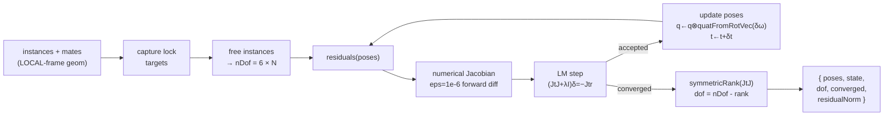

# assemblyMateSolver (Node)

> **System** ▸ [Overview](../../00-overview.md) ▸ [Assembly](../../40-assembly.md) ▸ [Subsystem map](../00-overview.md) ▸ **assemblyMateSolver**
> Related: [Mates & solver](../mates-solver.md) · [mateSolver (browser)](./mateSolver.md) · [assemblyRegenService](./assemblyRegenService.md)

---

## Requirements

| REQ | Status | Summary |
|-----|--------|---------|
| 755 | unapproved | Solve mate constraints during regeneration |
| 756 | unapproved | Mate types: coincident/concentric/parallel/perp/distance/angle/tangent/lock |
| 757 | unapproved | Report under/fully/over-constrained |

### REQ 755 — Authoritative server-side solve

- **Description:** When regenerating an assembly, the CAD module shall solve the assembly geometric mate constraints to position the floating component instances.
- **Rationale:** Positions must be solved authoritatively on the server so that stored placements reflect the solved state, not whatever the browser last computed.
- **Verification:** `assemblyMateSolver` unit test: two instances with a coincident mate converge; dof and state are correct.
- **Validation:** After regen, instance placements stored in the DB reflect the solved positions.

---

## Succinct description

Server-side Node.js port of the Levenberg-Marquardt rigid-body mate solver. It is the **authoritative solve** run during `regenerateAssembly`; the browser keeps an identical copy (`mateSolver.ts`) for interactive drag.

## How it works — for everyone (non-technical)

This module is the mathematics engine that works out where each part goes when mate rules are applied. It tries small nudges, measures how far the rules are from being satisfied, and keeps adjusting until everything snaps into place — or reports failure if the rules contradict each other.

## How it works — in detail (technical)

`backend/services/assemblyMateSolver.js` exports a single function:

**`solveMates(instances, mates, opts?)`**

- **`instances`**: `[{ id, grounded?, translate:[3], quaternion:[4] }]` — initial poses; grounded instances stay fixed.
- **`mates`**: `[{ id, type, a:{instanceId, geom}, b:{instanceId, geom}, value?, flip?, suppressed? }]` where `geom` is a LOCAL-frame `{ kind:'plane', origin, normal }` or `{ kind:'axis', origin, direction, radius? }`.
- Returns `{ poses, converged, residualNorm, dof, state, iterations }`.

The algorithm is identical to the browser solver (see [mateSolver.md](./mateSolver.md) for the full walkthrough). Key points:

- **Parameterization**: each free instance holds a 6-DOF twist `(δω ∈ R³, δt ∈ R³)`. Updates are applied as `q ← q ⊗ quatFromRotVec(δω)`, `t ← t + δt`. This body-frame rotation stays well-conditioned near identity.
- **Residuals** (`mateResiduals`): per-mate functions returning scalar arrays.
  - `coincident` (plane↔plane): 3 orientation residuals + 1 separation residual = 4.
  - `distance`: same shape as coincident but with a target offset `mate.value`.
  - `parallel`: `cross(nA, nB)` — 3 residuals.
  - `perpendicular`: `dot(nA, nB)` — 1 residual.
  - `angle`: `dot(nA, nB) - cos(value)` — 1 residual.
  - `concentric` (axis↔axis): 3 parallel residuals + 3 perpendicular-offset residuals = 6.
  - `tangent` (cylinder axis↔plane): 1 axis-parallel-to-plane + 1 signed-distance residual = 2.
  - `lock`: 3 rotation error (so(3) log) + 3 translation error, held at the relative pose captured at solve start — 6 residuals.
- **Jacobian**: numerically differentiated with `eps = 1e-6` forward differences per twist column. `JᵀJ` (size nDof × nDof) is computed as the symmetrized outer product.
- **LM loop**: up to `maxIterations` (default 80, tolerance 1e-7). Each iteration: build `JᵀJ` + `Jᵀr`, solve `(JᵀJ + λI)δ = -Jᵀr` via Gauss-Jordan `solveDamped`, try the step. Accept if residual decreases → halve `λ`; reject → quadruple `λ` (up to 8 tries). Stop when step norm < tolerance or cost < tolerance.
- **Constraint state**: after convergence, `symmetricRank(JᵀJ)` gives the number of constrained DOF. `dof = nDof - rank`. State: `'over'` if not converged; `'under'` if `dof > 0`; `'fully'` otherwise.
- **Lock targets**: captured from initial poses at the top of `solveMates`, cleared on return (module-level `Map` shared with the residual function).

The only exported symbol is `solveMates`. The algorithm is shared verbatim with the TypeScript browser module; the two files are intentionally kept in sync.

## Key files

- `backend/services/assemblyMateSolver.js` — this module (Node)
- `frontend/src/app/cad/lib/mateSolver.ts` — identical algorithm, browser TypeScript
- `backend/services/assemblyRegenService.js` — calls this via `solveAssemblyMates`
