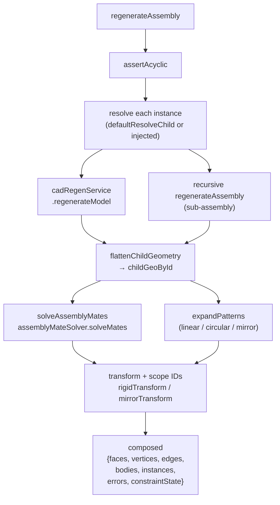

# assemblyRegenService

> **System** ▸ [Overview](../../00-overview.md) ▸ [Assembly](../../40-assembly.md) ▸ [Subsystem map](../00-overview.md) ▸ **assemblyRegenService**
> Related: [Instances & placement](../instances-placement.md) · [Patterns / mirror / subassemblies](../patterns-mirror-subassemblies.md) · [assemblyMateSolver](./assemblyMateSolver.md) · [assemblyAnalysisService](./assemblyAnalysisService.md)

---

## Requirements

| REQ | Status | Summary |
|-----|--------|---------|
| 752 | unapproved | Regenerate by resolving + transforming + scoping instances into one geometry |
| 753 | unapproved | Bill of materials from instances |
| 760 | unapproved | Linear component pattern |
| 761 | unapproved | Mirror a component instance |
| 763 | unapproved | Nested subassemblies |

### REQ 752 — Assembly regeneration

- **Description:** When regenerating an assembly, the CAD module shall resolve each non-suppressed component instance to its source geometry, apply its placement transform, and compose the combined assembly geometry.
- **Rationale:** An assembly is a composition of placed child parts; its geometry is derived, not stored.
- **Verification:** Compose two instances with namespaced IDs; confirm one combined geometry + per-instance roster.
- **Validation:** Moving a component re-composes the assembly view correctly.

---

## Succinct description

Node.js service that turns an `assemblyDoc` into renderable composed geometry: it resolves each component's mesh, runs the mate solver, expands patterns and mirrors, transforms and scopes all face/body IDs by instance, and returns a single flat geometry response.

## How it works — for everyone (non-technical)

When you open an assembly in the editor, this service is what produces the combined picture. It works through the assembly's parts list, fetches or re-draws each part's shape, then moves each part into the right place (using the mate solver if mates exist), and merges everything into one scene. It also expands any repeating patterns (a bolt that appears ten times, a mirrored component) and detects circular references (an assembly cannot contain itself).

## How it works — in detail (technical)

The module exports from `backend/services/assemblyRegenService.js`:

**`regenerateAssembly(assembly, { db, resolveChild?, kernelClient })`** is the main entry point. It runs three phases:

1. **Resolve** — calls `resolveChild` for each non-suppressed instance. The default resolver (`defaultResolveChild`) calls `cadRegenService.regenerateModel` for CAD children or recursively calls `regenerateAssembly` for sub-assembly children (`ref.kind === 'assembly'`, REQ 763), then normalizes the result through `flattenChildGeometry`.
2. **Solve** — if mates exist, delegates to the internal `solveAssemblyMates` wrapper which calls `assemblyMateSolver.solveMates`. Without mates, stored `placement` values are used as-is.
3. **Transform + compose** — for each render unit (base instances plus pattern copies), applies a `rigidTransform` or `mirrorTransform`, rescopes face IDs to `instanceId::faceId` via `scopeFace`, and accumulates into the `composed` result.

**`assemblyBom(assembly)`** aggregates instances by `partID`, skipping suppressed ones, returning `[{ partID, quantity }]` in first-appearance order (REQ 753).

**`assertAcyclic(assembly, db)`** walks the instance list recursively, rejecting any assembly that transitively contains its own `partID` with a 409 (REQ 763).

**`flattenChildGeometry(regenResult)`** normalizes the per-feature cumulative regen output from `cadRegenService` into `{ faces, vertices, edges, bodies }`. It picks the last recorded state per `bodyId` (last-write-wins, same convention as the editor), extracts topology vertices/edges, and preserves `volume`/`centroid` for mass-property accumulation.

Pattern expansion (`expandPatterns`) handles three kinds defined in each `AssemblyPattern` record:
- **linear**: copy `i` placed at `translate = seedTranslate + spacing * i`.
- **circular**: rotation by `angleStep * i` about `(axisOrigin, axisDir)` via `quatAboutAxis`/`qMul3`, count capped at 1000.
- **mirror**: single copy via `mirrorTransform`, which reflects world-space points/directions through the plane and sets `flip: true` so triangle winding is reversed in `transformFace`.

The `resolveChild` injection point allows unit tests to bypass the kernel entirely by supplying pre-built geometry stubs.

## Key files

- `backend/services/assemblyRegenService.js` — this module
- `backend/services/assemblyMateSolver.js` — mate solver called by `solveAssemblyMates`
- `backend/services/cadRegenService.js` — default child resolver delegates to this
