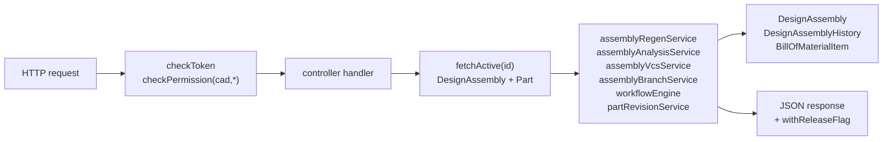

# assembly controller

> **System** ▸ [Overview](../../00-overview.md) ▸ [Assembly](../../40-assembly.md) ▸ [Subsystem map](../00-overview.md) ▸ **controller**
> Related: [routes](./routes.md) · [assemblyRegenService](./assemblyRegenService.md) · [assemblyAnalysisService](./assemblyAnalysisService.md) · [Instances & placement](../instances-placement.md)

---

## Requirements

Governed by the full assembly requirements group — [see 40-assembly.md](../../40-assembly.md) and [subsystem map](../00-overview.md). The controller is the HTTP surface for all of REQ 750–769.

---

## Succinct description

Express controller at `backend/api/design/assembly/controller.js` that exposes every assembly operation as an HTTP handler. It owns CRUD, component-instance and mate management, pattern/explode/display-state operations, regeneration, BOM, analysis, export, and the full VCS + branch + workflow + release surface.

## How it works — for everyone (non-technical)

The controller is the door between the web browser and the assembly back-end. Every button in the assembly editor triggers one of these handlers. The controller validates the request, finds the right assembly record in the database, calls the appropriate service, and sends back the result or a clear error message.

## How it works — in detail (technical)

All handlers require `cad` permission (read or write; `cad.approve` for force-unlock and production release). Two shared helpers run throughout:

- **`fetchActive(id)`** — finds a `DesignAssembly` row by id with `activeFlag: true`, including the associated Part (`id, name, sku, manufacturerPN, revision`).
- **`withReleaseFlag(assembly)`** — augments the serialized assembly with `released`, `displayRevision`, `draftRevision`, and `behindMain` by inspecting the VCS ref graph. Calls `cadVcsService.highestReleasedNumeric` and `vcsService.listRefs`/`walk`.
- **`recordHistory(assemblyID, userID, changeType, prev, next)`** — appends a `DesignAssemblyHistory` row on every mutation.
- **`sanitizePlacement(p)`** — validates and defaults `{ translate:[3], quaternion:[4] }`.

### Handler groups

**CRUD** (`listPartsWithAssembly`, `listEligibleParts`, `getActiveByPart`, `createForPart`, `getById`, `update`, `delete`)
- `createForPart`: validates Part exists and is in the "Assembly" category (fetches the part's category by PK then checks `category.name === 'Assembly'` — name-based, not a hardcoded id), rejects duplicates with 409, seeds the VCS repo (`assemblyVcsService.seedMain`) on a best-effort basis, records `'created'` history.
- `update`: calls `assemblyRegenService.assertAcyclic` before persisting a new `assemblyDoc`; sets `dirty: true`.
- `listEligibleParts`: finds the "Assembly" `PartCategory` by name (`findOne({ where: { name: 'Assembly' } })`), then lists every active part in it, annotated with `hasAssembly`.

**Instances** (`insertInstance`, `updateInstance`, `removeInstance`, `replaceInstance`)
- `insertInstance`: detects whether the child part has a CAD model or an assembly, sets `ref.kind` accordingly, auto-grounds the first inserted instance (SolidWorks "fix first part" convention), runs cycle detection.
- `replaceInstance`: swaps `partID`/`ref.kind` without touching mates (incompatible face references surface as regen errors later).

**Mates** (`addMate`, `removeMate`)
- Validates the eight mate types (`coincident`, `concentric`, `parallel`, `perpendicular`, `distance`, `angle`, `tangent`, `lock`), requires two distinct instances, stores both `mateId` and `id` fields (the solver keys by `id`).

**Patterns** (`addPattern`, `removePattern`)
- Validates `kind ∈ { linear, circular, mirror }`, sets pattern-specific fields (`count`, `spacing`, `axisOrigin`, `axisDir`, `angleStep`, `planeOrigin`, `planeNormal`).

**Explode / display states** (`autoExplode`, `setExplode`, `saveDisplayState`, `applyDisplayState`, `deleteDisplayState`)
- `autoExplode`: computes radial offsets from each instance's current `placement.translate` relative to the centroid, with a `spread` multiplier (default 1.5). Degenerate co-located instances fall back to a fan along +X by index.
- `setExplode`: clamps `factor` to `[0, 1]`, stores in `doc.explode`.
- `saveDisplayState`: snapshots which instances have `visible === false` as a named `{ id, name, hidden[] }` entry.
- `applyDisplayState`: restores visibility flags from a saved state's `hidden` set.

**Regen / BOM / analysis** (`regenerate`, `getBom`, `syncBom`, `massProperties`, `interference`)
- `regenerate`: calls `assemblyRegenService.regenerateAssembly`, then — if the requester holds the edit lock — persists back solved instance placements to `assemblyDoc`. Strips BRep bytes from the response (viewer needs meshes only).
- `syncBom`: calls `assemblyRegenService.assemblyBom`, destroys prior `BillOfMaterialItem` rows for the assembly Part, bulk-creates new rows.
- `massProperties` and `interference`: both run a full regen first, then call the corresponding `assemblyAnalysisService` function.

**Export** (`exportStep`, `exportStl`, `exportReleaseStep`, `exportReleaseStl`)
- Live export (`exportAssembly`): places each body's BRep via `placeBrep` (kernel `buildPattern` rotate + translate), then calls `cadRegenService.exportBodyBreps`.
- Release export (`exportFrozen`): resolves the revision tag → frozen commit → `assemblyFreezeService.geometryForCommit` — zero kernel regeneration.

**VCS** (`checkout`, `checkin`, `undoCheckout`, `forceUnlock`, `getCommits`)
- Thin wrappers over `assemblyVcsService`. `forceUnlock` requires `cad.approve`.

**Branches** (`listBranches`, `createBranch`, `switchBranch`, `archiveBranch`)
- Delegate to `assemblyBranchService`. Branches carry workflow state independently (`assemblyWorkflowRepo` keys by `repoId = lineageRoot:branchName`).

**Workflow** (`getWorkflow`, `transitionWorkflow`)
- Delegates to `workflowEngine`. Transitions fire with `authorUserID` for notification.

**Release** (`release`, `exportReleaseStep/Stl`, `productionRelease`)
- `release`: calls `releaseAssemblyToMain` — mints a new numeric Part revision via `partRevisionService.createNewRevision`, squash-releases the branch onto main, locks the Part and assembly, archives the branch ref. Requires checked-in state.
- `productionRelease`: requires `cad.approve` + workflow approval + existing dev release. Runs `partRevisionService.releaseToProduction` in a transaction, creates a new `DesignAssembly` row for the letter revision, tags the same frozen commit.

**Diff / reconcile** (`getCommitDiff`, `reconcilePreview`, `reconcile`)
- `getCommitDiff`: delegates to `cadDiffService.commitDiff` (shared with single-part CAD).
- `reconcilePreview`/`reconcile`: delegate to `assemblyBranchService`.

## Key files

- `backend/api/design/assembly/controller.js` — this module
- `backend/api/design/assembly/routes.js` — route wiring
- `backend/services/assemblyRegenService.js`, `assemblyAnalysisService.js` — called by regen/analysis/export handlers
- `backend/services/vcs/assemblyVcsService.js`, `assemblyBranchService.js`, `assemblyFreezeService.js` — VCS handlers
- `backend/services/vcs/workflowEngine.js` — review workflow
- `backend/services/partRevisionService.js` — revision minting at release
