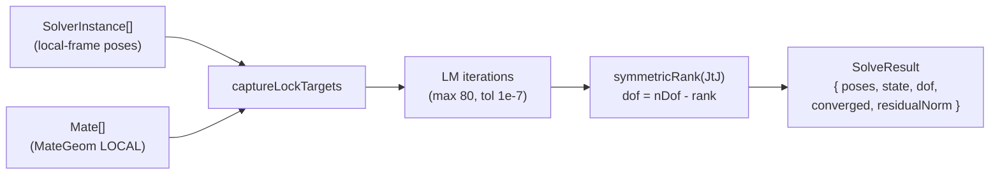

# mateSolver (browser)

> **System** ▸ [Overview](../../00-overview.md) ▸ [Assembly](../../40-assembly.md) ▸ [Subsystem map](../00-overview.md) ▸ **mateSolver**
> Related: [Mates & solver](../mates-solver.md) · [assemblyMateSolver (Node)](./assemblyMateSolver.md) · [assembly.types](./assembly.types.md)

---

## Requirements

| REQ | Status | Summary |
|-----|--------|---------|
| 748 | unapproved | 3D assembly mate solver |
| 756 | unapproved | Mate types: coincident/concentric/parallel/perp/distance/angle/tangent/lock |
| 757 | unapproved | Report under/fully/over-constrained |

### REQ 748 — 3D mate solver

- **Description:** The CAD module shall provide a 3D assembly mate solver that positions rigid component instances by solving geometric mate constraints (mates) between faces.
- **Rationale:** Real assemblies are defined by relationships, not absolute coordinates; a constraint solver lets parts move together correctly as the design changes.
- **Verification:** Two parts with a coincident + concentric mate solve to the expected relative pose; over-constraint is detected.
- **Validation:** A user mates a bolt into a hole and it snaps to the correct position.

---

## Succinct description

TypeScript browser module (`frontend/src/app/cad/lib/mateSolver.ts`) implementing the Levenberg-Marquardt rigid-body mate solver for interactive warm-started drag. It is framework-free and algorithm-identical to the Node port `assemblyMateSolver.js`.

## How it works — for everyone (non-technical)

When you drag a component in the assembly editor, the browser needs to re-solve its position in real time without a server round-trip. This module does that: it runs the same mathematics as the server, just directly in the browser, so the part snaps to its mated position instantly as you drag.

## How it works — in detail (technical)

`frontend/src/app/cad/lib/mateSolver.ts` exports one function and several types.

### Exported types

| Type | Shape |
|------|-------|
| `Vec3` | `[number, number, number]` |
| `Quat` | `[number, number, number, number]` (x,y,z,w) |
| `MateGeom` | `{ kind:'plane'; origin:Vec3; normal:Vec3 }` \| `{ kind:'axis'; origin:Vec3; direction:Vec3; radius?:number }` |
| `SolverInstance` | `{ id, grounded?, translate:Vec3, quaternion:Quat }` |
| `MateType` | `'coincident'|'concentric'|'parallel'|'perpendicular'|'distance'|'angle'|'tangent'|'lock'` |
| `Mate` | `{ id, type, a:MateRef, b:MateRef, value?, flip?, suppressed? }` |
| `MateRef` | `{ instanceId, geom:MateGeom }` |
| `Pose` | `{ translate:Vec3, quaternion:Quat }` |
| `ConstraintState` | `'under' | 'fully' | 'over'` |
| `SolveResult` | `{ poses, converged, residualNorm, dof, state, iterations }` |
| `SolveOptions` | `{ maxIterations?, tolerance? }` |

### Algorithm

**`solveMates(instances, mates, opts?): SolveResult`**

The geometry types passed here are LOCAL-frame analytic surfaces (not BRep, not tessellation). The residual functions and LM loop are algorithm-identical to the Node port; see [assemblyMateSolver.md](./assemblyMateSolver.md) for the full walkthrough.

Notable TypeScript-specific detail: `buildJtJ` is factored out as a standalone function, called when the main loop didn't run (already-solved input) in order to compute rank for the constraint-state classification. The Node port inlines this.

`lockTargets` is a module-level `Map<string, { relQ:Quat; relT:Vec3 }>` — not a class field — so the function is stateless between calls (targets are cleared at entry and exit).

### Differences from the Node port

| | Browser (`mateSolver.ts`) | Node (`assemblyMateSolver.js`) |
|---|---|---|
| Types | TypeScript, exported interfaces | Plain JS, JSDoc comments |
| `buildJtJ` | Factored out (used for rank on no-iteration path) | Inlined |
| Intended caller | `AssemblyEditController` (interactive drag, warm-start from current poses) | `assemblyRegenService.solveAssemblyMates` (authoritative on save/regen) |
| Lock targets | module-level `Map`, cleared per call | same |

The two files are intended to be kept in sync. The algorithm, constants (`maxIterations=80`, `tolerance=1e-7`, `eps=1e-6`, `lambda` initial value `1e-3`), and residual formulas are identical.

## Key files

- `frontend/src/app/cad/lib/mateSolver.ts` — this module
- `backend/services/assemblyMateSolver.js` — Node port (identical algorithm)
- `frontend/src/app/cad/lib/assembly.types.ts` — `MateType`, `ConstraintState`, `AssemblyDoc` types used upstream
