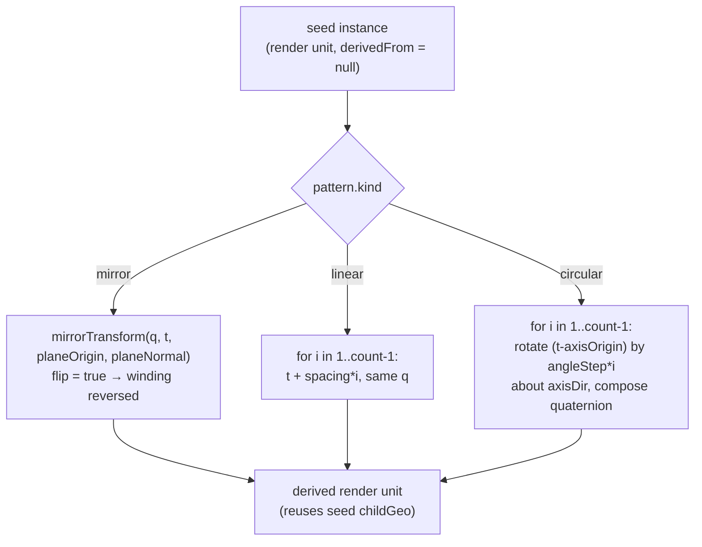

# Patterns, Mirror & Subassemblies

> **System** ▸ [Overview](../00-overview.md) ▸ [Assembly](../40-assembly.md) ▸ **Patterns / mirror / subassemblies**
> Related: [Assembly map](./00-overview.md) · [Instances & placement](./instances-placement.md) · [Mates & solver](./mates-solver.md)

---

## Requirements

| REQ | Status | Summary |
|-----|--------|---------|
| 760 | unapproved | Linear and circular component patterns from a seed instance |
| 761 | unapproved | Mirror a seed instance across a plane (opposite-hand copy) |
| 763 | unapproved | Nest one assembly inside another; recurse + reject cycles |

### REQ 760 — Component patterns

- **Description:** The CAD module shall support a linear component pattern that creates a specified number of additional copies of a seed component instance, each offset from the previous by a fixed translation vector, and a circular component pattern that creates copies rotated about a specified axis by a fixed angular step. Pattern copies are derived (expanded at regeneration) from the seed and its placement.
- **Rationale:** Component patterns are a core productivity feature (bolt circles, repeated brackets). Expanding copies parametrically from the seed at regeneration keeps the document compact and the copies tied to the seed position.
- **Verification:** Backend `assembly-patterns.test.js` asserts a linear pattern of N produces N placed bodies at the expected offsets and a circular pattern places copies at the expected rotated positions.
- **Validation:** A user creates a linear pattern of a bracket and sees evenly spaced copies; a circular pattern of a bolt places copies around a bolt circle.

### REQ 761 — Mirror

- **Description:** The CAD module shall support mirroring a seed component instance across a plane, producing an opposite-hand copy whose geometry is reflected across the plane (with consistent outward-facing surfaces).
- **Rationale:** Mirror is required for symmetric assemblies (left/right hand parts). A true geometric reflection (not just a repositioned copy) produces the correct opposite-hand geometry.
- **Verification:** Backend `assembly-patterns.test.js` asserts a mirrored instance reflects vertex positions across the plane and reverses triangle winding.
- **Validation:** A user mirrors a left bracket across the center plane and gets a correct right bracket.

### REQ 763 — Subassembly nesting

- **Description:** The CAD module shall support nesting one assembly inside another: a component instance may reference a part whose CAD content is itself an assembly, in which case regeneration recursively composes the sub-assembly geometry and places it as a single rigid component. The module shall reject a nesting that would create a cycle.
- **Rationale:** Subassemblies are fundamental to managing complex products. Recursive composition with cycle rejection prevents infinite recursion while enabling arbitrary nesting depth.
- **Verification:** Backend `assembly-subassembly.test.js` asserts a parent assembly composes a referenced sub-assembly's bodies under the parent instance scope and that a cyclic nesting is rejected.
- **Validation:** A user builds a sub-assembly and inserts it as a component of a larger assembly.

---

## Succinct description

Patterns and mirror are *derived* render units: a seed instance plus a transform, expanded only at regeneration so the document stays compact. Linear/circular patterns reuse the seed's already-resolved geometry with computed placements; mirror applies a true geometric reflection (with winding reversed for outward normals). Subassemblies are instances whose referenced part is itself an assembly — resolved by recursing through `regenerateAssembly` and placed as one rigid child, guarded by cycle detection.

---

## How it works — for everyone (non-technical)

Three ways to get more parts without inserting them one by one.

- **Patterns** repeat a part automatically. A *linear* pattern stamps copies in a straight line, each shifted by the same step ("ten brackets, 25 mm apart"). A *circular* pattern arranges copies around a circle ("eight bolts evenly around this hole circle"). You only place the original; the system fills in the rest.
- **Mirror** makes the opposite-hand twin of a part — a left bracket becomes a proper right bracket, genuinely flipped (not just moved to the other side), so it fits a mirror-image position correctly.
- **Subassemblies** let you build a small assembly once and drop the whole thing into a bigger one as a single component, as deep as you like. The only thing forbidden is putting an assembly inside itself (directly or through a chain) — that would never finish drawing, so the system blocks it.

---

## How it works — in detail (technical)

### Patterns & mirror are render-unit expansion

`regenerateAssembly` first builds **render units** from the base instances (each at its solved pose, with `rigidTransform(q, t)`), then calls `expandPatterns(patterns, renderUnits, errors)` to append derived units. Each derived unit reuses the seed's already-resolved `childGeo` — no extra kernel call — with a computed pose and transform. Phase C then transforms and scopes every unit identically, so a pattern copy and a hand-placed instance go through the same compose path.



`expandPatterns` (in `backend/services/assemblyRegenService.js`):

- **`seedOf(id)`** finds the seed render unit (a base unit with `derivedFrom === null`); a missing seed pushes an error and skips the pattern.
- **Mirror.** One copy with id `` `${seed.instanceId}#${pat.patternId}m` ``, pose held at the seed pose, transform = `mirrorTransform(sq, st, planeOrigin ?? [0,0,0], planeNormal ?? [1,0,0])`. `mirrorTransform` first applies the seed's rigid placement, then reflects points and directions across the world plane; its `flip: true` flag tells `transformFace` to **reverse triangle winding** (swap each triangle's 2nd/3rd index) so reflected geometry keeps outward-facing normals (REQ 761).
- **Linear.** `count` copies (clamped 1…1000). Copy `i` has translation `st + spacing*i` and the seed's quaternion; transform = `rigidTransform`.
- **Circular.** Copy `i` rotates the seed's relative position `(st − axisOrigin)` by `angleStep*i` about the normalized `axisDir` (via `quatAboutAxis`), re-adds `axisOrigin`, and composes the rotation onto the seed quaternion (`qMul3`).

Each derived unit carries a `derivedFrom` descriptor (`{ patternId, seedInstanceId, kind, index? }`), which propagates into both the placed `bodies[]` and the per-instance `instances[]` roster so the viewer can attribute derived geometry to its pattern.

> **Note on derived BReps:** derived bodies carry the **seed's** untransformed BRep plus their own placement. Linear/circular placements export correctly (rotate+translate kernel-side). Mirror copies are export-approximated as the seed BRep for now — a comment in `assemblyRegenService` flags this; the rendered mesh is correctly reflected, but the exported solid does not yet carry the reflection.

### Pattern authoring (controller)

`addPattern` (`POST /:id/patterns`) validates `kind ∈ {linear, circular, mirror}` and that `seedInstanceId` exists, then mints `` `p${nextPatternSeq}` `` and stores kind-specific fields: linear → `count` + `spacing` (default `[10,0,0]`); circular → `count` + `axisOrigin` + `axisDir` + `angleStep` (default `π/4`); mirror → `planeOrigin` + `planeNormal` (default `[1,0,0]`). `removePattern` (`DELETE /:id/patterns/:patternId`) filters it out. The frontend form (`assembly-edit.controller.ts` `createPattern`) maps a degrees angle to radians and the plane choice (`YZ`/`XZ`/`XY`) to the corresponding normal.

### Subassemblies (REQ 763)

A subassembly is just an instance whose referenced part has an active `DesignAssembly`. `defaultResolveChild` detects this — either `instance.ref.kind === 'assembly'` or a part with an assembly but no CAD model — and recurses:

```
const sub = await regenerateAssembly(childAssembly, { db, kernelClient });
return { faces: sub.faces, vertices: sub.vertices, edges: sub.edges, bodies: sub.bodies };
```

The sub-assembly's bodies are already placed in its own frame; the parent treats the whole thing as **one rigid child**, then applies the parent instance's placement and scopes the child body ids under the parent instance id (so a sub-body keeps its inner `subInstance::body` scope nested under `parentInstance::…`).

Cycle protection runs at two layers. `assertAcyclic(assembly, db, visited)` walks the reference graph before any mutating persist and at the top of `regenerateAssembly`, throwing a 409 (`Circular assembly reference: an assembly cannot contain itself`) on a repeat `partID`. The direct self-insert case (an instance whose `partID` equals the assembly's own `partID`) is caught without touching the database, so the guard works in the unit tests and on both PG and SQLite.

---

## Key files

- `backend/services/assemblyRegenService.js` — `expandPatterns`, `rigidTransform`, `mirrorTransform`, `quatAboutAxis`, `qMul3`, `defaultResolveChild` (subassembly recursion), `assertAcyclic`
- `backend/api/design/assembly/controller.js` — `addPattern`, `removePattern`
- `frontend/src/app/components/cad/assembly-editor/assembly-edit.controller.ts` — pattern form state (`createPattern`, `removePattern`)
- `frontend/src/app/cad/lib/assembly.types.ts` — `AssemblyPattern`, `PatternKind`
