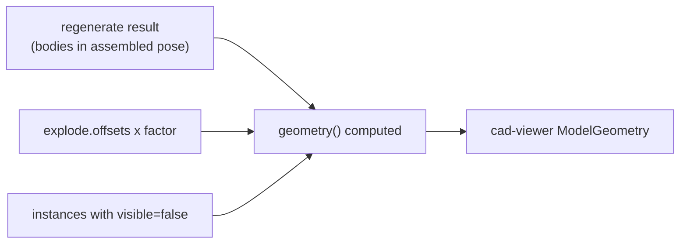

# Assembly Visualization — Explode, Display States, Section

> **System** ▸ [Overview](../00-overview.md) ▸ [Assembly](../40-assembly.md) ▸ **Visualization**
> Related: [Assembly map](./00-overview.md) · [Instances & placement](./instances-placement.md) · [Analysis](./analysis.md)

---

## Requirements

| REQ | Status | Summary |
|-----|--------|---------|
| 764 | unapproved | Exploded view: per-instance offsets × explode factor; auto-explode radially |
| 765 | unapproved | Named display states capturing hidden component instances |
| 766 | unapproved | Section view: clip displayed geometry against a plane; toggle off |

### REQ 764 — Exploded view

- **Description:** The CAD module shall provide an exploded view of an assembly in which each component instance is displaced from its assembled position by a per-instance offset scaled by an explode factor from zero (assembled) to one (fully exploded). The module shall offer an automatic explode that derives offsets by spreading components radially from the assembly center, and shall persist the explode offsets.
- **Rationale:** Exploded views are the standard way to communicate how an assembly goes together. A scalar factor gives smooth assemble/explode animation; an automatic radial explode gives a usable starting point.
- **Verification:** Backend `assembly-visualization.test.js` asserts auto-explode computes nonzero radial offsets from instance placements and that the explode configuration persists.
- **Validation:** A user clicks Auto Explode and drags a slider to pull the components apart and back together.

### REQ 765 — Named display states

- **Description:** The CAD module shall support named display states for an assembly that capture which component instances are hidden, with the ability to save the current visibility as a new display state, apply a saved state, and delete a state.
- **Rationale:** Display states let users save and recall visibility configurations (e.g. show only the frame, hide fasteners) without manually toggling every component.
- **Verification:** Backend `assembly-visualization.test.js` asserts saving the current visibility creates a state, applying it restores the hidden set, and deletion removes it.
- **Validation:** A user hides several components, saves the configuration as a named display state, and later re-applies it.

### REQ 766 — Section view

- **Description:** The assembly viewer shall support a section view that clips the displayed geometry against a plane (defined by an origin and a normal), revealing the interior of the assembly, and shall allow the section to be toggled off.
- **Rationale:** Section views are required to inspect internal fit and clearances. A single clipping plane covers the common inspection case.
- **Verification:** Manual browser smoke test (the clipping plane is a renderer feature verified visually; the section state plumbing is covered by the editor).
- **Validation:** A user enables a section plane and sees the assembly cut open to reveal interior components.

---

## Succinct description

Three presentation features, all driven from `assemblyDoc` (explode + display states) or editor state (section). Exploded view displaces each instance's mesh by a stored per-instance offset scaled by a 0…1 factor; auto-explode derives those offsets radially from the assembly centroid. Display states are named sets of hidden instance ids. Section view feeds a single clipping plane into the Three.js renderer. Explode and display states are mostly frontend group transforms over the regenerate result; section is a pure renderer feature.

---

## How it works — for everyone (non-technical)

Three ways to *look at* an assembly without changing what it is.

- **Exploded view** pulls the parts apart so you can see how they stack — like a furniture instruction diagram. A slider runs from "fully together" to "fully apart", and animates smoothly between. "Auto explode" spreads the parts outward from the middle automatically so you don't have to drag each one.
- **Display states** are saved show/hide setups. Hide all the fasteners, save it as "frame only", and later recall it in one click instead of toggling every bolt off again.
- **Section view** slices the assembly with a flat plane so you can peer inside and check that interior parts fit. Toggle it off to see the whole thing again.

---

## How it works — in detail (technical)

### Exploded view (REQ 764)

The explode config lives on `assemblyDoc.explode = { offsets: Record<instanceId, [x,y,z]>, factor }`.

- **Auto-explode** (`autoExplode`, `POST /:id/explode/auto`): computes the centroid of all non-suppressed instance translations, then for each instance sets `offset = (translate − centroid) × spread` (default `spread = 1.5`). A degenerate instance coincident with the centroid (magnitude < 1e-6) falls back to a fan along +X by index (`[50·(idx+1), 0, 0]`) so it still separates. Offsets are persisted; the response carries the new config.
- **Factor** (`setExplode`, `PUT /:id/explode`): clamps `factor` into `[0, 1]` and may set manual `offsets`. The frontend slider calls this without re-rendering server-side.
- **Application is frontend-only.** `assembly-edit.controller.ts`'s `geometry` computed signal reads `explode.offsets[instanceId]` × `explodeFactor()` and shifts each visible body's positions/vertices/edges by that vector when building the viewer `ModelGeometry`. The composed geometry from the server is untouched — the displacement is purely presentational.

### Named display states (REQ 765)

A display state is `{ id, name, hidden: string[] }` stored in `assemblyDoc.displayStates`.

- **Save** (`saveDisplayState`, `POST /:id/display-states`): snapshots `hidden = instances.filter(visible === false).map(instanceId)`, mints `` `ds${nextDisplayStateSeq}` ``, requires a non-empty `name`.
- **Apply** (`applyDisplayState`, `POST /:id/display-states/:stateId/apply`): sets every instance's `visible` to `!hidden.has(instanceId)`, restoring the saved show/hide configuration.
- **Delete** (`deleteDisplayState`, `DELETE /:id/display-states/:stateId`).

The per-instance `visible` flag (also toggled directly via `updateInstance`) is the runtime visibility; `geometry()` skips any body whose `instanceId` is in the hidden set.

### Section view (REQ 766)

Section is editor + renderer state, not stored on the document. In `assembly-edit.controller.ts`:

- `sectionEnabled`, `sectionAxis` (`'X' | 'Y' | 'Z'`), and `sectionPos` signals drive a `sectionPlane` computed → `{ normal, point }` (or `null` when disabled). The normal is the axis basis vector; the point is `normal × sectionPos`.
- The `cad-viewer.component.ts` accepts `sectionPlane` as an `input()` and, in an `effect`, sets `renderer.clippingPlanes = [new THREE.Plane().setFromNormalAndCoplanarPoint(n, p)]` when present, or clears it to `[]` when null. This is a single global clipping plane on the Three.js `WebGLRenderer` — the same viewer the CAD modeler uses, so section view is "written once" across CAD and assembly.

---

## Key files

- `backend/api/design/assembly/controller.js` — `autoExplode`, `setExplode`, `saveDisplayState`, `applyDisplayState`, `deleteDisplayState`
- `frontend/src/app/components/cad/assembly-editor/assembly-edit.controller.ts` — `geometry()` (explode + hide application), `explodeFactor`, `sectionPlane`, display-state actions
- `frontend/src/app/components/cad/cad-viewer/cad-viewer.component.ts` — `sectionPlane` input + clipping-plane effect (line ~719)
- `frontend/src/app/cad/lib/assembly.types.ts` — `ExplodeConfig`, `DisplayState`
