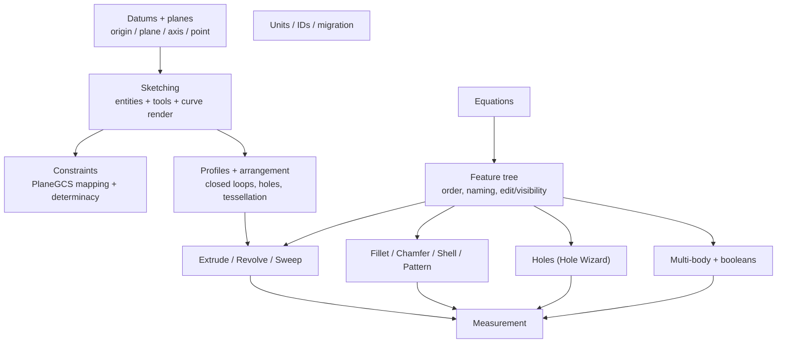

# CAD Modeler — Feature-Group Overview

> **System** ▸ [Overview](../00-overview.md) ▸ [CAD Modeler](../10-cad-modeler.md) ▸ **Modeler subsystem map**
> Related: [Kernel](../20-kernel.md) · [VCS](../30-vcs.md) · [Architecture](../50-architecture.md)

---

## Requirements

| REQ | Status | Summary |
|-----|--------|---------|
| 512 | unapproved | Parametric 3D CAD modeling capability attached to each Part record |
| 521 | unapproved | 2D sketching environment (place primitives, apply constraints) |
| 545 | unapproved | Ordered feature list that produces the model's 3D geometry |
| 558 | unapproved | Newton-Raphson 2D constraint solver (PlaneGCS / FreeCAD) |
| 559 | unapproved | Discriminated-union SketchEntity model (point/line/circle/arc/…) |
| 616 | unapproved | Tabbed ribbon toolbar; sketch as a 2D overlay in the 3D scene |

### REQ 512 — CAD modeling capability (the root)

- **Description:** The system shall provide a parametric 3D CAD modeling capability attached to each Part record, allowing a user to create and edit a versioned model through a browser interface without native software installation, and to release each revision through a draft→review→released workflow.
- **Rationale:** Mechanical part geometry currently has no first-class home in the inventory system. A versioned CAD model per Part enables downstream features (visual identification, 3D drawings, BOM derivation) and aligns mechanical design with the release workflow used for wire harnesses and engineering masters.
- **Verification:** Demonstration in current Chromium / Firefox / WebKit plus backend CRUD/revision tests and an end-to-end editor smoke test.
- **Validation:** A mechanical designer can open a Part, attach a CAD model, edit it through draft, submit for review, and release it for downstream use.

### REQ 545 — Ordered feature list

- **Description:** The CAD module shall maintain an ordered list of features that produces the model's 3D geometry; each feature shall have a unique identifier, a type, and parameters appropriate to that type.
- **Rationale:** Parametric modeling treats features as first-class entities so they can be edited, reordered, and used as inputs to subsequent features. The feature tree is the spine all parametric operations hang off.
- **Verification:** `frontend/src/app/cad/lib/featureTree.spec.ts` (start with origin, append, remove, immutable updates, type guards).
- **Validation:** A user can examine the list of features that produced the current model.

### REQ 616 — Tabbed ribbon + 3D sketch overlay

- **Description:** The top of the CAD editor shall present a tabbed toolbar (ribbon) similar to SolidWorks and OnShape, auto-switching to the Sketch tab when a sketch is active. While a sketch is active the 3D viewport stays in perspective projection and sketch entities render as a 2D overlay on the host plane; picking and dragging operate via ray-plane intersection projected to the sketch's 2D coordinate system.
- **Rationale:** SolidWorks and OnShape users expect tabs plus a persistent 3D context — switching back and forth to compare sketch placement against existing geometry is the central modeling gesture.
- **Verification:** Manual UI verification of tab rendering, `[hidden]`-based content swap, the auto-switch effect, and `cad-viewer.toSketchCoords` ray-plane projection.
- **Validation:** A user can sketch on a face of an existing body while still seeing the surrounding 3D geometry.

---

## Succinct description

The modeler is the part-design surface: a 2D sketcher backed by a PlaneGCS constraint solver, an ordered feature tree that regenerates a solid through the kernel, and a Three.js viewer for visualizing and selecting the result — all inside a SolidWorks-style ribbon editor. This page is the map; each linked sub-page covers one coherent slice.

---

## How it works — for everyone (non-technical)

You build a part in two layers. First you **sketch** a 2D outline on a flat surface and pin it down with rules ("this line is horizontal", "this gap is 5 mm"). Then you turn sketches into **3D features**: push a profile into a block, spin it around an axis, drag it along a path, round edges, hollow it out, drill holes, stamp patterns. Every step is an entry in an ordered list — the *feature tree* — and editing any step rebuilds everything after it.

Around those two layers sit helpers: **datums** (reference planes and axes to sketch on), **equations** (so dimensions stay related), **measurement** (distances and angles between anything you click), and **multi-body** tools (several separate solids in one part, which you can then join, cut, or intersect). This page links to a focused write-up for each.

---

## How it works — in detail (technical)

The modeler library is `frontend/src/app/cad/lib/`. Sketches are tagged-union `SketchEntity` lists (`types.ts`) mutated immutably (`store.ts`), solved by PlaneGCS (`solver.ts`), and analyzed for degrees of freedom (`determinacy.ts`). The ordered `FeatureTree` (`featureTree.ts`) drives backend regeneration (`backend/services/cadRegenService.js`), which extracts a profile per sketch (`cadProfile.js`), resolves equations (`cadEquations.js`), and calls the Rust/OCCT kernel.

### Sub-pages

- [Sketching](./sketching.md) — the 2D environment, the entity model, the sketch tools, curve rendering. (REQ 521, 522, 523, 559–565, 566–581, 598–606)
- [Constraints](./constraints.md) — constraint types, the PlaneGCS solver mapping, determinacy. (REQ 524, 525, 526, 532, 533, 558, 582–597)
- [Datums and planes](./datums-planes.md) — origin, datum plane/axis/point, plane math. (REQ 534, 535, 536, 657, 660, 661)
- [Profiles and arrangement](./profiles-arrangement.md) — profile extraction, closed-loop arrangement, holes, tessellation, picking. (REQ 548, 612, 617, 621)
- [Feature tree](./feature-tree.md) — ordered list, naming, edit/delete/visibility, multi-select. (REQ 545, 546, 547, 607, 609, 610, 611, 622, 624, 626, 649)
- [Extrude / Revolve / Sweep](./extrude-revolve-sweep.md) — the additive features, previews, dialogs. (REQ 549, 550, 607, 609, 617, 618, 619)
- [Fillet / Chamfer / Shell / Pattern](./fillet-chamfer-shell-pattern.md) — edge blend, chamfer modes, shell, patterns, mirror/move body. (REQ 642–648, 658, 659, 666, 667)
- [Holes](./holes.md) — Hole Wizard, spec table, cosmetic threads. (REQ 663, 664, 665)
- [Equations](./equations.md) — global + target-driven equations, expr-eval, dependency graph. (REQ 634–641)
- [Multi-body](./multi-body.md) — multiple bodies, combine/boolean, merge-result, bodies panel. (REQ 621, 662, 666, 667)
- [Measurement](./measurement.md) — the Measure tool, shared with the assembly editor. (REQ 652–656)
- [Units, IDs, migration](./units-ids-migration.md) — unit parse/format, globally-unique IDs, schema migration. (REQ 565, 742)

---

## Key files

- `frontend/src/app/cad/lib/` — the modeling library (`types.ts`, `store.ts`, `solver.ts`, `determinacy.ts`, `featureTree.ts`, `profile.ts`, `datum.ts`, `equations.ts`, `pattern.ts`, `measure.ts`, `holeSpecs.ts`, `units.ts`, `ids.ts`, `migration.ts`, …)
- `frontend/src/app/components/cad/` — editor, sketch editor, viewer, feature-tree panel, dialogs
- `backend/services/cadRegenService.js`, `cadProfile.js`, `cadEquations.js` — backend regeneration
- `frontend/src/app/cad/vendor/planegcs/` — vendored PlaneGCS WASM solver
