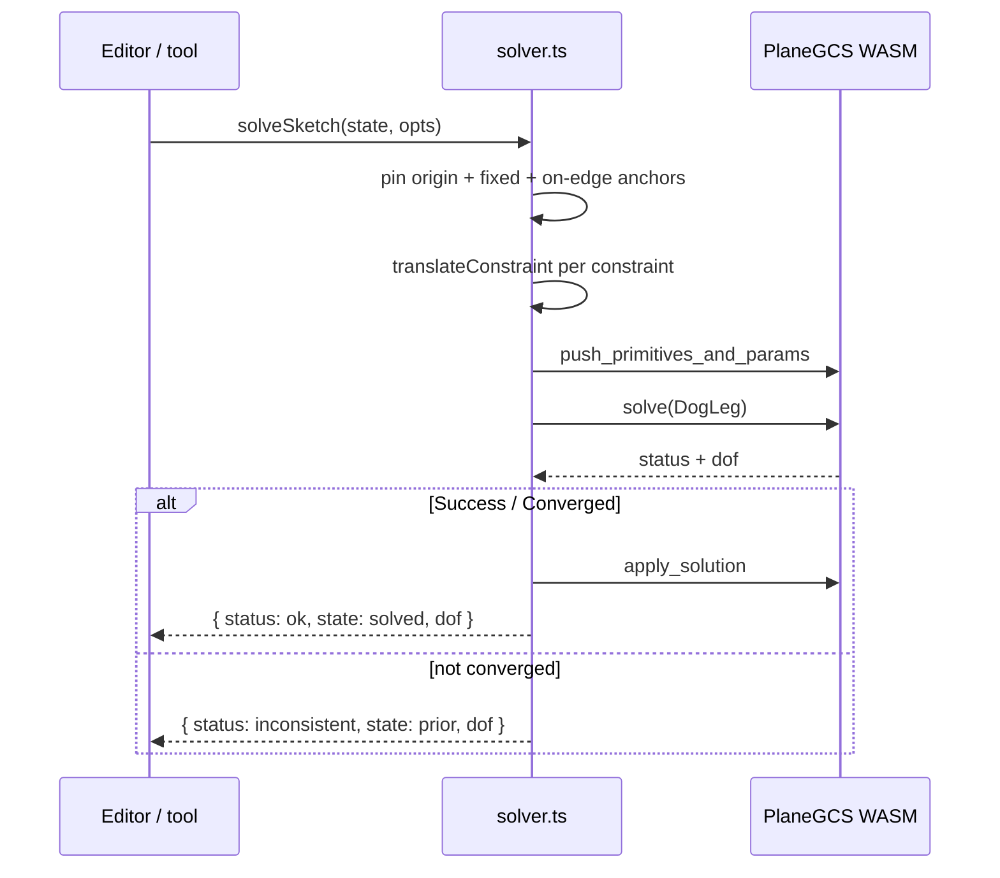

# Constraints and the Solver

> **System** ▸ [Overview](../00-overview.md) ▸ [CAD Modeler](../10-cad-modeler.md) ▸ **Constraints**
> Related: [Sketching](./sketching.md) · [Modeler overview](./00-overview.md) · [VCS](../30-vcs.md)

---

## Requirements

| REQ | Status | Summary |
|-----|--------|---------|
| 524 | unapproved | Supported constraint types (coincident, parallel, …) between primitives |
| 525 | unapproved | Re-solve when a primitive moves or a constraint parameter changes |
| 526 | unapproved | Reject a constraint that yields an inconsistent system |
| 532 | unapproved | Present a user-visible message when a constraint is rejected |
| 533 | unapproved | Render under-constrained primitives distinguishably |
| 558 | unapproved | Newton-Raphson 2D solver based on PlaneGCS |
| 582–589 | unapproved | Perpendicular / parallel / tangent / equal / symmetric / midpoint / concentric / collinear |
| 590–595 | unapproved | Radius / diameter / angle / horizontal-distance / vertical-distance / point-on-curve |
| 596, 597 | unapproved | Block constraint; Merge of two points |

### REQ 558 — 2D constraint solver

- **Description:** The CAD module shall solve sketch constraint systems using a Newton-Raphson 2D geometric constraint solver based on the PlaneGCS WASM library (vendored at `frontend/src/app/cad/vendor/planegcs/`), replacing the prior iterative projection solver.
- **Rationale:** Iterative projection cannot reliably converge on mixed-constraint systems involving tangency, perpendicularity, equality, and dimensions. PlaneGCS is the production solver shipped with FreeCAD and exposes analytical Jacobians.
- **Verification:** `frontend/src/app/cad/lib/solver.spec.ts` covers every supported constraint type, construction-point pinning, a fully-constrained rectangle (DOF=0), and conflict rejection.
- **Validation:** Sketches with realistic constraint combinations (two tangent circles with equal radius and a dimensioned center distance) reach DOF=0 in a single solve.

### REQ 526 — Reject inconsistent systems

- **Description:** When the user attempts to apply a constraint that yields an inconsistent constraint system, the CAD module shall reject that constraint and leave the sketch in its prior solved state.
- **Rationale:** Over-defining a sketch must fail safe — the user's existing geometry must not be corrupted by a contradictory constraint.
- **Verification:** `solver.spec.ts` adds a contradictory constraint and asserts the solve reports `inconsistent` and the state is unchanged.
- **Validation:** A user adds a conflicting dimension and the editor refuses it without scrambling the sketch.

### REQ 533 — Under-constrained styling

- **Description:** The CAD module shall render under-constrained sketch primitives in a visual style distinguishable from the style used for fully-constrained primitives.
- **Rationale:** Designers rely on the "is this geometry pinned?" signal to know when a sketch is finished — it is the central feedback loop of parametric sketching.
- **Verification:** `determinacy.spec.ts` asserts the determined-entity set for known under/over/fully-constrained sketches.
- **Validation:** A user sees which entities still have freedom and which are locked.

---

## Succinct description

User-facing constraints (geometric and dimensional) translate to PlaneGCS primitives in `solver.ts`, the WASM solver runs Newton-Raphson with analytical Jacobians, and a separate Jacobian-rank analyzer (`determinacy.ts`) reports which entities are fully determined so the UI can color them.

---

## How it works — for everyone (non-technical)

Constraints are rules you put on your sketch: "these two lines are parallel", "this circle is tangent to that line", "this distance is exactly 20 mm". After every change, a small math engine re-arranges the sketch so all the rules hold at once — like tightening guy-wires until the tent settles into one shape.

If you add a rule that contradicts the others (say, two different lengths for the same line), the engine refuses it and leaves your sketch exactly as it was, with a message explaining why. The editor also colors geometry differently depending on whether it is still free to wiggle or fully pinned down, so you always know how close you are to "finished".

---

## How it works — in detail (technical)

### Constraint data model

A `SketchConstraint` (in `types.ts`) has an `id`, a `ConstraintType`, an array of `ConstraintTarget` (`{ entityId, sub? }`), and optional `value`, `unit`, `placement`, `driven`, `chainId`, and `externalRef`. Geometric types: `coincident`, `fixed`, `horizontal`, `vertical`, `perpendicular`, `parallel`, `tangent`, `equal`, `symmetric`, `midpoint`, `concentric`, `coradial`, `collinear`, `on-edge`. Dimensional types: `distance`, `radius`, `diameter`, `angle`, `horizontal-distance`, `vertical-distance`, `point-line-distance`, `arc-length`, `chord-distance`. The unified `coincident` covers point-point, point-on-line, and point-on-curve (legacy `point-on-line`/`point-on-curve` migrate into it).

### The PlaneGCS translation (`solver.ts`)

The solver is the vendored WASM at `frontend/src/app/cad/vendor/planegcs/` (LGPL, vendored rather than an npm dep — see its `PROVENANCE.md`). `translateConstraint` maps each `SketchConstraint` to one or more PlaneGCS `SketchPrimitive`s:

- **Direct (1:1):** `horizontal`→`horizontal_l`, `vertical`→`vertical_l`, `distance`→`p2p_distance`, `perpendicular`→`perpendicular_ll`, `parallel`→`parallel`, `point-line-distance`→`p2l_distance`.
- **Dispatch by kind:** `tangent` selects among `tangent_lc/la/le/cc/aa/ca` by the two entities' kinds (`tangentPrimitive`); `equal` selects among `equal_length`/`equal_radius_cc/aa/ca` (`equalPrimitive`).
- **Synthesized (one constraint → several primitives):** `midpoint` = point-on-line + point-on-perp-bisector; `symmetric` = midpoint-on-line + perpendicular about the axis; `concentric` = coincident centers; `coradial` = coincident centers + equal radius; `collinear` = parallel + point-on-line. Synthesized primitive ids are suffixed (`${c.id}-onl`, `-pb`, …) to avoid clashing with entity ids.
- **Driven dimensions:** `radius`/`diameter` emit `circle_radius`/`arc_radius`/`circle_diameter`/`arc_diameter`; `angle` uses `l2l_angle_pppp` with sign-correction so the rotation takes the minimal path; `horizontal-distance`/`vertical-distance` use PlaneGCS `difference` on the x/y param with a sign chosen from current geometry.

### The solve flow

`solveSketch` caches the WASM wrapper for the module lifetime (init is ~50 ms; `clear_data()` resets between solves). It pins the origin and every `fixed`-target point, plus `on-edge` (Convert Entities) anchor points whose coordinates come from a body edge — unless the point is otherwise position-constrained. It solves with the DogLeg algorithm and reads `dof()`. On `Success`/`Converged` it applies and reads back coordinates (REQ 525); otherwise it returns the **prior** state tagged `inconsistent` so the caller can reject the constraint and show a message (REQ 526, 532). `solveSketchAfterAdd` runs a two-pass solve that first pins everything not touched by the new constraint, biasing the solution toward minimal disturbance.

### Determinacy (REQ 533)

`determinacy.ts` computes per-entity determinacy that PlaneGCS's scalar DOF doesn't give. `analyzeDeterminacy` builds the constraint Jacobian by finite differences (rows = constraint residuals, columns = free params: each non-fixed point's x/y, each circle/arc radius), reduces to row echelon form with column pivoting, and reads off pivot columns as "determined". The origin, `fixed` targets, and `on-edge` anchors are pre-fixed (no column allocated). An entity is reported determined only when all its supporting params are — a line when both endpoints are, a circle when center + radius are. A heuristic fallback (`analyzeHeuristic`) runs if the exact analyzer throws. Dimension annotations (extension lines, value pills, placement) are derived in `dimensions.ts`; constraint badges in `constraintIcons.ts`.

---

## Key files

- `frontend/src/app/cad/lib/solver.ts` — constraint translation + PlaneGCS solve (REQ 558, 525, 526)
- `frontend/src/app/cad/lib/determinacy.ts` — Jacobian-rank per-entity determinacy (REQ 533)
- `frontend/src/app/cad/lib/dimensions.ts` — dimension annotation derivation (extension lines, labels)
- `frontend/src/app/cad/lib/constraintIcons.ts` — hover constraint badges
- `frontend/src/app/cad/vendor/planegcs/` — vendored PlaneGCS WASM solver (+ `PROVENANCE.md`)
