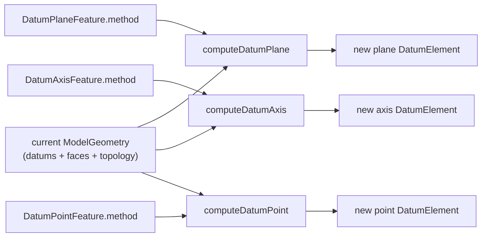

# Datums and Planes

> **System** ▸ [Overview](../00-overview.md) ▸ [CAD Modeler](../10-cad-modeler.md) ▸ **Datums and planes**
> Related: [Sketching](./sketching.md) · [Feature tree](./feature-tree.md) · [Modeler overview](./00-overview.md)

---

## Requirements

| REQ | Status | Summary |
|-----|--------|---------|
| 534 | unapproved | Associate each sketch with a planar host (planar face or datum plane) |
| 535 | unapproved | Create-sketch when exactly one planar host is selected |
| 536 | unapproved | Reject create-sketch against a non-planar face |
| 657 | unapproved | Datum Plane feature with eight construction methods |
| 660 | unapproved | Datum Axis feature with five construction methods |
| 661 | unapproved | Datum Point feature with five construction methods |
| 625 | unapproved | The user shall be able to host a sketch on a flat face of an existing extrude (in additi |
| 627 | unapproved | When a new sketch is created on an existing face (REQ 625), the sketch's plane origin sh |

### REQ 657 — Datum Plane feature

- **Description:** The CAD editor shall provide a Datum Plane feature with eight SolidWorks-style construction methods (Offset, parallel-through-point, angle-through-edge, three-points, mid-plane, line-and-perpendicular-face, point-and-perpendicular-edge, tangent-to-cylinder).
- **Rationale:** Real parts need sketch and reference planes that don't coincide with the origin planes — angled faces, offsets, mid-planes between two features.
- **Verification:** `datum.spec.ts` exercises each method's computed plane against known geometry.
- **Validation:** A user can construct an offset/angled/mid plane and sketch on it.

### REQ 534 — Sketch host

- **Description:** The CAD module shall associate each sketch with a planar host (a planar face of a 3D solid in the same CAD model, or a datum plane).
- **Rationale:** A 2D sketch only has meaning relative to a 3D plane; the host defines the sketch's coordinate frame.
- **Verification:** Sketch creation stores a `hostId` and a `Plane3`; covered by sketch document tests.
- **Validation:** A user picks a face or datum and the new sketch lies on it.

### REQ 660 — Datum Axis feature

- **Description:** The CAD editor shall provide a Datum Axis feature with five construction methods, mirroring the Datum Plane feature (two-points, along-edge, two-planes-intersection, cylindrical-face-axis, point-and-perpendicular-face).
- **Rationale:** Axes are needed as rotation axes for circular patterns/revolves and as references for further datums.
- **Verification:** `datum.spec.ts` covers each axis method.
- **Validation:** A user constructs an axis and uses it as a pattern rotation axis.

---

## Succinct description

Every model starts with an Origin feature carrying seven standard datums (origin point, three axes, three planes); user Datum Plane / Axis / Point features compute one new `DatumElement` each from picked geometry, via eight / five / five SolidWorks-style construction methods. Sketches host on a datum plane or a flat face.

---

## How it works — for everyone (non-technical)

Datums are the invisible scaffolding you build geometry against: reference planes to draw on, reference lines to spin or mirror around, reference points to locate things. Every part starts with a standard set — three planes (like the floor and two walls of a room) and three axes through their intersection.

When the standard set isn't enough, you build your own: a plane offset 10 mm above a face, a plane tilted at an angle, a plane exactly halfway between two faces, an axis through two points, a point at the center of a circular edge. The system recomputes these every time the part rebuilds, so they follow the geometry they were attached to.

---

## How it works — in detail (technical)

### Origin datums and plane math

`datum.ts` → `buildOriginDatums()` emits the seven standard `DatumElement`s: `origin` (point), `x_axis`/`y_axis`/`z_axis` (axes), `xy_plane`/`yz_plane`/`xz_plane` (planes). `planeForDatum(id)` returns the concrete `Plane3` (`origin`, `xAxis`, `yAxis`, `normal`) for each standard plane. The `xz_plane` basis uses `xAxis = [-1,0,0]` so all standard planes are **right-handed** (`xAxis × yAxis === normal`) — a left-handed basis previously mirrored orientation-sensitive geometry such as sketch text. Per-datum visibility is stored on `OriginFeature.visibility` (a `Record<string, boolean>`; missing key = visible).

`plane.ts` provides the 2D↔3D bridge: `projectTo3D(plane, x, y)` places a sketch-local point in world space; `projectFrom3D(plane, world)` recovers sketch-local coords by dotting against the plane basis. This is the same math the viewer uses to convert a 3D pick to a 2D sketch coordinate.

### Resolving references

A `PlaneRef` is either `{ kind: 'datum', datumId }` or `{ kind: 'face', faceId, fallbackPlane }`; a `VertexRef` carries `vertexId` + `fallbackPosition`; an `EdgeRef3D` carries world-space `start`/`end`. `resolvePlaneRef` resolves a datum (origin planes first, then user datums) or reconstructs a face plane from its captured `fallbackPlane` snapshot — the snapshot survives upstream regens that renumber face ids. `resolveVertex` falls back to the cached position when the vertex id can't be found.

### Construction methods

- **`computeDatumPlane`** dispatches on `method.kind` across the eight cases (REQ 657): `offset`, `parallelThroughPoint`, `angleThroughEdge`, `threePoints`, `midPlane`, `lineAndPerpFace`, `pointAndPerpEdge`, `tangentCylinder`. Each resolves its picks via `resolvePlaneRef`/`resolveVertex`/`resolveEdgeDirection`, then builds a `Plane3` (the private `planeFromNormal` chooses a stable in-plane basis).
- **`computeDatumAxis`** dispatches across five cases (REQ 660): `twoPoints`, `alongEdge`, `twoPlanesIntersection`, `cylindricalFaceAxis`, `pointAndPerpFace` → an `Axis3` (origin + unit direction).
- **`computeDatumPoint`** dispatches across five cases (REQ 661): `onVertex`, `centerOfFace`, `centerOfCircularEdge` (uses `fitCircle` from `measure.ts`), `centerOfMass`, `alongEdge` (parameter `t`).

These compute functions run during regeneration so each user datum is re-derived against current geometry. Sketch hosting (REQ 534/535/536) records the host's `hostId` and resolved `Plane3` on the `Sketch`; a non-planar face is rejected at create time.

---

## Key files

- `frontend/src/app/cad/lib/datum.ts` — origin datums, `resolvePlaneRef`, `computeDatumPlane/Axis/Point` (REQ 657/660/661)
- `frontend/src/app/cad/lib/plane.ts` — `projectTo3D` / `projectFrom3D` 2D↔3D bridge
- `frontend/src/app/cad/lib/types.ts` — `Plane3`, `PlaneRef`, `VertexRef`, `EdgeRef3D`, the datum feature types
