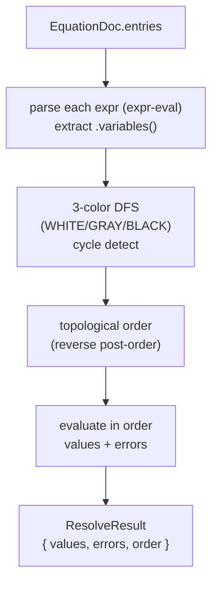

# Equations

> **System** ▸ [Overview](../00-overview.md) ▸ [CAD Modeler](../10-cad-modeler.md) ▸ **Equations**
> Related: [Feature tree](./feature-tree.md) · [Extrude / Revolve / Sweep](./extrude-revolve-sweep.md) · [Modeler overview](./00-overview.md)

---

## Requirements

| REQ | Status | Summary |
|-----|--------|---------|
| 634 | unapproved | SolidWorks-style equations: named global scalar variables |
| 635 | unapproved | Persist an equations document as a JSONB column |
| 636 | unapproved | Parse/evaluate expressions with `expr-eval` |
| 637 | unapproved | Build a dependency graph over equation entries |
| 638 | unapproved | Resolve equations before feature dispatch during regen |
| 639 | unapproved | All numeric feature parameters drivable by equations |
| 640 | unapproved | Equations panel listing every entry, live values |
| 641 | unapproved | Every numeric CAD input accepts an equation expression |

### REQ 634 — Global equations

- **Description:** The system shall provide a SolidWorks-style equations capability that lets a user define named global scalar variables and reference them from numeric parameters.
- **Rationale:** Design intent is often relational ("length = 2 × width"); equations keep dependent dimensions in lockstep instead of being edited by hand.
- **Verification:** `equations.spec.ts` covers parse, evaluation, dependency ordering, cycle detection, and error reporting.
- **Validation:** A user defines `width = 20` and `length = 2*width` and editing `width` updates `length` and everything driven by it.

### REQ 637 — Dependency graph

- **Description:** The equations resolver shall build a dependency graph over the equation entries (using `expr-eval`'s `variables()`), topologically sort it, and evaluate in order, detecting cycles.
- **Rationale:** Equations reference each other; they must be evaluated in dependency order, and circular references must be reported rather than looping forever.
- **Verification:** `equations.spec.ts` asserts topological order and that a cycle (`a → b → a`) is reported on every member.
- **Validation:** A user accidentally creates a circular equation and sees a clear cycle error instead of a hang.

### REQ 638 — Resolve before dispatch

- **Description:** During regeneration, the backend shall resolve all equations before feature dispatch and overwrite every feature parameter bound to an equation target with the resolved value.
- **Rationale:** The kernel must see final numeric values; equation resolution has to happen up front so every downstream feature builds against resolved dimensions.
- **Verification:** Backend regen tests confirm an equation-driven extrude distance reaches the kernel as the resolved number.
- **Validation:** A part built from equation-driven dimensions regenerates with all values consistent.

---

## Succinct description

Equations are named scalar variables plus target-bound parameter drivers, stored in one JSONB map. A shared resolver (`equations.ts` frontend, `cadEquations.js` backend) parses with `expr-eval`, builds a dependency graph, topologically sorts, evaluates, and the backend applies resolved values to feature parameters before the kernel runs.

---

## How it works — for everyone (non-technical)

Equations let you tie dimensions together with math instead of typing the same number in twenty places. You define variables like `width = 20`, then write `length = 2 * width` or set an extrude distance to `width / 4`. Change `width` once and every dimension built on it updates automatically when the part rebuilds.

The system figures out the right order to compute everything (it won't try to compute `length` before it knows `width`), and if you accidentally make two equations depend on each other in a loop, it tells you clearly instead of getting stuck.

---

## How it works — in detail (technical)

### Document shape (REQ 635)

`EquationDoc = { entries: Record<string, EquationEntry> }` persists on `DesignCADModels.equations` (JSONB). A key is either a bare global name (referenced from expressions) or a dotted **target path** identifying a driven CAD parameter — `feature.<id>.distance`, `feature.<id>.angle`, `feature.<id>.startCondition.distance`, `feature.<id>.direction2.distance`, `sketch.<id>.constraint.<id>`. Globals and target entries share one map so the panel renders them together. Each `EquationEntry` has an `expression`, plus a resolver-written `lastValue` and optional `error`.

### Resolution algorithm (REQ 636/637)

`resolveEquations` (in `equations.ts`) parses every expression, builds the dependency graph from `expr-eval`'s `.variables()`, runs a three-color DFS to detect cycles (a cycle records `cycle: a → b → a` on every member), topologically sorts, and evaluates each entry in order. Each entry's failure (parse error, cycle, undefined identifier, non-finite result) is reported independently so one bad expression doesn't take down the document. The resolver also temporarily shadows any `expr-eval` built-in operator/function whose name a user reused (so `length / 4` parses) and clears built-in math constants (`E`, `PI`, …) so user variables win; `RESERVED_EQUATION_NAMES` is exported for a UI warning. `evalExpression` gives a single-expression live preview.

### Applying during regen (REQ 638/639)

`backend/services/cadEquations.js` mirrors the frontend (same JSON shapes, same algorithm — separate file because the backend is CJS; the test suite asserts identical output on shared fixtures). `applyEquationsToModel(model)` resolves the doc, then walks the feature tree and sketch constraints, overwriting each parameter whose target key resolved to a value, and returns a new `featureTree` + `sketchDoc` plus an `equationErrors` array. `cadRegenService` calls this **before** dispatching any feature, so the kernel only ever sees resolved numbers. Drivable parameters (REQ 639) include `ExtrudeFeature.distance`, `CutExtrudeFeature.distance`, start-condition offsets, direction-2 distances, revolve/pattern/etc. numerics, and sketch dimension constraint values.

### Panel (REQ 640/641)

`cad-equations-panel.component.ts` (toolbar button "Σ Equations") renders two 4-column tables — **Variables** (user globals, with an always-present draft row that auto-promotes on typing) and **Used in** (parameter-bound entries with friendly read-only labels like `f20 · distance`). The value column updates live via `evalExpression` against the rest of the resolved values. Numeric inputs across the editor accept an equation expression (REQ 641).

---

## Key files

- `frontend/src/app/cad/lib/equations.ts` — `EquationDoc`, `resolveEquations`, `evalExpression`, dependency graph (REQ 634/636/637)
- `backend/services/cadEquations.js` — backend mirror + `applyEquationsToModel` (REQ 638/639)
- `frontend/src/app/components/cad/cad-equations-panel/cad-equations-panel.component.ts` — the equations dialog (REQ 640)
