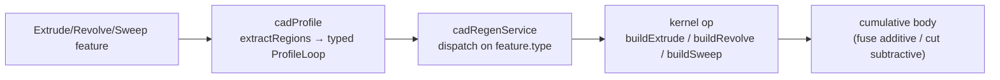

# Extrude, Revolve, Sweep

> **System** ▸ [Overview](../00-overview.md) ▸ [CAD Modeler](../10-cad-modeler.md) ▸ **Extrude / Revolve / Sweep**
> Related: [Profiles and arrangement](./profiles-arrangement.md) · [Multi-body](./multi-body.md) · [Kernel operations](../kernel/operations.md) · [Modeler overview](./00-overview.md)

---

## Requirements

| REQ | Status | Summary |
|-----|--------|---------|
| 549 | unapproved | Extrude feature: sketch reference + positive distance → solid |
| 550 | unapproved | Invoke extrude while a sketch with a valid profile is active |
| 607 | unapproved | Delete an Extrude feature via context menu |
| 609 | unapproved | Edit an Extrude feature's distance via context menu |
| 617 | unapproved | Typed `ProfileLoop` preserving curve identity (consumed by extrude) |
| 618 | unapproved | Optional `flipped` flag + direction toggle in the extrude dialog |
| 619 | unapproved | Creating an Extrude auto-sets the source sketch's `visible` flag |

### REQ 549 — Extrude feature

- **Description:** The CAD module shall provide an extrude feature that takes a sketch reference and a positive distance value and produces a solid by extruding the sketch's profile along its plane normal.
- **Rationale:** Extrude is the foundational additive feature — pushing a 2D outline into a prism is how most parametric solids start.
- **Verification:** Feature-tree and regen tests build an extrude from a square sketch and confirm the kernel returns a solid; preview tests cover the ghost mesh.
- **Validation:** A user sketches a rectangle, extrudes it, and sees a box.

### REQ 618 — Flipped / direction

- **Description:** The Extrude feature shall carry an optional `flipped` boolean (default false); the extrude dialog shall expose a direction toggle.
- **Rationale:** Profiles need to grow either side of the sketch plane; the direction toggle gives the user control without re-sketching.
- **Verification:** Extrude dialog tests confirm the flip toggle sets `flipped`; regen honors it by extruding along `-normal`.
- **Validation:** A user flips the extrude direction and the solid grows the other way.

### REQ 619 — Auto-hide source sketch

- **Description:** When an Extrude feature is created from a sketch, the system shall automatically set that sketch's `visible` flag so the consumed sketch no longer clutters the 3D view.
- **Rationale:** Once a sketch becomes a solid, its 2D overlay is visual noise; SolidWorks auto-collapses consumed sketches.
- **Verification:** Store/editor tests confirm the sketch's `visible` is set on extrude creation.
- **Validation:** A user extrudes a sketch and the flat outline disappears, leaving the solid.

---

## Succinct description

The additive features — Extrude, Revolve, Sweep (each with a Cut variant) and Loft — take one or more sketch profiles plus parameters (distance / angle / path) and produce solids through the kernel. A live translucent preview (`preview.ts`) shows the result before commit; dialogs collect parameters.

---

## How it works — for everyone (non-technical)

These are the tools that give a flat sketch depth. **Extrude** pushes an outline straight out into a block. **Revolve** spins an outline around a line, like a lathe, to make round parts. **Sweep** drags an outline along a path, like squeezing toothpaste along a curve, to make pipes and rails. Each has a **Cut** version that removes material instead of adding it. **Loft** blends between two or more outlines to make a smooth transition.

While you set the numbers, a translucent ghost shows exactly what you'll get, so you can dial in the distance or angle before committing. The real, precise shape is built by the separate geometry engine once you confirm.

---

## How it works — in detail (technical)

### Feature shapes

In `types.ts`: `ExtrudeFeature` carries `sketchId`, `distance`, optional `flipped` (REQ 618), `endCondition` (`blind` / `midPlane` / `throughAll` / `upToVertex` / `upToSurface` / `offsetFromSurface` / `upToBody`), `startCondition`, an optional `direction2` (two-direction extrude), `regionIndices`, and `merge` (multi-body). `CutExtrudeFeature` shares the same fields but boolean-subtracts. `RevolveFeature`/`CutRevolveFeature` carry `axisLineId` (a sketched line whose endpoints define the rotation axis) + `angle`. `SweepFeature`/`CutSweepFeature` carry `profileSketchId` + `pathSketchId`. `LoftFeature` carries an ordered `sketchIds`. All carry `visible`, `suppressed`, `name`.

### Live preview (`preview.ts`)

`preview.ts` generates a translucent "ghost" triangle mesh from the current sidebar parameters — ear-clipped caps plus side walls / swept quads from the analytic profile, **no boolean evaluation**. It honors `flipped`, `direction2`, start/end conditions (with a `startOffsetOverride` the editor passes for Up-To-* targets), and `regionIndices`. For a Cut Extrude it renders the *cutting prism* (shown red by the viewer) so the user sees the volume being removed without a kernel round-trip per keystroke. The viewer wraps the output in a Three.js geometry with a translucent material.

### Dialogs

`extrude-dialog.component.ts` collects `distance`, the flip toggle, and (when the sketch has more than one region) a region picker returning `loopIndices`. Edit/distance changes also flow through the feature-tree context menu (REQ 607/609) via `updateFeatureParam`. Creating an extrude auto-hides the source sketch (REQ 619).

### Regeneration → kernel

`cadRegenService.js` extracts the typed `ProfileLoop` (preserving curve identity, REQ 617), dispatches on `feature.type`, and calls the kernel. The kernel ops (`cad-kernel/src/ops/`) build OCCT faces from the analytic edges:

- `buildExtrude` — line/arc/circle edges; arcs use `Sketch::three_point_arc` so the side face carries a true analytic arc, not chords.
- `buildRevolve` — `Face::revolve` (or `CompoundFace::revolve` for holes) about a world-space axis resolved from the sketched line.
- `buildSweep` — `Face::sweep_along_shell` (OCCT `BRepOffsetAPI_MakePipeShell`); holes become hole-tubes boolean-subtracted from the outer swept solid.

Additive results fuse into the cumulative body; cut variants subtract. See [Kernel operations](../kernel/operations.md) and [Multi-body](./multi-body.md).

---

## Key files

- `frontend/src/app/cad/lib/preview.ts` — translucent live preview mesh (extrude / cut / revolve)
- `frontend/src/app/cad/lib/types.ts` — `ExtrudeFeature`, `RevolveFeature`, `SweepFeature`, `LoftFeature` + Cut variants
- `frontend/src/app/components/cad/extrude-dialog/extrude-dialog.component.ts` — the extrude parameter dialog
- `backend/services/cadRegenService.js` — feature dispatch + cumulative-body pipeline
- `cad-kernel/src/ops/extrude.rs`, `revolve.rs`, `sweep.rs` — the OCCT operations (see [kernel/operations](../kernel/operations.md))
