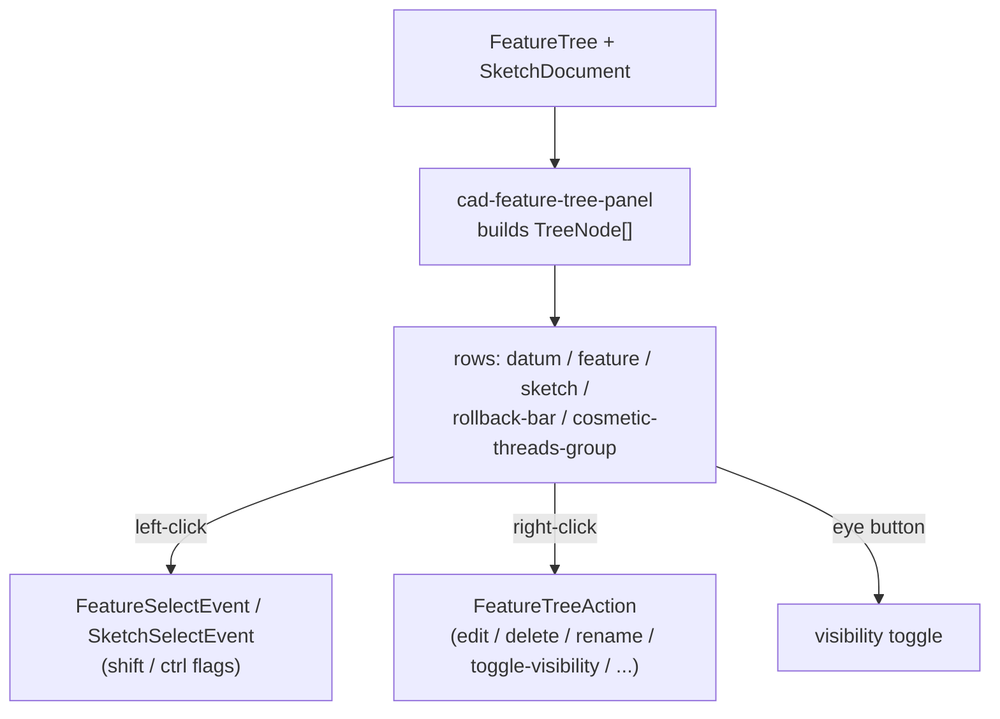

# Feature Tree

> **System** ▸ [Overview](../00-overview.md) ▸ [CAD Modeler](../10-cad-modeler.md) ▸ **Feature tree**
> Related: [Extrude / Revolve / Sweep](./extrude-revolve-sweep.md) · [Datums and planes](./datums-planes.md) · [Multi-body](./multi-body.md) · [Modeler overview](./00-overview.md)

---

## Requirements

| REQ | Status | Summary |
|-----|--------|---------|
| 545 | unapproved | Ordered list of features producing the model's geometry; each has id/type/params |
| 546 | unapproved | A new model initializes with exactly one origin feature |
| 547 | unapproved | Re-sequence and regenerate when a feature is added/removed/modified |
| 607 | unapproved | Delete an Extrude feature via the context menu |
| 609 | unapproved | Edit an Extrude feature's distance via the context menu |
| 610 | unapproved | Optional `visible` flag on every non-Origin feature |
| 611 | unapproved | Right-click context menu on feature and sketch rows |
| 622 | unapproved | Origin feature group collapsed by default |
| 624 | unapproved | Optional `name` on ExtrudeFeature and Sketch; row shows name or default |
| 626 | unapproved | Multi-select with modifier keys (bare / shift / ctrl) |
| 649 | unapproved | Fixed-width chevron column for all tree rows |

### REQ 545 — Ordered feature list

- **Description:** The CAD module shall maintain an ordered list of features that produces the model's 3D geometry; each feature shall have a unique identifier, a type, and parameters appropriate to that type.
- **Rationale:** Parametric modeling treats features as first-class entities so they can be edited, reordered, and used as inputs to subsequent features. The feature tree is the spine all parametric operations hang off.
- **Verification:** `featureTree.spec.ts` — start with origin, append, remove, immutable updates, type guards.
- **Validation:** A user can examine the list of features that produced the current model.

### REQ 546 — Origin feature seed

- **Description:** When a CAD model is created with no features, the CAD module shall initialize it with exactly one origin feature.
- **Rationale:** Every model needs the standard datums to sketch against from the very first action.
- **Verification:** `featureTree.spec.ts` asserts `emptyFeatureTree()` contains a single origin feature with default datum visibility.
- **Validation:** A brand-new CAD model already shows the origin planes and axes.

### REQ 624 — Feature and sketch names

- **Description:** ExtrudeFeature and Sketch shall each carry an optional `name` string; the feature-tree row label renders the name when present, else a default.
- **Rationale:** Designers rename features to communicate intent ("Mounting Boss", "Lightening Pocket"); defaults keep unnamed features readable.
- **Verification:** `featureTree.spec.ts` checks default naming ("Extrude 1", "Cut-Extrude 1", …).
- **Validation:** A user renames a feature and the new label sticks across edits.

---

## Succinct description

The feature tree is an immutable, ordered, auto-named list of features (`featureTree.ts`) seeded with a single Origin. Adds/removes/edits return a new tree and trigger a sequential regeneration; the side panel renders the tree with collapse, visibility eyes, multi-select, and a right-click menu.

---

## How it works — for everyone (non-technical)

The feature tree is the recipe for your part, shown as a list down the side: "start with the origin, extrude this sketch 10 mm, cut that hole, round these edges". The order matters — each step builds on the result of the steps above it. You can rename steps, hide them, suppress them, delete them, or edit their numbers, and the part rebuilds from that point down.

Right-clicking any row opens a menu of the things you can do to it. The origin group (the standard planes and axes) is folded away by default so the list stays tidy, and you can select several features at once with Shift or Ctrl, just like files in a folder.

---

## How it works — in detail (technical)

### The data structure

`featureTree.ts` operates on `FeatureTree = { features: Feature[], nextFeatureSeq, defaultUnit? }`. `Feature` is a tagged union over `type` (`origin`, `extrude`, `cutExtrude`, `revolve`, `cutRevolve`, `sweep`, `cutSweep`, `loft`, `fillet`, `chamfer`, `datumPlane`, `datumAxis`, `datumPoint`, `mirror`, `linearPattern`, `circularPattern`, `shell`, `combine`, `hole`, `mirrorBody`, `moveCopyBody`). Every non-Origin feature shares optional `visible` (REQ 610), `suppressed`, `name` (REQ 624), and `createdAt`.

Operations are pure and return a new tree:

- `emptyFeatureTree()` seeds a single `OriginFeature` with `defaultDatumVisibility()` (REQ 546).
- `addFeature(tree, feature)` assigns a globally-unique id (`newFeatureId()` from `ids.ts` — sequential ids collide across branches), stamps `createdAt`, and fills a default name via `defaultFeatureName` ("Extrude 1", "Cut-Extrude 2", …; the Origin gets none) unless one was supplied.
- `removeFeature`, `updateFeatureParam<T>(tree, id, patch)` (used by Edit, REQ 607/609), and `removeFeaturesReferencingSketch` (the sketch-deletion cascade — drops every feature whose `sketchId`/`profileSketchId`/`pathSketchId` matches).
- Type guards: `isOriginFeature`, `isExtrudeFeature`, `isAnyExtrudeFeature`, etc.

### Regeneration trigger (REQ 547)

Any tree mutation flows to the backend, which re-runs `cadRegenService` from the affected feature forward. Features with `visible === false` or `suppressed === true` are both skipped during regen (downstream features compose against the body state before them); rolled-back features (past the rollback bar) are also excluded. See [Multi-body](./multi-body.md) and the [kernel operations](../kernel/operations.md) doc.

### The panel

`cad-feature-tree-panel.component.ts` builds a flat `TreeNode[]` (kinds `feature`/`sketch`/`datum`/`rollback-bar`/`cosmetic-threads-group`) with depth, an expandable chevron (reserved as a fixed-width column, REQ 649), and a visibility eye where applicable. The Origin group collapses by default (REQ 622). Left-click emits a `FeatureSelectEvent`/`SketchSelectEvent` carrying `shiftKey`/`ctrlKey` so the editor applies multi-select policy (bare = set-to-one, shift/ctrl = toggle; REQ 626). Right-click emits a `FeatureTreeAction` tagged union (`edit-feature`, `delete-feature`, `rename-feature`, `toggle-feature-visibility`, `toggle-feature-suppression`, `edit-sketch`, `delete-sketch`, `toggle-sketch-visibility`, `rename-sketch`, `toggle-cosmetic-threads-visibility`, REQ 611). The panel stays pure UI; the editor owns the dialog/state side effects.

---

## Key files

- `frontend/src/app/cad/lib/featureTree.ts` — immutable tree ops, default naming, type guards (REQ 545/546/547/610/624)
- `frontend/src/app/cad/lib/types.ts` — the `Feature` union and per-feature fields
- `frontend/src/app/cad/lib/ids.ts` — globally-unique feature/sketch ids
- `frontend/src/app/components/cad/cad-feature-tree-panel/cad-feature-tree-panel.component.ts` — the side panel, context menu, multi-select (REQ 607/609/611/622/626/649)
