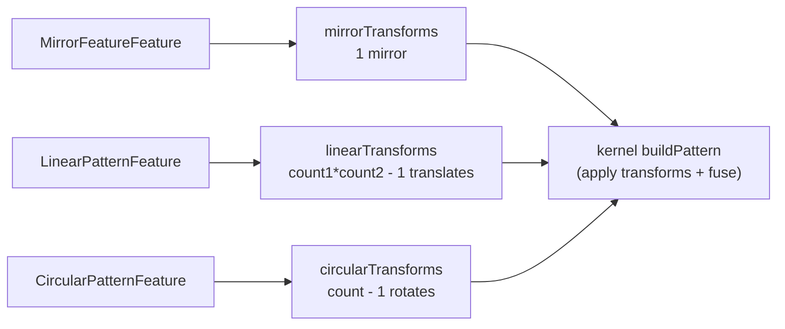

# Fillet, Chamfer, Shell, Pattern

> **System** ▸ [Overview](../00-overview.md) ▸ [CAD Modeler](../10-cad-modeler.md) ▸ **Fillet / Chamfer / Shell / Pattern**
> Related: [Feature tree](./feature-tree.md) · [Multi-body](./multi-body.md) · [Kernel operations](../kernel/operations.md) · [Modeler overview](./00-overview.md)

---

## Requirements

| REQ | Status | Summary |
|-----|--------|---------|
| 642 | unapproved | Fillet (Round) action with an edge-collecting sidebar |
| 643 | unapproved | Chamfer (Bevel) with three modes (equal / two-distance / distance-and-angle) |
| 644 | unapproved | Picked edges persisted by world-space endpoint coordinates |
| 645 | unapproved | Colored preview overlay of picked edges in the sidebar |
| 646 | unapproved | Tangent Propagation toggle (default ON) |
| 647 | unapproved | Per-edge value override reserved in the data model |
| 648 | unapproved | Chamfer sidebar shows a three-option mode selector |
| 658 | unapproved | Linear / circular / mirror pattern features |
| 659 | unapproved | Shell feature: hollow a solid by removing picked faces + wall offset |
| 666 | unapproved | Mirror Body feature: reflect bodies across a plane |
| 667 | unapproved | Move/Copy Body feature: rigid-body transform of bodies |
| 650 | unapproved | When the user opens the Fillet or Chamfer sidebar for a NEW feature (not editing an exis |
| 651 | unapproved | While the Fillet or Chamfer sidebar is open and the user is in edge-pick mode, clicking  |

### REQ 643 — Chamfer modes

- **Description:** The CAD editor shall provide a Chamfer (Bevel) action with three SolidWorks-style modes: (a) equal distance, (b) two distances, (c) distance and angle.
- **Rationale:** Production chamfers aren't always 45°; asymmetric and angled chamfers are routine on machined parts.
- **Verification:** Chamfer feature/regen tests cover each mode's kernel dispatch.
- **Validation:** A user creates an angled chamfer and the bevel matches the specified distance and angle.

### REQ 658 — Pattern features

- **Description:** The CAD editor shall provide three pattern features that replicate one or more existing features by applying transforms: linear, circular, and mirror.
- **Rationale:** Bolt circles, vent slots, and symmetric parts are defined by repetition; patterns capture that intent parametrically.
- **Verification:** `pattern.spec.ts` asserts the generated transform lists for linear (1D/2D), circular (equal-spacing/specified-angle), and mirror.
- **Validation:** A user patterns a hole into a bolt circle and edits the count, regenerating all copies.

### REQ 659 — Shell feature

- **Description:** The CAD editor shall provide a Shell feature that hollows a solid by removing one or more picked faces and offsetting the rest by a wall thickness.
- **Rationale:** Plastic and sheet-metal-like parts are thin-walled; shelling is the standard way to produce them.
- **Verification:** Shell feature/regen tests confirm the kernel produces a valid thin-walled solid and rejects malformed output.
- **Validation:** A user shells a box with the top face open and gets an open container of the specified wall thickness.

---

## Succinct description

These features modify or replicate existing bodies rather than build from sketches. Fillet/chamfer round or bevel picked edges; shell hollows a body; linear/circular/mirror patterns and mirror/move-copy body apply transforms. Edges and faces are identified by world-space geometry (robust to OCCT re-numbering); `pattern.ts` computes the transform lists.

---

## How it works — for everyone (non-technical)

This group finishes and multiplies geometry. **Fillet** rounds sharp edges; **Chamfer** cuts them at an angle. **Shell** scoops a solid hollow, leaving thin walls and an opening where you pick. **Patterns** stamp copies of features in a row, around a circle, or as a mirror image. **Mirror Body** and **Move/Copy Body** flip or relocate whole solids.

You pick edges or faces directly in the 3D view, and they highlight so you can see exactly what's selected. Because the system remembers picks by where they are in space (not by an internal number that can change), your fillet stays on the right edge even after the part is rebuilt.

---

## How it works — in detail (technical)

### Geometry-keyed picks

Fillet/chamfer edges are stored as `EdgeRef3D` (`{ start, end }` world-space endpoints + optional per-edge `value`, `faceId`, `edgeGroupId`). Shell faces are `ShellFaceRef` (`{ faceId, fallbackPlane: { origin, normal } }`). The kernel matches each pick to a body edge/face by closest geometry (not by id), because OCCT renumbers topology across every boolean/transform. `value` on `EdgeRef3D` is reserved for per-edge overrides (multi-radius fillet / mixed chamfer; REQ 647); `faceId`/`edgeGroupId` drive sidebar row grouping after face-expansion / tangent propagation.

### Feature shapes

- `FilletFeature`: `edges: EdgeRef3D[]` + `radius` (REQ 642).
- `ChamferFeature`: `edges` + `distance` + `mode` (`equal` / `twoDistance` / `distanceAngle`) + `distance2` / `angle` (REQ 643/648).
- `ShellFeature`: `faces: ShellFaceRef[]` + `thickness` + `direction` (`inward`/`outward`) + optional `tolerance` (REQ 659).
- `LinearPatternFeature` (`direction1` + optional `direction2`), `CircularPatternFeature` (`axisRef` + `count` + `mode`), `MirrorFeatureFeature` (`planeSnapshot`), `MirrorBodyFeature` (`bodyIds` + `planeSnapshot` + `keepOriginals`), `MoveCopyBodyFeature` (`bodyIds` + `translate`/`rotate` + `copy`).

### Pattern transform compute (`pattern.ts`)

`pattern.ts` converts each pattern feature into a `PatternTransform[]` (`translate` / `rotate` / `mirror`) whose field names mirror the kernel's `protocol::PatternTransform`. `linearTransforms` emits every grid cell except the (0,0) seed (with count/spacing validation); `circularTransforms` distributes the sweep across slots for `equalSpacing` or uses the per-step delta for `specifiedAngle`; `mirrorTransforms` emits one mirror across the snapshot plane. The kernel `buildPattern` op applies the transforms and fuses the copies (and optionally the source).

### Kernel ops

`cad-kernel/src/ops/`: `edge_blend.rs` (fillet via `BRepFilletAPI_MakeFillet`, chamfer via `BRepFilletAPI_MakeChamfer`, matching edges by closest endpoints in either pairing); `shell.rs` (`BRepOffsetAPI_MakeThickSolid`, faces matched by centroid + normal, with an empty-BRep check that rejects malformed output even when the OCCT operation reports success); `pattern.rs` (transforms + fuse). `backend/services/cadRegenService.js` dispatches these through the cumulative-body pipeline. See [Kernel operations](../kernel/operations.md).

---

## Key files

- `frontend/src/app/cad/lib/pattern.ts` — pattern → kernel transform lists (REQ 658)
- `frontend/src/app/cad/lib/types.ts` — `FilletFeature`, `ChamferFeature`, `ShellFeature`, pattern + mirror/move-body features
- `frontend/src/app/cad/lib/tangentPropagation.ts` — tangent-edge expansion for fillet/chamfer (REQ 646)
- `backend/services/cadRegenService.js` — feature dispatch into the cumulative-body pipeline
- `cad-kernel/src/ops/edge_blend.rs`, `shell.rs`, `pattern.rs` — the OCCT operations (see [kernel/operations](../kernel/operations.md))
