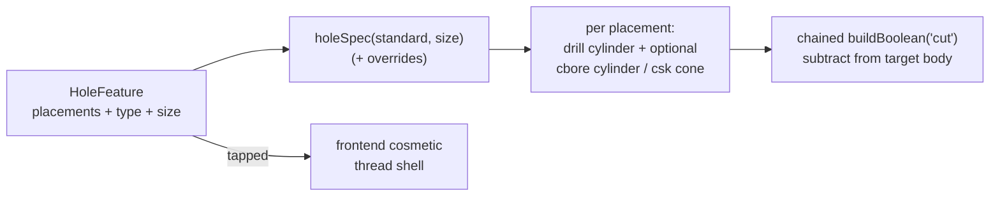

# Holes (Hole Wizard)

> **System** ▸ [Overview](../00-overview.md) ▸ [CAD Modeler](../10-cad-modeler.md) ▸ **Holes**
> Related: [Extrude / Revolve / Sweep](./extrude-revolve-sweep.md) · [Fillet / Chamfer / Shell / Pattern](./fillet-chamfer-shell-pattern.md) · [Multi-body](./multi-body.md) · [Modeler overview](./00-overview.md)

---

## Requirements

| REQ | Status | Summary |
|-----|--------|---------|
| 663 | unapproved | Hole Wizard feature: standardized holes dropped through a body |
| 664 | unapproved | Static hardware spec table (ISO metric + ANSI inch) |
| 665 | unapproved | Cosmetic thread display around tapped holes |

### REQ 663 — Hole Wizard

- **Description:** The CAD editor shall provide a Hole Wizard feature that drops one or more standardized holes through a body; placements are captured by clicking faces in the viewer.
- **Rationale:** Holes for fasteners follow hardware standards (clearance, counterbore, countersink, tapped); a wizard that pulls dimensions from a spec table is faster and less error-prone than modeling each hole by hand.
- **Verification:** Hole feature/regen tests build drill / counterbore / countersink / tapped holes and confirm the kernel subtracts them.
- **Validation:** A user drops M4 clearance holes on a face and the body shows correctly sized through-holes.

### REQ 664 — Hardware spec table

- **Description:** The Hole Wizard feature shall include a static hardware specification table covering ISO metric sizes M2 through M12 (and ANSI inch sizes), giving clearance/tap-drill/counterbore/countersink dimensions and thread data per size.
- **Rationale:** Standard dimensions must come from one authoritative table shared by the UI dropdown and the geometry dispatch, so the picked size and the cut geometry never disagree.
- **Verification:** `holeSpecs.spec.ts` checks lookups and the size-key/standard pairing.
- **Validation:** Selecting "M4, counterbore" produces a counterbore sized for an M4 socket-head cap screw.

### REQ 665 — Cosmetic threads

- **Description:** The Tapped hole type in the Hole Wizard shall render a cosmetic thread display around each tapped cut, indicating a threaded hole without modeling the actual helix.
- **Rationale:** Real thread geometry is expensive and rarely needed for design intent; a cosmetic annotation communicates "this is tapped" at a fraction of the cost.
- **Verification:** The renderer adds a thread shell around tapped cuts; backend cuts the tap-drill cylinder.
- **Validation:** A user creates a tapped M5 hole and sees a thread indication around the tap-drill bore.

---

## Succinct description

The Hole Wizard drops standardized holes at face-clicked placements, pulling all dimensions from a single static spec table (`holeSpecs.ts`, mirrored on the backend). The backend synthesizes each hole as cylinders/cones it boolean-subtracts from the target body; tapped holes get a frontend-only cosmetic thread shell.

---

## How it works — for everyone (non-technical)

The Hole Wizard is the "drill a proper bolt hole" tool. You pick the hardware — say an M4 screw — and the type of hole (a simple clearance hole, a counterbore for a recessed head, a countersink for a flat head, or a tapped hole for threading). Then you click where you want the holes on a face, and the system drills them all to the correct standard dimensions automatically.

Tapped holes get a thread indication drawn around them so anyone reading the model knows it's meant to be threaded — without the system having to model the actual spiral, which would be slow and unnecessary.

---

## How it works — in detail (technical)

### The spec table (REQ 664)

`frontend/src/app/cad/lib/holeSpecs.ts` is the single source of truth. `HoleStandard` is `'iso' | 'ansi'`; each `HoleSpec` carries `clearanceDrillDiameter`, `tapDrillDiameter`, `counterboreDiameter`/`Depth`, `countersinkDiameter`/`AngleDeg`, `threadPitch`, and `threadMajorDiameter`, **all in millimeters** (inch sizes are pre-converted at table-write time). `ISO_TABLE` covers M2–M12 (90° countersink); `ANSI_TABLE` covers #4–1/2″ (82° countersink). `holeSpec(standard, sizeKey)` looks up by pair, `sizeOptions` drives the dropdown, `defaultSizeFor` keeps the dropdown valid across a standard switch. A backend `holeSpecs` mirror is required by the regen service so UI and geometry agree.

### The feature

`HoleFeature` (in `types.ts`) carries `placements: HolePlacement[]` (each `{ faceId, position, faceCentroid, faceNormal }`, captured by clicking a face — the click point is the center, the face normal is the axis), `holeType` (`drill` / `counterbore` / `countersink` / `tapped`), `standard`, `size`, an `endCondition` (`throughAll` or `blind { depth }`), `flipped`, and per-dimension overrides (`drillDiameterOverride`, `counterboreDiameterOverride`, …). Overrides take precedence over the spec value at dispatch.

### Geometry synthesis

`cadRegenService.js` → `_dispatchHole` reads each placement, builds a drill cylinder (and a counterbore cylinder or countersink cone where the type calls for it), and subtracts them from the most-recent body via chained `buildBoolean('cut', …)` calls. There are **no new kernel ops**: cylinders are `buildExtrude` of a single-circle profile, cones are `buildRevolve` of a right-triangle profile around the hole axis. Tapped holes use the tap-drill diameter and the backend cuts the bore; everything else uses clearance so a screw passes through. The cosmetic thread (REQ 665) is frontend-only — the renderer draws a translucent thread shell over the tap-drill bore.

---

## Key files

- `frontend/src/app/cad/lib/holeSpecs.ts` — the ISO/ANSI hardware spec table (REQ 664)
- `frontend/src/app/cad/lib/types.ts` — `HoleFeature`, `HolePlacement`
- `backend/services/cadRegenService.js` — `_dispatchHole` synthesis + boolean subtraction (REQ 663/665)
- `backend/services/holeSpecs.js` — backend mirror of the spec table
