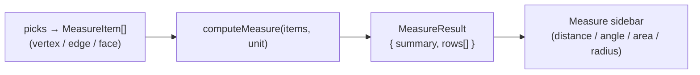

# Measurement

> **System** ▸ [Overview](../00-overview.md) ▸ [CAD Modeler](../10-cad-modeler.md) ▸ **Measurement**
> Related: [Datums and planes](./datums-planes.md) · [Assembly](../40-assembly.md) · [Modeler overview](./00-overview.md)

---

## Requirements

| REQ | Status | Summary |
|-----|--------|---------|
| 652 | unapproved | Measure tool: sidebar accepting vertex / edge / face picks |
| 653 | unapproved | Distance results for the supported pick combinations |
| 654 | unapproved | Angle result between two straight edges (degrees) |
| 655 | unapproved | Face picks as first-class entities (area, centroid, plane distance) |
| 656 | unapproved | Recognize circular curves (arc/circle) and extend the result rows |

### REQ 652 — Measure tool

- **Description:** The CAD editor shall provide a Measure tool that, when activated, opens a sidebar accepting picks of vertices, edges, and faces in the 3D viewer and reports the resulting measurements.
- **Rationale:** Designers constantly need quick distances, angles, and radii without adding a dimension; a measure tool is a baseline expectation in any CAD package.
- **Verification:** `measure.spec.ts` covers the pick-combination compute paths.
- **Validation:** A user picks two vertices and reads the distance between them.

### REQ 655 — Face picks

- **Description:** The Measure sidebar shall support face picks as first-class measurement entities: for a single flat face, report surface area, centroid, and (with another planar entity) plane-based distance; curved faces skip the plane-based rows.
- **Rationale:** Area and face-to-face distance are common manufacturing checks that vertex/edge picks can't express.
- **Verification:** `measure.spec.ts` asserts area/centroid for a flat face and plane-distance for two parallel faces.
- **Validation:** A user measures the area of a face and the gap between two faces.

### REQ 656 — Circular curves

- **Description:** The Measure tool shall recognize circular curves (arcs and full circles) on picked edges and extend the result rows: a single arc reports length + radius + diameter; a full circle reports circumference + radius + diameter.
- **Rationale:** Round features are measured by radius/diameter, not chord length; the tool must detect circularity and report the right quantities.
- **Verification:** `measure.spec.ts` asserts the extended rows for a fitted arc and full circle.
- **Validation:** A user picks a hole edge and reads its diameter directly.

---

## Succinct description

The Measure tool reduces each 3D pick (vertex / edge / face) to a `MeasureItem` and runs a pure compute (`measure.ts`) that emits human-readable result rows for the supported combinations — distances, angles, areas, and radius/diameter for circular edges. The module is shared with the assembly editor (written once).

---

## How it works — for everyone (non-technical)

The Measure tool is the on-screen ruler and protractor. Turn it on, click things in the 3D view — a corner, an edge, a face — and it tells you the relevant numbers: the length of an edge, the distance between two points or two faces, the angle between two edges, the area of a face, or the radius and diameter of a round hole. It picks the right kind of answer for what you clicked, so a round edge reports a diameter instead of a meaningless straight-line length.

The exact same tool is used when working on assemblies, so there's nothing new to learn there.

---

## How it works — in detail (technical)

### Pick reduction

The viewer/editor reduces each raw pick to a `MeasureItem` (in `measure.ts`):

- `vertex` — a position.
- `edge` — two endpoints, `isStraight`, an optional analytic `length` (kernel-emitted for curves), and an optional `circle: EdgeCircleFit` produced by `fitCircle` on the edge's polyline samples (center, radius, normal, `closed`).
- `face` — optional `area` (sum of triangle areas), `centroid`, `normal` (flat faces only), and `isFlat`.

### Compute

`computeMeasure(items, unit)` is pure (no DOM, no Three.js). It dispatches on the kinds and counts of the picked items and returns a `MeasureResult` (`summary` + ordered `rows` of `{ label, value, unit? }`):

- **Single edge (REQ 653):** straight edges report length; circular edges (`circle` present) report length/circumference + radius + diameter (REQ 656).
- **Two straight edges (REQ 654):** the angle between their lines, in degrees.
- **Two points / point+edge / two faces (REQ 653/655):** the appropriate distance; parallel flat faces report a plane-to-plane gap.
- **Single flat face (REQ 655):** area + centroid; curved faces skip plane-based rows.

`fitCircle` least-squares-fits a circle to a polyline and decides full-circle vs arc by whether the endpoints coincide. `computeMeasure` is the same compute used by the datum "center of circular edge" path and is shared by the assembly editor's Measure sidebar.

---

## Key files

- `frontend/src/app/cad/lib/measure.ts` — `MeasureItem`, `fitCircle`, `computeMeasure` (REQ 652–656)
- `frontend/src/app/cad/lib/datum.ts` — reuses `fitCircle` for the center-of-circular-edge datum
