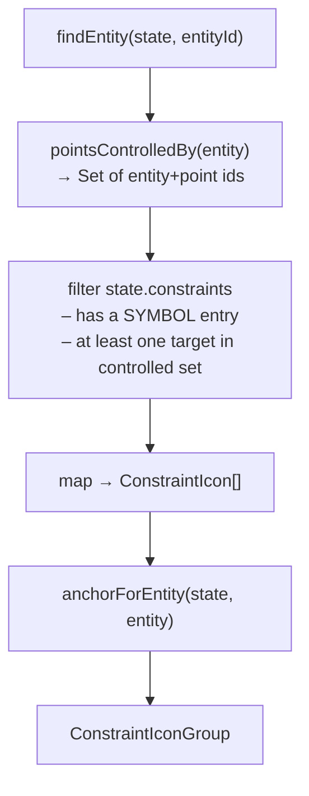

# constraintIcons.ts

> **System** ▸ [Overview](../../00-overview.md) ▸ [CAD Modeler](../../10-cad-modeler.md) ▸ [Sketching](../sketching.md) ▸ **constraintIcons.ts**
> Related: [Constraints group page](../constraints.md) · [Sketching group page](../sketching.md)

---

## Requirements

No single requirement maps exclusively to this module. It implements the badge UI described informally alongside the constraint requirements (REQ 524–526, 582–589). Governed by the [Sketching group page](../sketching.md).

---

## Succinct description

`constraintIcons.ts` computes SolidWorks-style constraint badge clusters for a selected sketch entity: one symbol badge per geometric constraint that touches the entity (directly or via a controlled point), anchored at a single 2D position in sketch-local coordinates.

---

## How it works — for everyone (non-technical)

When you click a line or circle in the sketch editor, small symbol badges appear nearby — one per constraint applied to that entity (for example, a "∥" badge for parallel, a "⊥" badge for perpendicular). Clicking a badge removes that constraint. This module figures out which badges to show and where to put them.

---

## How it works — in detail (technical)

### Exported types

- `ConstraintIcon` — `{ constraintId: string; constraintType: ConstraintType; symbol: string; label: string }` — one badge.
- `ConstraintIconGroup` — `{ anchor: { x: number; y: number }; icons: ConstraintIcon[] }` — the full cluster for one selected entity. The renderer builds a single CSS flex container at the anchor position so spacing stays fixed in screen pixels regardless of zoom.

### Exported function

`constraintIconsForEntity(state: SketchState, entityId: string): ConstraintIconGroup | null`

Returns `null` when there is nothing to show (entity not found or no applicable constraints).

### Algorithm

**What `pointsControlledBy` covers per kind:**
- `point` → `[entity.id]`
- `line` → `[startId, endId]`
- `circle` → `[centerId]`
- `arc` → `[centerId, startId, endId]`
- `ellipse` → `[centerId, majorAxisEndId]`
- `spline` → `[...controlPointIds]`

### Symbol map

| Type | Symbol | Label |
|------|--------|-------|
| `coincident` | ● | Coincident |
| `fixed` | L | Fixed |
| `horizontal` | H | Horizontal |
| `vertical` | V | Vertical |
| `perpendicular` | ⊥ | Perpendicular |
| `parallel` | ∥ | Parallel |
| `tangent` | ∽ | Tangent |
| `equal` | = | Equal |
| `symmetric` | ↔ | Symmetric |
| `midpoint` | M | Midpoint |
| `concentric` | ◎ | Concentric |
| `coradial` | ⊙ | Coradial |
| `collinear` | ≡ | Collinear |

Dimensional constraints (`distance`, `radius`, `diameter`, `angle`, `horizontal-distance`, `vertical-distance`) are not in the symbol map — they render as full dimension labels with extension lines elsewhere.

### Anchor placement

The anchor is offset by `ICON_OFFSET = 6` sketch units from the entity:
- **Point:** `(x + 6, y + 6)`
- **Line:** midpoint, then offset by `ICON_OFFSET` in the CCW perpendicular direction.
- **Circle / arc:** `(cx, cy + radius + 6)` — above the topmost point.
- **Other kinds:** `(0, 0)` fallback.

### Design note

`pointsControlledBy` is a local copy of a helper that also exists in `cad-sketch-editor.component.ts`. It was intentionally duplicated so this module has zero dependencies on the component layer, making it fully unit-testable.

---

## Key files

- `frontend/src/app/cad/lib/constraintIcons.ts` — this module
- `frontend/src/app/cad/lib/constraintIcons.spec.ts` — unit tests
- `frontend/src/app/cad/lib/types.ts` — `SketchState`, `ConstraintType`, entity types
