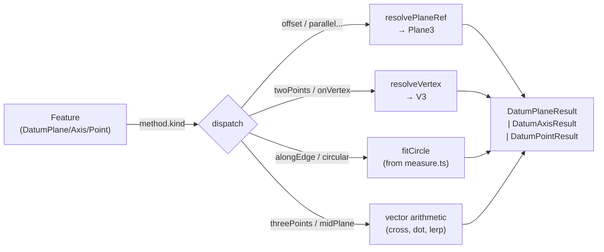

# Datum Module

> **System** ▸ [Overview](../../00-overview.md) ▸ [CAD Modeler](../../10-cad-modeler.md) ▸ [Datums & Planes](../datums-planes.md) ▸ **datum.ts**
> Related: [plane.md](./plane.md) · [featureTree.md](./featureTree.md) · [datums-planes.md](../datums-planes.md) · [geometry.md](./geometry.md)

---

## Requirements

| REQ | Status | Summary |
|-----|--------|---------|
| 657 | unapproved | Datum Plane feature — eight construction methods |
| 660 | unapproved | Datum Axis feature — five construction methods |
| 661 | unapproved | Datum Point feature — five construction methods |

### REQ 657 — Datum Plane (eight construction methods)
- **Description:** The CAD editor shall provide a Datum Plane feature with eight SolidWorks-style construction methods: (1) Offset — offset a distance from a reference plane or flat face; (2) Parallel Through Point — parallel to a plane through a picked vertex; (3) Angle Through Edge — rotated by an angle around an edge; (4) Three Points — plane through three picked vertices; (5) Mid-Plane — halfway between two parallel planes; (6) Line and Perpendicular Face — contains an edge and is perpendicular to a face; (7) Point and Perpendicular Edge — through a vertex, normal to an edge; (8) Tangent Cylinder — tangent to a cylindrical face.
- **Rationale:** Downstream operations such as sketching, extrude, shell, and pattern all require a reference plane that the model's faces may not provide; construction datum planes provide the exact reference geometry those operations need.
- **Verification:** Unit tests for each method in `frontend/src/app/cad/lib/datum.spec.ts`; also covered by backend integration tests via the regen pipeline.
- **Validation:** A designer can add a datum plane of each supported type and sketch on it or reference it from a pattern feature.

---

## Succinct description

`datum.ts` is a pure computation module that resolves user-defined datum planes, axes, and points to their world-space geometry given the current model topology.

## How it works — for everyone (non-technical)

Every CAD model starts with three invisible flat reference surfaces — the XY, YZ, and XZ planes — plus three coordinate axes and the origin point. This module creates *custom* versions of these reference objects from picks the user makes: "a plane 10 mm above that face," "an axis through the center of that hole," "a point at the midpoint of that edge." None of these produce any visible solid geometry; they are pure construction aids that other features can reference.

## How it works — in detail (technical)

`datum.ts` exports three families of functions, one per datum kind, each following the same `compute* → { ok: true; ... } | { ok: false; error }` discriminated-union pattern so callers can surface stale-pick errors to the user.

### Origin datums

`buildOriginDatums()` returns the seven fixed `DatumElement` objects (ids: `origin`, `x_axis`, `y_axis`, `z_axis`, `xy_plane`, `yz_plane`, `xz_plane`). `planeForDatum(id)` maps the three plane ids to fully-specified `Plane3` values. The `xz_plane` xAxis is deliberately `-X` to keep the basis right-handed (a left-handed `xz_plane` would mirror sketch text).

### Datum Plane — `computeDatumPlane(feature, geometry)`

Dispatches on `feature.method.kind`:

| Kind | Core math |
|------|-----------|
| `offset` | Translate reference plane's origin along its normal by `distance × sign`. |
| `parallelThroughPoint` | Keep reference normal; set origin to the resolved vertex. |
| `angleThroughEdge` | Rodrigues rotation of the reference plane's normal around the edge direction by `angleDeg`. |
| `threePoints` | Normal = `(p1-p0) × (p2-p0)`; collinear → error. |
| `midPlane` | Average origins of two planes; average (sign-aligned) unit normals for non-parallel case. |
| `lineAndPerpFace` | Normal = `faceNormal × edgeDir`; plane contains the edge. |
| `pointAndPerpEdge` | Normal = edge direction; origin = picked vertex. |
| `tangentCylinder` | Scans face tessellation samples to find the one whose normal best aligns with the reference plane's normal. |

Internal helpers (`planeFromNormal`, `rotateAroundAxis`, `resolveVertex`, `resolvePlaneRef`) are kept private to this module. `resolvePlaneRef` handles both `datum` refs (including user datum planes cached on the geometry sidecar) and `face` refs (via `fallbackPlane` snapshot).

### Datum Axis — `computeDatumAxis(feature, geometry)`

| Kind | Core math |
|------|-----------|
| `twoPoints` | Direction = unit vector from A to B. |
| `alongEdge` | Tries `fitCircle` on a curved edge polyline (from `measure.ts`) to extract the cylinder axis; falls back to chord direction for straight edges. |
| `twoPlanesIntersection` | Direction = `n1 × n2`; origin via 2×2 Cramer solve, zeroing the dominant axis component. |
| `cylindricalFaceAxis` | Reads `fallbackAxis` snapshot captured at pick time by the viewer. |
| `pointAndPerpFace` | Origin = vertex, direction = face/plane normal. |

### Datum Point — `computeDatumPoint(feature, geometry)`

| Kind | Core math |
|------|-----------|
| `onVertex` | Direct vertex lookup (fallback-aware). |
| `centerOfFace` | Centroid of tessellated face (`faceCentroid`); falls back to snapshot when face id not found. |
| `centerOfCircularEdge` | `fitCircle` on edge polyline (from `measure.ts`). |
| `centerOfMass` | Uses `fallbackPosition` snapshot (live body centroid not yet in `ModelGeometry`). |
| `alongEdge` | Linear lerp at parameter `t ∈ [0,1]` between edge endpoints. |

### Private vector library

The module carries its own `V3`-typed arithmetic (`sub3`, `add3`, `scale3`, `dot3`, `cross3`, `len3`, `unit3`) to avoid circular imports with `measure.ts`.

## Key files

- `frontend/src/app/cad/lib/datum.ts` — all datum computation exports
- `frontend/src/app/cad/lib/datum.spec.ts` — unit tests (per-method coverage including handedness assertion)
- `frontend/src/app/cad/lib/measure.ts` — `fitCircle` referenced by `alongEdge` and `cylindricalFaceAxis`
- `frontend/src/app/cad/lib/types.ts` — `DatumPlaneFeature`, `DatumAxisFeature`, `DatumPointFeature`, `Plane3`, `Axis3`, `PlaneRef`, `VertexRef`, `EdgeRef3D`
