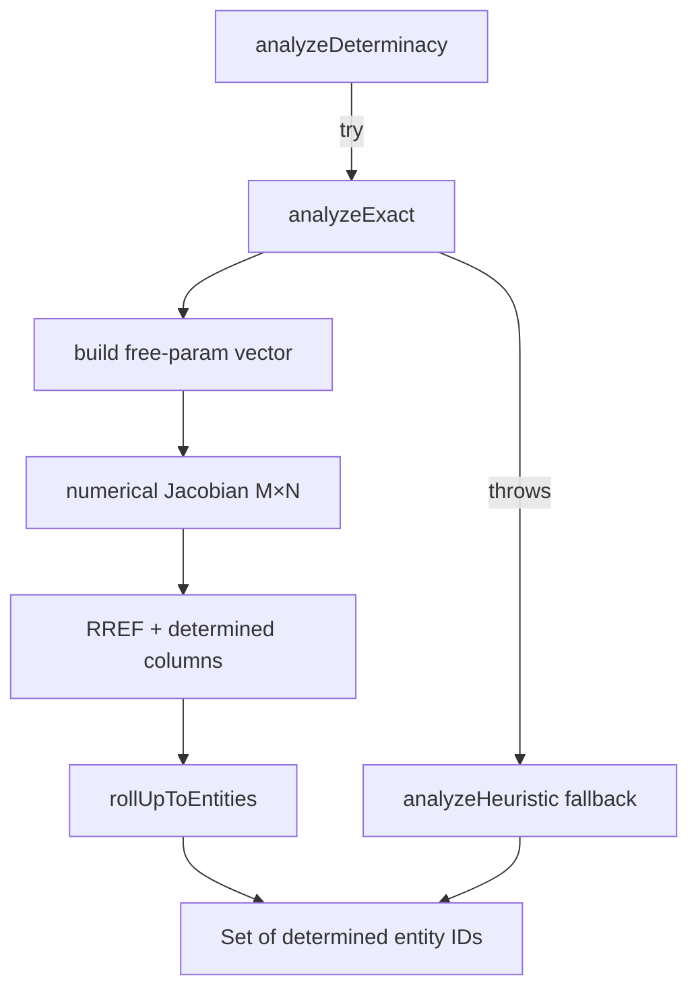

# Determinacy

> **System** ▸ [Overview](../../00-overview.md) ▸ [CAD Modeler](../../10-cad-modeler.md) ▸ [Sketching](../sketching.md) ▸ **determinacy**
> Related: [Sketching](../sketching.md) · [Constraints](../constraints.md) · [solver](./solver.md)

---

## Requirements

Requirements are governed by [Sketching](../sketching.md) · [Constraints](../constraints.md).

| REQ | Status | Summary |
|-----|--------|---------|
| 533 | unapproved | Render under-constrained primitives in a visually distinct style |

### REQ 533 — Under-constrained visual distinction

- **Description:** The CAD module shall render under-constrained sketch primitives in a visual style distinguishable from the style used for fully-constrained primitives.
- **Rationale:** The user must identify which parts of a sketch retain free degrees of freedom to know whether further constraints are required.
- **Verification:** Manual inspection — under-constrained and fully-constrained primitives render in mutually distinct styles. Implementation in `SketchSceneComponent#colorFor`.
- **Validation:** A user can distinguish fully-constrained from under-constrained primitives at a glance.

---

## Succinct description

`determinacy.ts` exports `analyzeDeterminacy(state)`, which returns the set of entity IDs that are fully determined by the current constraint graph. The viewer uses this set to color entities blue (determined) vs. black (free).

---

## How it works — for everyone (non-technical)

When you add constraints to a sketch, some shapes become "locked" — they can only be in one position and can no longer move. Others are still free to slide or rotate. The determinacy analyzer figures out which shapes are locked and which are still free. The sketch editor then draws locked shapes in one color and free shapes in another so you can tell at a glance how many more constraints you still need.

---

## How it works — in detail (technical)

### Primary path: Jacobian rank analysis (`analyzeExact`)

1. **Free-parameter vector.** For each entity: points contribute `x` and `y`; circles and arcs contribute `radius`. Parameters targeted by a `fixed` constraint, the origin point, and on-edge anchor points are pre-fixed and excluded from the column set entirely.

2. **Numerical Jacobian.** Each constraint type contributes residual rows. The Jacobian `J` (M rows × N columns) is computed by forward finite differences with step `h = EPS * (|baseValue| + 1)` where `EPS = 1e-7`. Arc invariants (`|P_start - center| = r`, `|P_end - center| = r`) are included as implicit rows so arc endpoint parameters are correctly tracked.

3. **RREF with column pivoting.** `determinedColumns(J)` performs Gauss-Jordan elimination. A pivot column is considered **uniquely determined** only when its pivot row has zero entries in every non-pivot (free) column — a pivot variable depending linearly on any free variable is not fully determined. This matches SolidWorks's black-vs-blue semantics precisely.

4. **Entity roll-up.** `rollUpToEntities` marks an entity determined when every parameter it owns appears in the determined set: points when both `x` and `y` are determined; lines when both endpoint points are; circles when center + radius are; arcs when center + start + end + radius all are.

### Fallback: heuristic propagation (`analyzeHeuristic`)

When the exact analyzer throws (malformed state, numerical edge cases), a constraint-propagation heuristic runs instead. It tracks per-point DOF counts (2 for a free point, 0 for a fixed one), propagates reductions through coincident/distance/horizontal/vertical constraints iteratively, then rolls up to lines, circles, and arcs. Less accurate for implicitly determined triangles but robust to unusual inputs.

### Tolerance

The Gauss-Jordan tolerance scales with the largest absolute entry in `J`: `tol = max(maxAbs * 1e-7, 1e-6)`. The floor `1e-6` absorbs FD truncation noise from the `1e-7` step.

---

## Key files

- `frontend/src/app/cad/lib/determinacy.ts` — analyzer
- `frontend/src/app/cad/lib/determinacy.spec.ts` — unit tests
