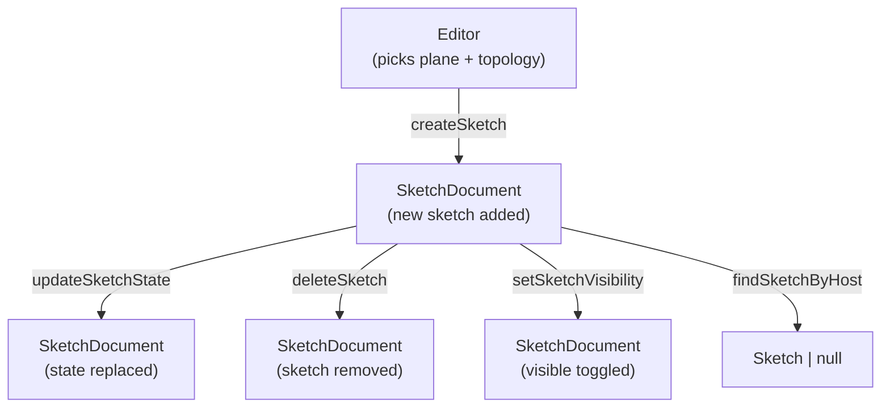

# Document Module

> **System** ▸ [Overview](../../00-overview.md) ▸ [CAD Modeler](../../10-cad-modeler.md) ▸ [Sketching](../sketching.md) ▸ **document.ts**
> Related: [featureTree.md](./featureTree.md) · [plane.md](./plane.md) · [sketching.md](../sketching.md) · [feature-tree.md](../feature-tree.md)

---

## Requirements

| REQ | Status | Summary |
|-----|--------|---------|
| 534 | unapproved | Associate each sketch with a planar host |
| 535 | unapproved | Create-sketch action creates a new sketch when one planar host is selected |
| 614 | unapproved | Every Sketch carries an optional visible boolean flag |
| 624 | unapproved | Sketch carries an optional name string |

### REQ 534 — Sketch-to-host association
- **Description:** The CAD module shall associate each sketch with a planar host (a planar face of a 3D solid in the same CAD model or a datum plane), store the host's coordinate system (origin, xAxis, yAxis, normal) with the sketch, and use that stored coordinate system for subsequent projection, rendering, and solver operations on the sketch.
- **Rationale:** Sketches are fundamentally 2D objects; the stored plane ties them to the 3D world and makes all 2D↔3D operations deterministic after the host geometry changes.
- **Verification:** `frontend/src/app/cad/lib/document.spec.ts` tests `createSketch` records the correct `hostId` and `plane`.
- **Validation:** A sketch created on a face retains the correct 2D↔3D mapping even when the model is regenerated.

---

## Succinct description

`document.ts` manages the `SketchDocument` — the collection of all sketches attached to one CAD model — with pure, immutable operations for creating, updating, deleting, and querying sketches.

## How it works — for everyone (non-technical)

A CAD model can contain many sketches. This module is the filing system for those sketches: it creates a new sketch on a chosen surface, records which surface it lives on, projects nearby 3D edges onto the sketch plane so they appear as reference lines, and lets the rest of the app update or remove individual sketches without touching the others.

## How it works — in detail (technical)

### Data shape

```
SketchDocument {
  sketches: Record<string, Sketch>   // keyed by globally-unique id
  nextSketchSeq: number              // legacy counter; id uses ids.newSketchId()
}

Sketch {
  id, hostId, plane, state, candidates, createdAt, name
  visible?   // REQ 614 — missing → visible
}
```

All functions return new immutable `SketchDocument` values (spread-copy with updated `sketches` map).

### `createSketch(doc, hostId, plane, topology)`

1. Calls `newSketchId()` (`ids.ts`) for a globally-unique identifier (random, not sequential — REQ 742).
2. Builds a default name `"Sketch N"` from the current sketch count.
3. Projects the supplied `ModelTopology` onto `plane` via `projectTopologyToCandidates`:
   - vertices → `ReferenceCandidate { kind: 'vertex', points: [p2d] }`
   - straight edges → `ReferenceCandidate { kind: 'edge', points: [a2d, b2d] }` (degenerate/perpendicular edges filtered out)
4. Records `createdAt: Date.now()` so the feature tree can interleave sketches by time.

### Reference promotion

`promoteVertex` and `promoteEdge` materialise a `ReferenceCandidate` into actual `construction: true` sketch entities so the solver can see and the renderer can display them:

- `promoteVertex` → one `PointEntity` with id `ref-<candidateId>`
- `promoteEdge` → two `PointEntity` + one `LineEntity`, all `construction: true`

These are called by the sketch editor when the user snaps to a candidate (REQ 542, 543).

### Other exports

| Function | Purpose |
|----------|---------|
| `updateSketchState` | Replace a sketch's `SketchState` (all entities + constraints) with a new one. |
| `deleteSketch` | Remove a sketch by id; no-op if not found. |
| `setSketchVisibility` | Set `visible` flag (REQ 614). |
| `setSketchName` | Rename a sketch (REQ 624). |
| `findSketchByHost` | Linear scan for the first sketch on a given `HostId`. |
| `emptyDocument` | `{ sketches: {}, nextSketchSeq: 1 }` — initial state for a new CAD model. |



## Key files

- `frontend/src/app/cad/lib/document.ts` — all sketch-document operations
- `frontend/src/app/cad/lib/document.spec.ts` — unit tests
- `frontend/src/app/cad/lib/ids.ts` — `newSketchId()` (random globally-unique ids)
- `frontend/src/app/cad/lib/store.ts` — `emptySketchState()` used by `createSketch`
- `frontend/src/app/cad/lib/plane.ts` — `projectFrom3D` used in candidate projection
- `frontend/src/app/cad/lib/types.ts` — `SketchDocument`, `Sketch`, `HostId`, `ReferenceCandidate`
