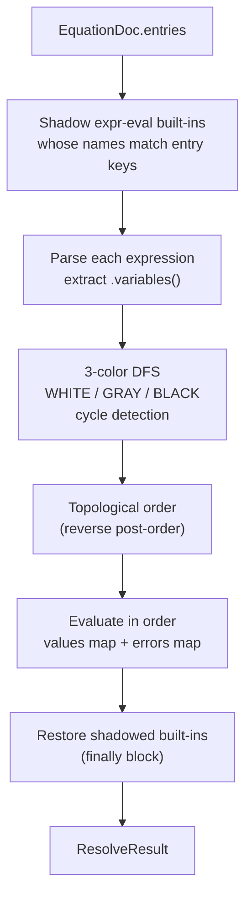

# equations.ts

> **System** ▸ [Overview](../../00-overview.md) ▸ [CAD Modeler](../../10-cad-modeler.md) ▸ [Equations](../equations.md) ▸ **equations.ts**
> Related: [units.ts](./units.md) · [migration.ts](./migration.md) · [Equations group page](../equations.md)

---

## Requirements

| REQ | Status | Summary |
|-----|--------|---------|
| 635 | unapproved | Persist equations document as JSONB with `{ entries: Record<key, EquationEntry> }` |
| 636 | unapproved | Parse and evaluate expressions with `expr-eval` |
| 637 | unapproved | Build a dependency graph, topologically sort, detect cycles |

Full context for REQs 634/638/639/640/641 lives on the [Equations group page](../equations.md).

### REQ 637 — Dependency graph and topological sort

- **Description:** The equations resolver shall build a dependency graph over the equation entries (using `expr-eval`'s `variables()`), topologically sort it, and evaluate in order, detecting cycles.
- **Rationale:** Equations reference each other; they must be evaluated in dependency order, and circular references must be reported rather than looping forever.
- **Verification:** `equations.spec.ts` asserts topological order and that a cycle (`a → b → a`) is reported on every member.
- **Validation:** A user accidentally creating a circular equation sees a clear cycle error instead of a hang.

---

## Succinct description

`equations.ts` is the frontend equations resolver: it owns the `EquationDoc` / `EquationEntry` types, the pure document-mutation helpers, and the `resolveEquations` function that parses, dependency-sorts, and evaluates every entry, isolating each failure independently.

---

## How it works — for everyone (non-technical)

This module is a self-contained calculator. Given a list of named formulas, it figures out which ones depend on which others, computes them in the right order, and flags any that form a loop or contain a mistake — without those errors contaminating the results of unrelated formulas.

---

## How it works — in detail (technical)

### Exported types

- `EquationDoc` — `{ entries: Record<string, EquationEntry> }` — the JSONB shape persisted on `DesignCADModels.equations`.
- `EquationEntry` — `{ expression: string; lastValue?: number; error?: string }` — one entry; `lastValue` is written by the resolver for live UI display.
- `ResolveResult` — `{ values: Record<string, number>; errors: Record<string, string>; order: string[] }`.

Keys are either bare global names (`width`) or dotted target paths (`feature.<id>.distance`, `sketch.<id>.constraint.<id>`).

### Exported functions

| Function | Purpose |
|----------|---------|
| `setEquation(doc, key, expr)` | Pure add/update returning a new `EquationDoc`. |
| `removeEquation(doc, key)` | Pure removal; no-op when key absent. |
| `evalExpression(expr, values)` | Single-shot live preview; returns `{ value }` or `{ error }`. |
| `resolveEquations(doc)` | Full resolve: parse → DFS → topo sort → evaluate. |
| `RESERVED_EQUATION_NAMES` | `ReadonlySet<string>` of `expr-eval` built-ins the UI warns against overriding. |

### Resolution algorithm

`resolveEquations` runs as follows:

1. **Shadow built-ins.** Before parsing, any `expr-eval` function, unary-op, or binary-op name that appears as an entry key is temporarily removed from the parser's surfaces (e.g., `length`, `sin`). A `finally` guard restores them unconditionally so a stray exception never leaves the shared parser corrupted.

2. **Parse all expressions.** Parse failures go directly into `errors`; those keys are skipped in the graph.

3. **Three-color DFS.** WHITE = unvisited, GRAY = on the current recursion stack (cycle candidate), BLACK = fully processed. A GRAY-ancestor encounter records `cycle: a → b → a` on every node in the cycle path.

4. **Evaluate in topological order.** Cycle members are already in `errors` and are skipped. A non-finite or non-number result is reported as an error without stopping evaluation of other entries.

5. The module-level `parser` instance has its `consts` cleared so user-defined names (`E`, `PI`, …) shadow math constants; `RESERVED_EQUATION_NAMES` exports the cleared names so the UI can warn the user.

### Connection to neighbors

The backend mirror is `backend/services/cadEquations.js` — same algorithm, CommonJS. `cadRegenService.js` calls `applyEquationsToModel` before dispatching any feature, so the kernel only ever sees resolved numbers. The frontend `cad-equations-panel` component consumes the exported types and calls `resolveEquations` for live panel display.

---

## Key files

- `frontend/src/app/cad/lib/equations.ts` — this module
- `frontend/src/app/cad/lib/equations.spec.ts` — unit tests
- `backend/services/cadEquations.js` — backend mirror
