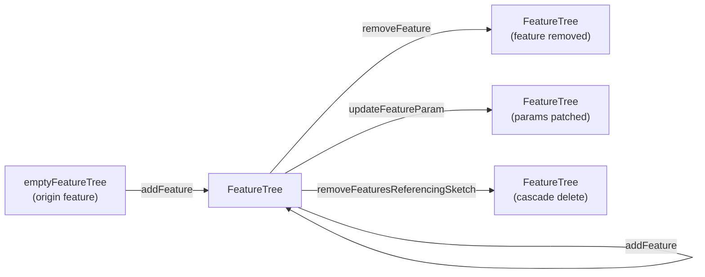

# Feature Tree Module

> **System** ▸ [Overview](../../00-overview.md) ▸ [CAD Modeler](../../10-cad-modeler.md) ▸ [Feature Tree](../feature-tree.md) ▸ **featureTree.ts**
> Related: [document.md](./document.md) · [preview.md](./preview.md) · [feature-tree.md](../feature-tree.md) · [extrude-revolve-sweep.md](../extrude-revolve-sweep.md)

---

## Requirements

| REQ | Status | Summary |
|-----|--------|---------|
| 545 | unapproved | Ordered feature list producing the model's 3D geometry |
| 546 | unapproved | New CAD model initialized with exactly one origin feature |
| 607 | unapproved | Delete an Extrude from the feature tree |
| 608 | unapproved | Delete a sketch — cascade or break references |
| 610 | unapproved | Non-Origin feature carries an optional visible boolean flag |
| 624 | unapproved | ExtrudeFeature and Sketch carry an optional name string |

### REQ 545 — Ordered feature list
- **Description:** The CAD module shall maintain an ordered list of features that produces the model's 3D geometry; each feature shall have an identifier unique within the document, a type, and type-specific parameters; the ordering shall be meaningful (earlier features precede later features in the regeneration sequence).
- **Rationale:** Parametric CAD is fundamentally a time-ordered history; the ordering determines which geometry is available to later features and makes edits predictable.
- **Verification:** `frontend/src/app/cad/lib/featureTree.spec.ts` asserts `addFeature`, `removeFeature`, and `updateFeatureParam` preserve or alter list order correctly.
- **Validation:** A designer can add, remove, and reorder features and see the model regenerate in the expected sequence.

---

## Succinct description

`featureTree.ts` provides pure, immutable operations for managing the ordered list of features that defines a CAD model's history.

## How it works — for everyone (non-technical)

A parametric CAD model is built step by step: first the origin planes, then a sketch, then an extrude, then a fillet, and so on. This module is the ledger that maintains that list of steps. It lets you add a new step, remove one, change its settings, or clean up entries that reference a deleted sketch — all without side effects, returning a new copy of the list each time.

## How it works — in detail (technical)

### Data shape

```
FeatureTree {
  features: Feature[]       // ordered; index 0 is always the OriginFeature
  nextFeatureSeq: number    // legacy counter; actual ids use ids.newFeatureId()
}
```

`Feature` is a tagged union (from `types.ts`): `OriginFeature | ExtrudeFeature | CutExtrudeFeature | RevolveFeature | CutRevolveFeature | SweepFeature | CutSweepFeature | LoftFeature | FilletFeature | ChamferFeature | DatumPlaneFeature | MirrorFeatureFeature | LinearPatternFeature | CircularPatternFeature | ShellFeature | DatumAxisFeature | DatumPointFeature | CombineFeature | HoleFeature | MirrorBodyFeature | MoveCopyBodyFeature`.

### Core operations

| Export | Behaviour |
|--------|-----------|
| `emptyFeatureTree()` | Creates a tree with a single `OriginFeature` at `id='f1'` with all datum visibilities set to `true`. |
| `addFeature(tree, input)` | Assigns a random id via `newFeatureId()`, stamps `createdAt: Date.now()`, derives a default name from `featureKindLabel` + a per-kind count, appends to the end. |
| `removeFeature(tree, id)` | Filters out the entry with matching id; no-op if absent. |
| `updateFeatureParam<T>(tree, id, patch)` | Merges `patch` into the feature (spread); preserves type. |
| `removeFeaturesReferencingSketch(tree, sketchId)` | Removes all Extrude, CutExtrude, Revolve, CutRevolve, Sweep, CutSweep entries whose `sketchId` / `profileSketchId` / `pathSketchId` matches (REQ 608 cascade). |
| `defaultDatumVisibility()` | Returns a fresh `Record<string, boolean>` with all seven origin datum ids set to `true`. |

### Default naming

`featureKindLabel` maps feature type strings to SolidWorks-style labels ("Extrude", "Cut-Extrude", "Revolve", "Fillet", "Plane", etc.) and returns `null` for `'origin'` (no default name). `addFeature` counts existing features of the same type in the current tree and appends `${label} ${count + 1}`.

### Type-guard helpers

`isOriginFeature`, `isExtrudeFeature`, `isCutExtrudeFeature`, `isRevolveFeature`, `isCutRevolveFeature`, `isSweepFeature`, `isCutSweepFeature`, `isAnyExtrudeFeature` — all narrowing predicates exported for use across the editor.



Note: regeneration itself was moved server-side to `backend/services/cadRegenService.js`. This module is strictly the pure-data layer for the feature list.

## Key files

- `frontend/src/app/cad/lib/featureTree.ts` — feature-tree operations
- `frontend/src/app/cad/lib/featureTree.spec.ts` — unit tests
- `frontend/src/app/cad/lib/ids.ts` — `newFeatureId()` (random globally-unique ids)
- `frontend/src/app/cad/lib/types.ts` — `Feature` tagged union, `FeatureTree`, `OriginFeature`
- `backend/services/cadRegenService.js` — server-side regeneration (walks this tree)
