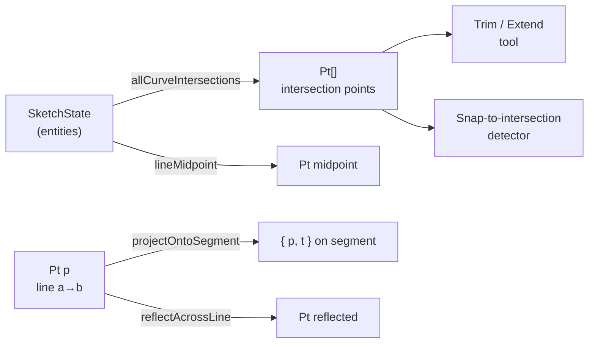

# Geometry Module

> **System** ▸ [Overview](../../00-overview.md) ▸ [CAD Modeler](../../10-cad-modeler.md) ▸ [Sketching](../sketching.md) ▸ **geometry.ts**
> Related: [datum.md](./datum.md) · [sketching.md](../sketching.md) · [profiles-arrangement.md](../profiles-arrangement.md)

---

## Requirements

Requirements for this module are governed by the sketching group. See [Sketching](../sketching.md).

---

## Succinct description

`geometry.ts` is a collection of pure 2D analytic geometry primitives — intersection, projection, reflection, and offset — used by sketch editing tools such as Trim, Extend, Mirror, and Offset, as well as by snap detection.

## How it works — for everyone (non-technical)

When the user trims a line to an intersection, the tool needs to know exactly where two curves cross. When they mirror an entity across a line, the tool needs the reflection formula. This module supplies those building blocks. None of it touches the Angular framework, the database, or the constraint solver — it is plain coordinate arithmetic that can be tested in complete isolation.

## How it works — in detail (technical)

All functions operate in 2D sketch-plane coordinates using the `Pt { x: number; y: number }` type. Tolerance constants: `EPS = 1e-9`.

### Exported functions

| Function | Signature | Purpose |
|----------|-----------|---------|
| `dist` | `(a, b) → number` | Euclidean distance. |
| `reflectAcrossLine` | `(p, a, b) → Pt` | Mirror `p` across the infinite line through `a` and `b`. |
| `lineLineIntersection` | `(a1,a2,b1,b2) → { p, t1, t2 } \| null` | Parametric intersection of two lines. `t=0` is start, `t=1` is end; `null` when parallel. |
| `lineCircleIntersection` | `(a1,a2,center,radius) → Pt[]` | 0–2 intersection points along the line direction. |
| `circleCircleIntersection` | `(c1,r1,c2,r2) → Pt[]` | 0–2 intersection points; handles tangent (1 point) and non-intersecting cases. |
| `angleInArcSweep` | `(pointAngle,startAngle,endAngle,ccw) → boolean` | Tests whether an angle lies within the arc's CCW or CW sweep. Used to filter `lineCircleIntersection` hits down to actual arc hits. |
| `allCurveIntersections` | `(state) → Pt[]` | All pairwise intersection points among non-construction lines, circles, and arcs in a sketch state. Used by Trim/Extend cut-point finder and snap-to-intersection. |
| `lineMidpoint` | `(state, l) → Pt \| null` | Midpoint of a non-construction line (looks up start/end points from sketch state). |
| `circleQuadrants` | `(center,radius) → Pt[]` | Four cardinal points (right, left, top, bottom). Used for snap-to-quadrant. |
| `projectOntoSegment` | `(a,b,p) → { p, t }` | Closest point on segment `a→b` to `p`, with clamped parameter. |
| `projectOntoLine` | `(a,b,p) → { p, t }` | Closest point on the INFINITE line (unclamped). Used by Extend. |
| `offsetLineLeft` | `(a,b,d) → { a, b } \| null` | Offset line `a→b` by distance `d` to its left (CCW perpendicular). |

### `allCurveIntersections` algorithm

1. Collects all non-construction `LineEntity`, `CircleEntity`, and `ArcEntity` from `state.entities`, resolving their center/endpoint `PointEntity` references via `findPoint`.
2. Tests all line–line pairs (segment-internal hits only: `t ∈ (0,1)` for both).
3. Tests all line–circle/arc pairs (segment-internal on the line, `angleInArcSweep` on arcs).
4. Tests all circle/arc–circle/arc pairs (both arcs swept filter applied).
5. Returns the deduplicated (no dedup in code — caller deduplicates by proximity if needed) list of intersection `Pt` values.

## Key files

- `frontend/src/app/cad/lib/geometry.ts` — all 2D geometry primitives
- `frontend/src/app/cad/lib/geometry.spec.ts` — unit tests
- `frontend/src/app/cad/lib/types.ts` — `SketchState`, `LineEntity`, `CircleEntity`, `ArcEntity`
- `frontend/src/app/cad/lib/sketchEditOps.ts` — consumes these primitives for Trim/Extend/Mirror/Offset UI wiring
