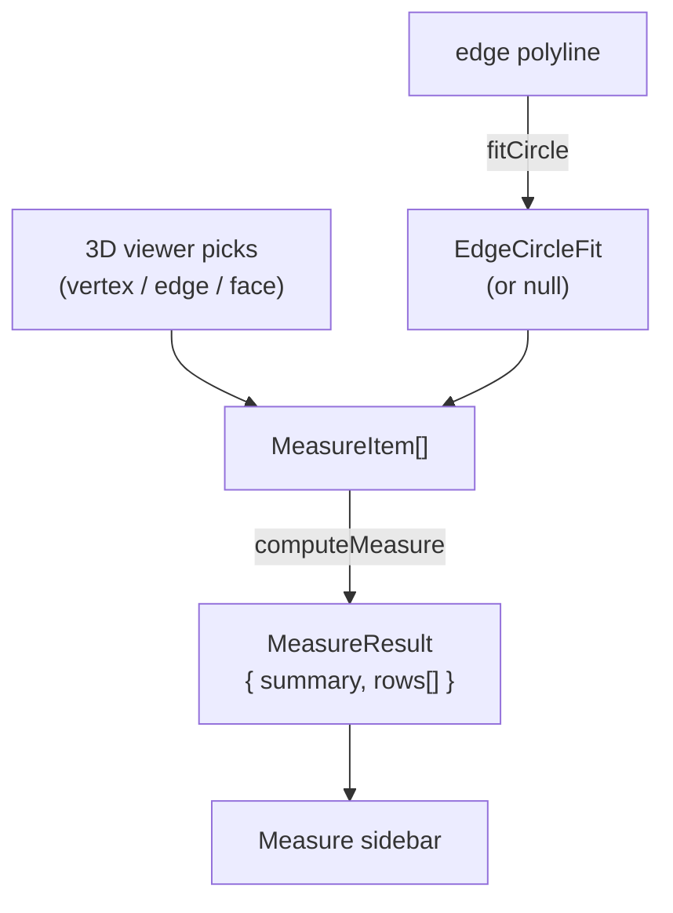

# Measure Module

> **System** ▸ [Overview](../../00-overview.md) ▸ [CAD Modeler](../../10-cad-modeler.md) ▸ [Measurement](../measurement.md) ▸ **measure.ts**
> Related: [datum.md](./datum.md) · [tangentPropagation.md](./tangentPropagation.md) · [measurement.md](../measurement.md)

---

## Requirements

| REQ | Status | Summary |
|-----|--------|---------|
| 652 | unapproved | Measure tool — sidebar accepting picks of vertices, edges, faces |
| 653 | unapproved | Distance results for edge, vertex-vertex, and vertex-edge combinations |
| 654 | unapproved | Angle result between two straight edges |
| 655 | unapproved | Face picks — area, centroid, normal for flat faces |
| 656 | unapproved | Circular-curve recognition — radius, diameter, circumference, center |

### REQ 652 — Measure tool
- **Description:** The CAD editor shall provide a Measure tool that, when activated, opens a sidebar accepting picks of vertices, edges, and faces from the 3D viewer. As picks are made the sidebar shall display computed measurement results updated in real time.
- **Rationale:** Inspecting existing geometry dimensions without creating constraint-driving entities is a fundamental CAD workflow step.
- **Verification:** `frontend/src/app/cad/lib/measure.spec.ts` tests all pick combinations with known inputs and expected outputs.
- **Validation:** A designer can pick two faces and read the distance between them directly in the sidebar.

---

## Succinct description

`measure.ts` contains two independent responsibilities: `computeMeasure` — a pure function that turns a list of picked 3D entities into human-readable measurement rows — and `fitCircle` — a geometric utility that fits a circle through a polyline, reused by the datum module.

## How it works — for everyone (non-technical)

After the user clicks one or two things in the 3D viewer (vertices, edges, or faces), the Measure sidebar calls this module to work out what to display. Pick one edge and it shows the length. Pick two vertices and it shows the distance and the X/Y/Z components. Pick a circular edge and it also shows the radius, diameter, and center. The same module contains the math for fitting a circle to a curved edge's sampled points — that math is also used by the datum module when it needs to find the axis of a cylindrical face.

## How it works — in detail (technical)

### `MeasureItem` — the pick input shape

```ts
type MeasureItem =
  | { kind: 'vertex'; id; position: [number,number,number] }
  | { kind: 'edge';   id; start; end; isStraight; length?; circle?: EdgeCircleFit }
  | { kind: 'face';   id; area?; centroid?; normal?; isFlat }
```

The `circle` field on an edge carries the result of `fitCircle` run by the viewer on the edge's polyline samples. The viewer/editor populates `MeasureItem` arrays and calls `computeMeasure`.

### `computeMeasure(items, unit) → MeasureResult`

Dispatches on `items.length` then `[a.kind, b.kind].sort().join('+')`:

| Pick combination | Result |
|------------------|--------|
| 1 vertex | X / Y / Z coordinates |
| 1 edge (straight) | Length |
| 1 edge (circular) | Length + Radius + (if closed: Diameter, Circumference) + Center |
| 1 face (flat) | Area + Centroid X/Y/Z + Normal |
| vertex + vertex | Distance + ΔX/ΔY/ΔZ |
| vertex + edge | Perpendicular distance from vertex to infinite line |
| vertex + face (flat) | Perpendicular distance from vertex to plane |
| edge + edge (both circular) | Center-to-center distance; if co-axial: Axial + Radial + ΔRadius |
| edge + edge (one circular + one straight) | Distance from circle center to infinite line |
| edge + edge (two straight, parallel) | Distance + Angle = 0 |
| edge + edge (two straight, skew) | Angle in [0°, 90°] |
| edge + face (flat, edge parallel to plane) | Distance + Angle |
| edge + face (flat, edge at angle) | Angle |
| face + face (parallel flat) | Distance + Angle = 0 |
| face + face (non-parallel flat) | Angle |

Parallelism threshold: `|cos θ| ≥ 0.99985` (≈ 1°). The number formatter (`fmt`) targets 3–4 significant digits; final format strips noise without over-rounding.

### `fitCircle(polyline) → EdgeCircleFit | null`

1. Selects three samples: `polyline[0]`, `polyline[floor(n/2)]`, `polyline[n-1]`. For closed polylines (`|p0−pN| < 1e-6`) uses `polyline[floor(n*3/4)]` as the third point to avoid coincidence.
2. Computes the circumcircle via the standard 3-point circumcenter formula (barycentric/plane projection variant).
3. Validates by checking every polyline sample sits within `max(0.001, radius * 0.005)` of the fitted radius — edges that fail (splines, general curves) return `null`.
4. Returns `{ center, radius, normal: unit(N), closed }`.

Reused by:
- `datum.ts` — `computeDatumAxis` (`alongEdge` method) and `computeDatumPoint` (`centerOfCircularEdge` method)
- viewer edge-pick code when populating `circle` on `MeasureItem`



## Key files

- `frontend/src/app/cad/lib/measure.ts` — `computeMeasure`, `fitCircle`, `MeasureItem`, `MeasureResult`, `EdgeCircleFit`
- `frontend/src/app/cad/lib/measure.spec.ts` — unit tests
- `frontend/src/app/cad/lib/datum.ts` — consumes `fitCircle`
- `frontend/src/app/cad/lib/types.ts` — `ModelTopology`, `ModelGeometry`
