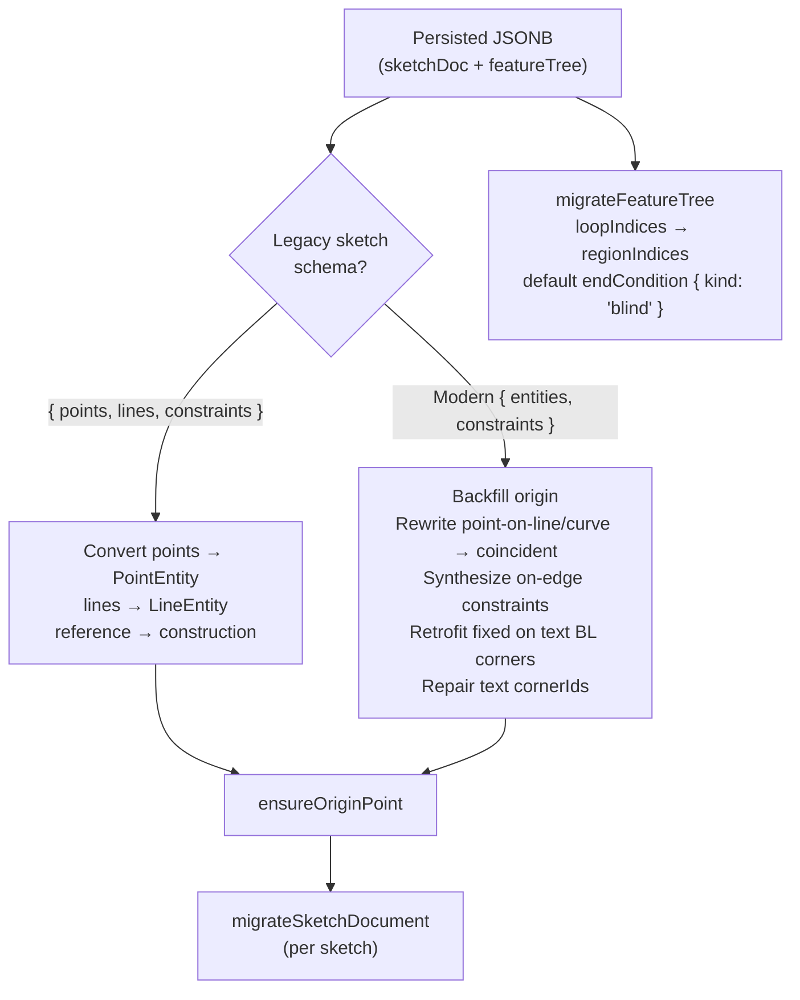

# migration.ts

> **System** ▸ [Overview](../../00-overview.md) ▸ [CAD Modeler](../../10-cad-modeler.md) ▸ [Units / IDs / Migration](../units-ids-migration.md) ▸ **migration.ts**
> Related: [ids.ts](./ids.md) · [units.ts](./units.md) · [Units / IDs / Migration group page](../units-ids-migration.md)

---

## Requirements

Governed by [Units / IDs / Migration](../units-ids-migration.md).

| REQ | Status | Summary |
|-----|--------|---------|
| 565 | unapproved | Migrate legacy `{ points, lines, constraints }` sketch docs in memory on load |

### REQ 565 — Schema migration on load

- **Description:** When the CAD module loads a sketch document persisted under the prior `{ points, lines, constraints }` flat schema, it shall migrate it in memory to the current `SketchEntity` model.
- **Rationale:** Existing persisted documents must keep loading without a database migration step; consumers should only ever see the modern schema.
- **Verification:** `migration.spec.ts` round-trips legacy documents and asserts the upgraded entity/constraint shapes.
- **Validation:** A sketch saved under the old schema opens correctly in the current editor.

---

## Succinct description

`migration.ts` upgrades persisted CAD documents in memory — no database migration step. It handles the legacy flat-array sketch schema, removed constraint types, the old `projectedFrom` field, and feature-tree compatibility shims.

---

## How it works — for everyone (non-technical)

Old saved files used a slightly different internal format. This module is the translator: every time a file opens, it quietly converts any old-format parts to the format the editor expects, so nothing is ever left behind in an unreadable state.

---

## How it works — in detail (technical)

### Exported functions

| Function | Signature | Purpose |
|----------|-----------|---------|
| `isLegacySketchState` | `(unknown) → boolean` | Detects the old `{ points, lines, constraints }` shape by checking for `points[]` + absence of `entities[]`. |
| `migrateSketchState` | `(legacy \| modern) → SketchState` | Upgrades a single sketch state. Idempotent. |
| `migrateSketchDocument` | `(SketchDocument) → SketchDocument` | Calls `migrateSketchState` on every sketch in the document. |
| `migrateFeatureTree` | `(FeatureTree) → FeatureTree` | Read-side compat shim for extrude features. |

Also exported for tests: `LegacyPoint`, `LegacyLine`, `LegacyConstraint`, `LegacySketchState`.

### Migration paths

**Legacy schema conversion (`isLegacySketchState` → `migrateSketchState`):**
- Each `LegacyPoint` → `PointEntity`; `reference: true` → `construction: true`.
- Each `LegacyLine` → `LineEntity`; same `reference` → `construction` mapping.
- Constraint `targets` were plain string ids; upgraded to `{ entityId: string }` objects.
- Removed constraint types `point-on-line` and `point-on-curve` are rewritten to `coincident` via `rewriteLegacyType`.

**Modern-schema backfill (`migrateSketchState` on a non-legacy input):**
- `point-on-line` / `point-on-curve` constraint type rewrites (idempotent if already rewritten).
- `projectedFrom` → `on-edge` constraint synthesis: entities that carried an old `projectedFrom: { featureId, edgeId }` field get a synthesized `SketchConstraint` of type `'on-edge'`, and the field is stripped.
- Text BL-corner `fixed` constraint retrofit: every `TextEntity` whose bottom-left corner lacks a `fixed` constraint gets one added so dimensioning can't drift the box.
- Text `cornerIds` repair: a text entity without `cornerIds` and without `anchorId` is scanned against construction points to find a matching axis-aligned rectangle; if found, the corners are bound.

**Feature tree shim (`migrateFeatureTree`):**
- `loopIndices` (old field on extrudes) → `regionIndices` (current field); the old field is removed.
- Missing `endCondition` on extrude/cutExtrude features defaults to `{ kind: 'blind' }`.

All migrations are **idempotent** — running twice produces the same result as running once.

---

## Key files

- `frontend/src/app/cad/lib/migration.ts` — this module
- `frontend/src/app/cad/lib/migration.spec.ts` — unit tests
- `frontend/src/app/cad/lib/store.ts` — provides `ensureOriginPoint` called during migration
