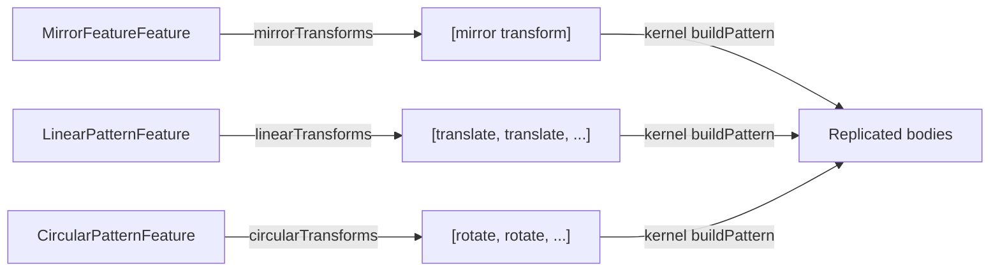

# Pattern Module

> **System** ▸ [Overview](../../00-overview.md) ▸ [CAD Modeler](../../10-cad-modeler.md) ▸ [Fillet / Chamfer / Shell / Pattern](../fillet-chamfer-shell-pattern.md) ▸ **pattern.ts**
> Related: [featureTree.md](./featureTree.md) · [fillet-chamfer-shell-pattern.md](../fillet-chamfer-shell-pattern.md)

---

## Requirements

| REQ | Status | Summary |
|-----|--------|---------|
| 658 | unapproved | Three pattern features: Mirror, Linear, and Circular |

### REQ 658 — Pattern features
- **Description:** The CAD editor shall provide three pattern features that replicate one or more existing features by applying transforms: (a) Mirror — reflect across a plane; (b) Linear — translate along one or two directions with a count and spacing; (c) Circular — rotate around an axis with a count and angle (equal-spacing or specified-angle modes).
- **Rationale:** Repeating geometric features without manually duplicating them is fundamental to efficient part design; patterns encode the design intent (symmetry, arrays) rather than brute-forcing redundant extrudes.
- **Verification:** `frontend/src/app/cad/lib/pattern.spec.ts` tests each transform builder for correct transform count, direction, and spacing/angle values.
- **Validation:** A designer can add a linear hole pattern and verify the correct count and spacing of instances rendered in the viewer.

---

## Succinct description

`pattern.ts` converts Mirror, Linear, and Circular pattern features into the flat `PatternTransform[]` list the Rust geometry kernel needs to replicate bodies.

## How it works — for everyone (non-technical)

To make a row of six holes, you describe the pattern once — "go in this direction, every 10 mm, six times" — and this module turns that description into a list of translations. The kernel then copies the source geometry using each translation, producing the full set of holes without the user having to draw each one individually. Mirror and circular variants work the same way, just with reflections or rotations instead of translations.

## How it works — in detail (technical)

### `PatternTransform` type

```ts
type PatternTransform =
  | { kind: 'translate'; dx; dy; dz }
  | { kind: 'rotate';   origin; direction; angleRad }
  | { kind: 'mirror';   origin; normal };
```

Field names mirror the `protocol::PatternTransform` enum on the kernel side (`#[serde(tag="kind", rename_all="lowercase")]`). These must stay in sync.

### `mirrorTransforms(feature: MirrorFeatureFeature) → PatternTransform[]`

Returns a single `mirror` entry using the feature's `planeSnapshot.origin` and `.normal`. The snapshot is captured at the time the user picks the mirror plane and freezes it so the transform survives a regen that moves the origin plane.

### `linearTransforms(feature: LinearPatternFeature) → PatternTransform[]`

Iterates an `i × j` grid where `i ∈ [0, d1.count)` and `j ∈ [0, d2.count)` (d2 optional). The `(0, 0)` source seed is skipped. Each cell becomes:

```
dx = v1[0]*i + v2[0]*j
dy = v1[1]*i + v2[1]*j
dz = v1[2]*i + v2[2]*j
```

where `v1 = d1.axisSnapshot.direction * d1.spacing * (flipped ? -1 : 1)`. Throws on `count < 1` or `spacing == 0 when count >= 2`.

### `circularTransforms(feature: CircularPatternFeature) → PatternTransform[]`

Emits `count - 1` rotation entries (i=0 is the source). Step calculation:

- `equalSpacing` mode: `stepDeg = angleDeg / count` — the total sweep is divided evenly.
- `specifiedAngle` mode: `stepDeg = angleDeg` — each step is the stated delta.

Each entry carries `axisSnapshot.origin` and `axisSnapshot.direction` so the transform survives topology rename across regens.



## Key files

- `frontend/src/app/cad/lib/pattern.ts` — `mirrorTransforms`, `linearTransforms`, `circularTransforms`, `PatternTransform`
- `frontend/src/app/cad/lib/pattern.spec.ts` — unit tests
- `frontend/src/app/cad/lib/types.ts` — `MirrorFeatureFeature`, `LinearPatternFeature`, `CircularPatternFeature`
- `cad-kernel/src/protocol.rs` — `PatternTransform` Rust counterpart (must stay in sync)
